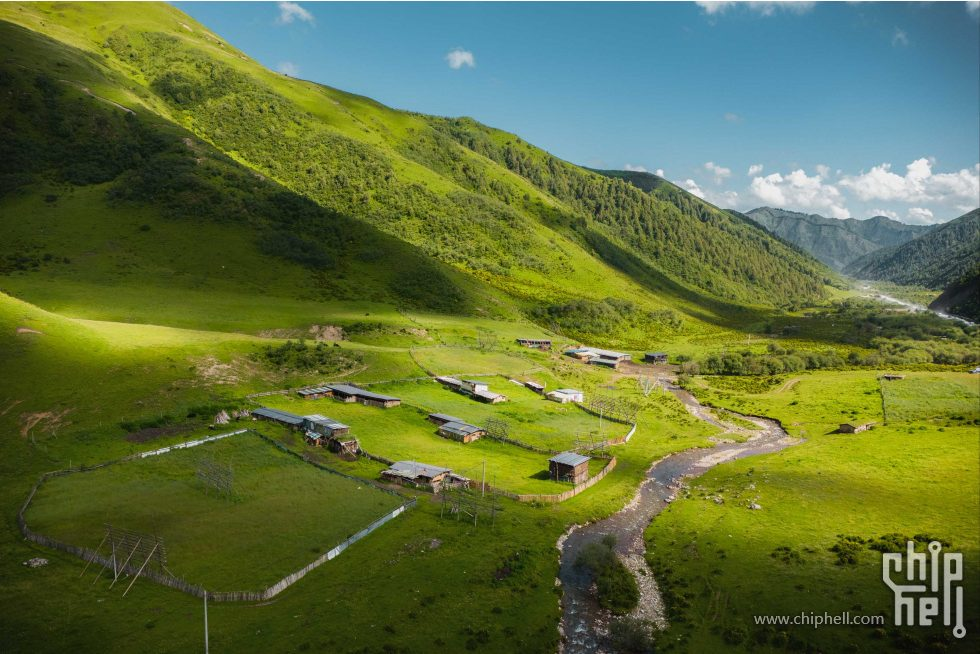
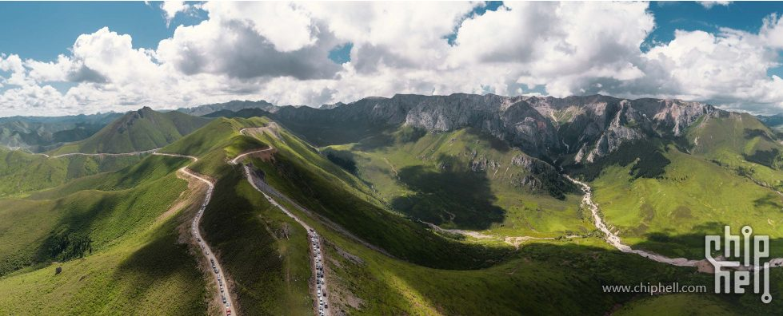
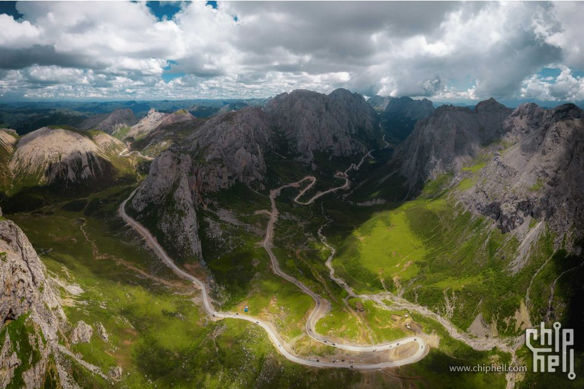
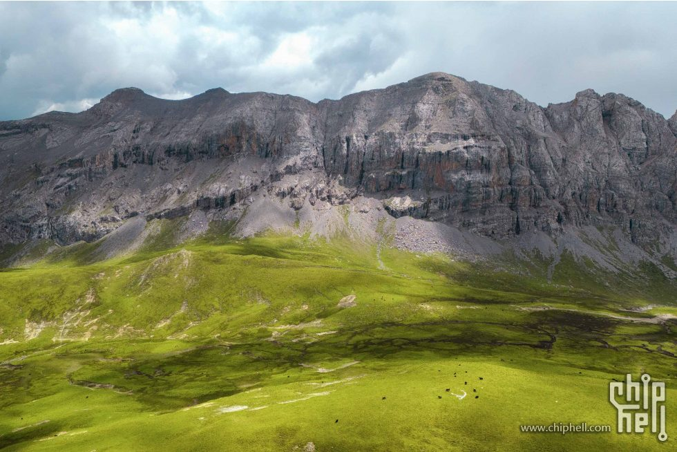

# 甘南自驾完整旅行计划

行程日期：2026 年 7 月 18 日至 7 月 26 日
出发方式：杭州飞兰州中川国际机场，兰州取车自驾
航班：7/18 3U3195 07:20-10:25；7/26 MU2446 17:55-20:40

## 动态路线预告片

32 秒按 D1-D9 查看全程路线、每日里程、住宿地和海拔变化：[横版视频](media/gannan-route-landscape.mp4) · [手机竖版](media/gannan-route-portrait.mp4)

## 行前重点

1. D3 洛克之路和 D6 莲宝叶则看天气行事，雨雾大就降速、缩短停留或改线。
2. D5 住阿坝县，黄河九曲第一湾下午打卡，不等完整日落后再走夜路。
3. D7 久治到夏河高德实算约 336.6km / 5h26m，含午餐、拍照、停车按 8-9 小时预留。
4. D8 甘加秘境出发前 1-2 天确认开放范围和交通管制。

## 全程概览

天气更新于 2026 年 7 月 14 日 23:47，按路书中各景点实际坐标调用 [Open-Meteo](https://open-meteo.com/en/docs) 预报。气温为单点当日最高/最低，降水概率为单点日最大值；D7-D9 仍属中远期预报，建议每天出发前复核一次。

原则：全程按“短袖/速干内层 + 防晒层 + 抓绒或薄羽绒 + 冲锋衣/雨衣”分层准备。兰州、临夏白天偏热，高海拔草原和莲宝叶则早晚冷、风大、雨来得快。

| 日期 | 天数 | 住宿 | 主要路线 | 天气/温度参考 | 穿衣建议 | 随身重点 | 节奏判断 |
|---|---:|---|---|---|---|---|---|
| 7/18 周六 | D1 | [全季酒店(兰州张掖路省政府地铁站店)](https://m.ctrip.com/html5/hotel/hoteldetail/66757085.html) | 兰州中川机场 -> 甘肃省博物馆 -> 中山桥 -> [全季酒店](https://m.ctrip.com/html5/hotel/hoteldetail/66757085.html) | 路线 29/17℃ 兰州市区：阴 29/18℃，降水 33% 中川机场：零星小雨 26/17℃，降水 39% | 市区白天短袖/薄长袖；机场和黄河边备轻薄防风雨外套。 | 防晒帽、轻薄外套、舒适步行鞋 | 航班到达后轻松适应 |
| 7/19 周日 | D2 | [卓尼扎古录大酒店](https://m.ctrip.com/html5/hotel/hoteldetail/111531991.html) | [全季酒店](https://m.ctrip.com/html5/hotel/hoteldetail/66757085.html) -> 美仁大草原 -> 米拉日巴佛阁 -> [卓尼扎古录大酒店](https://m.ctrip.com/html5/hotel/hoteldetail/111531991.html) | 路线 21/4℃ 美仁草原：零星小雨 17/5℃，降水 67% 合作佛阁：零星小雨 21/7℃，降水 49% 扎古录：零星小雨 20/4℃，降水 39% | 温差很大：草原和扎古录夜间加抓绒/薄羽绒，下车带防雨层。 | 防风外套、抓绒、墨镜、防晒霜 | 沿途可能有小雨，约 5h 驾驶 |
| 7/20 周一 | D3 | [云端山舍·全域日出观景民宿(扎尕那达日观景台店)](https://m.ctrip.com/html5/hotel/hoteldetail/111872533.html) | [卓尼扎古录大酒店](https://m.ctrip.com/html5/hotel/hoteldetail/111531991.html) -> 达日观景台 -> [云端山舍](https://m.ctrip.com/html5/hotel/hoteldetail/111872533.html) | 路线 21/6℃ 达日观景台：小雨 21/6℃，降水 67%，阵风 41km/h 扎尕那：小雨 21/8℃，降水 74% | 速干长袖 + 抓绒/薄羽绒 + 冲锋衣，山路湿滑，观景台注意风雨。 | 雨衣、防滑鞋、保暖帽 | 降水概率较高，避免夜走洛克之路 |
| 7/21 周二 | D4 | [郎木寺庚盼民宿(白龙江峡谷店)](https://m.ctrip.com/html5/hotel/hoteldetail/134867328.html) | [云端山舍](https://m.ctrip.com/html5/hotel/hoteldetail/111872533.html) -> 扎尕那仙女滩 -> 格尔底寺 -> 纳摩大峡谷 -> [郎木寺庚盼民宿](https://m.ctrip.com/html5/hotel/hoteldetail/134867328.html) | 路线 22/9℃ 扎尕那仙女滩：小雨 22/9℃，降水 67%，阵风 62km/h 郎木寺：小雨 17/11℃，降水 41%，阵风 54km/h | 抓绒/薄羽绒外加冲锋衣；观景台和峡谷按强风、间歇小雨准备。 | 冲锋衣、轻便徒步鞋、保暖帽 | 风力明显偏强，仙女滩和峡谷按天气缩时 |
| 7/22 周三 | D5 | [朵兰达V酒店(阿坝县店)](https://m.ctrip.com/html5/hotel/hoteldetail/131972530.html) | [郎木寺庚盼民宿](https://m.ctrip.com/html5/hotel/hoteldetail/134867328.html) -> 花湖 -> 黄河九曲第一湾 -> [朵兰达V酒店](https://m.ctrip.com/html5/hotel/hoteldetail/131972530.html) | 路线 21/6℃ 花湖：零星小雨 16/7℃，降水 41% 黄河九曲：阴 19/6℃，降水 29% 阿坝县：晴间多云 21/9℃，降水 51% | 花湖和九曲约 6-19℃，长袖外加防风层，清晨和雨后补抓绒。 | 防晒、雨具、保温杯 | 午后天气相对好转，仍不等九曲完整日落 |
| 7/23 周四 | D6 | [久治玉宫酒店](https://m.ctrip.com/html5/hotel/hoteldetail/121194192.html) | [朵兰达V酒店](https://m.ctrip.com/html5/hotel/hoteldetail/131972530.html) -> 莲宝叶则 -> 各莫寺 -> [久治玉宫酒店](https://m.ctrip.com/html5/hotel/hoteldetail/121194192.html) | 路线 20/6℃ 莲宝叶则：小雨 17/7℃，降水 58%，阵风 35km/h 各莫寺：小雨 15/6℃，降水 58% 久治：小雨 20/8℃，降水 71% | 抓绒/薄羽绒 + 冲锋衣，莲宝叶则按 7℃、有雨有风准备。 | 保暖层、手套/帽子、雨衣 | 景区降水概率较高，注意高海拔 |
| 7/24 周五 | D7 | [夏河蓝庭雅居酒店](https://m.ctrip.com/html5/hotel/hoteldetail/130838449.html) | [久治玉宫酒店](https://m.ctrip.com/html5/hotel/hoteldetail/121194192.html) -> 娘玛寺 -> 阿万仓 -> 郭莽 -> 桑科 -> [蓝庭雅居酒店](https://m.ctrip.com/html5/hotel/hoteldetail/130838449.html) | 路线 24/8℃ 阿万仓：小雨 17/8℃，降水 46% 郭莽湿地：小雨 16/8℃，降水 49%，阵风 38km/h 桑科/夏河：小雨 18/8℃ -> 多云 24/12℃ | 湿地沿线约 8-18℃且有风，下车加抓绒和防风雨外套；到夏河后可减衣。 | 防风外套、雨具、备用袜子 | 高德约 336.6km/5h26m，雨天按 8-9h 安排 |
| 7/25 周六 | D8 | [临夏八坊十三巷美仑酒店](https://m.ctrip.com/html5/hotel/hoteldetail/127225302.html) | [蓝庭雅居酒店](https://m.ctrip.com/html5/hotel/hoteldetail/130838449.html) -> 拉卜楞寺 -> 甘加秘境 -> [临夏八坊十三巷美仑酒店](https://m.ctrip.com/html5/hotel/hoteldetail/127225302.html) | 路线 24/10℃ 拉卜楞寺：小雨 17/12℃，降水 51%，阵风 41km/h 甘加秘境：小雨 15/10℃，降水 83% 临夏：雷阵雨 24/18℃，降水 59% | 甘加按 10-15℃和雨天穿；到临夏后可减衣，但保留雨具。 | 雨具、防滑鞋、抓绒 | 甘加降水高，临夏有雷暴信号，避开空旷高点 |
| 7/26 周日 | D9 | 返程 | [临夏八坊十三巷美仑酒店](https://m.ctrip.com/html5/hotel/hoteldetail/127225302.html) -> 黄洮交汇观景平台 -> 兰州中川机场 T3 | 路线 30/17℃ 黄洮交汇：零星小雨 30/19℃，降水 43% 中川机场：多云 29/17℃，降水 31%，阵风 33km/h | 白天偏热，以短袖/薄长袖为主；观景平台和机场备轻薄防风雨外套。 | 防风外套、易脱鞋/舒适鞋 | 17:55 航班，13:00 前离开观景平台 |

## 住宿订单

| 天数 | 日期 | 酒店 | 房型与间数 | 价格 |
|---|---|---|---|---:|
| D0 | 7-17 | [全季酒店(兰州张掖路省政府地铁站店)](https://m.ctrip.com/html5/hotel/hoteldetail/66757085.html) | 双床房A【安静舒睡 + 商务…】 1间 | ¥363.70 × 1间 |
| D1 | 7-18 | [全季酒店(兰州张掖路省政府地铁站店)](https://m.ctrip.com/html5/hotel/hoteldetail/66757085.html) | 双床房【舒适安睡 + 商务…】 1间 高级大床房A【安静舒睡】 2间 | ¥441.42 × 1间 ¥414.02 × 1间 + ¥216.01 × 1间 |
| D2 | 7-19 | [卓尼扎古录大酒店](https://m.ctrip.com/html5/hotel/hoteldetail/111531991.html) | 特惠双床房（一次性面巾 + 一次性浴巾） 3间 | ¥398.33 × 3间 |
| D3 | 7-20 | [云端山舍·全域日出观景民宿(扎尕那达日观景台店)](https://m.ctrip.com/html5/hotel/hoteldetail/111872533.html) | 栖山｜观景双床房 1间 枕山｜观景双床房 2间 | ¥854 × 1间 ¥813 × 2间 |
| D4 | 7-21 | [郎木寺庚盼民宿(白龙江峡谷店)](https://m.ctrip.com/html5/hotel/hoteldetail/134867328.html) | 郎木寺观景｜豪华标间 2间 郎木寺观景｜标间 1间 | ¥475.48 × 2间 ¥404.55 × 1间 |
| D5 | 7-22 | [朵兰达V酒店(阿坝县店)](https://m.ctrip.com/html5/hotel/hoteldetail/131972530.html) | Senior·静谧双床房（智能客控 + 空调 + 制氧机 + 加湿器） 1间 智能语音大床房 2间 | ¥534 × 1间 ¥447 × 2间 |
| D6 | 7-23 | [久治玉宫酒店](https://m.ctrip.com/html5/hotel/hoteldetail/121194192.html) | 豪华双床房（医用级鼻吸供氧） 3间 | ¥471 × 3间 |
| D7 | 7-24 | [夏河蓝庭雅居酒店](https://m.ctrip.com/html5/hotel/hoteldetail/130838449.html) | 豪华双床房 3间 | ¥450 × 3间 |
| D8 | 7-25 | [临夏八坊十三巷美仑酒店](https://m.ctrip.com/html5/hotel/hoteldetail/127225302.html) | 大床房 3间 | ¥378.73 × 3间 |

住宿订单合计（D0-D8）：¥11792.85。

## 同类景点取舍

| 类型 | 优先玩 | 各自亮点 | 可舍弃/短停 | 取舍建议 |
|---|---|---|---|---|
| 高山峡谷/大景 | 莲宝叶则、扎尕那、洛克之路 | 莲宝叶则看高海拔海子和石山；扎尕那看石城村落、晨雾和观景台；洛克之路胜在路上山谷、垭口和穿越感 | 甘加秘境 | 天气好优先莲宝叶则和扎尕那；洛克之路遇雨雾降级为安全通过；甘加秘境开放不稳或赶路时可舍弃 |
| 草原/湿地 | 花湖、阿万仓湿地 | 花湖有栈道、湖面和水鸟，体验完整；阿万仓湿地视野开阔，适合 D7 长线中段舒展 | 美仁大草原、郭莽湿地、桑科草原 | 同类不要贪多。保花湖和阿万仓；美仁、郭莽、桑科都按路边短停处理，天色晚直接跳过 |
| 寺庙/藏地人文 | 拉卜楞寺、郎木寺/格尔底寺 | 拉卜楞寺体量最大，转经长廊和讲解最值得；郎木寺兼具小镇、寺院和纳摩大峡谷 | 米拉日巴佛阁、各莫寺、娘玛寺 | 人文重点放拉卜楞寺和郎木寺；米拉日巴适合 D2 顺路登阁；各莫寺、娘玛寺作为短停，不占用莲宝叶则/D7 主时间 |
| 观景台/日落 | 达日观景台、黄河九曲第一湾 | 达日适合看扎尕那全景；黄河九曲适合高位看河湾，天气好很出片 | 黄洮交汇观景平台 | D3 保达日；D5 住阿坝则九曲下午看完就走，不为日落冒夜路；D9 黄洮只在时间宽裕、天气好时短停 |
| 城市轻量点 | 甘肃省博物馆、中山桥 | 博物馆看铜奔马和彩陶，适合落地第一天；中山桥适合饭后散步看黄河 | 中山桥 | D1 若航班延误或太累，优先保博物馆预约；中山桥可缩短到 20-30 分钟或取消 |

总原则：自然大景看天气，寺庙人文看讲解和体力，草原湿地同质化高，保 1-2 个代表点就够。

## 全程海拔示意图

海拔为近似值，用来判断身体适应节奏；实际以当天停车点和道路为准。

<svg viewBox="0 0 880 330" role="img" aria-label="甘南自驾全程海拔示意图" style="width:100%;height:auto;display:block;min-width:760px">
  <defs>
    <linearGradient id="elevFill" x1="0" y1="0" x2="0" y2="1">
      <stop offset="0%" stop-color="#f97316" stop-opacity="0.32"/>
      <stop offset="100%" stop-color="#2563eb" stop-opacity="0.08"/>
    </linearGradient>
  </defs>
  <rect x="0" y="0" width="880" height="330" rx="16" fill="#f8fbff"/>
  <g stroke="#d8e0ea" stroke-width="1">
    <line x1="58" y1="240" x2="820" y2="240"/>
    <line x1="58" y1="176" x2="820" y2="176" stroke-dasharray="4 6"/>
    <line x1="58" y1="112" x2="820" y2="112" stroke-dasharray="4 6"/>
    <line x1="58" y1="48" x2="820" y2="48" stroke-dasharray="4 6"/>
  </g>
  <g fill="#64748b" font-size="12">
    <text x="14" y="244">1500m</text>
    <text x="14" y="180">2500m</text>
    <text x="14" y="116">3500m</text>
    <text x="14" y="52">4500m</text>
  </g>
  <path d="M58,239 L117,147 L175,173 L234,106 L292,131 L351,119 L410,115 L468,126 L527,47 L586,104 L644,115 L703,149 L761,213 L820,211 L820,240 L58,240 Z" fill="url(#elevFill)"/>
  <polyline points="58,239 117,147 175,173 234,106 292,131 351,119 410,115 468,126 527,47 586,104 644,115 703,149 761,213 820,211" fill="none" stroke="#ea580c" stroke-width="4" stroke-linecap="round" stroke-linejoin="round"/>
  <g fill="#fff" stroke="#ea580c" stroke-width="3">
    <circle cx="58" cy="239" r="5"/><circle cx="117" cy="147" r="5"/><circle cx="175" cy="173" r="5"/><circle cx="234" cy="106" r="5"/><circle cx="292" cy="131" r="5"/><circle cx="351" cy="119" r="5"/><circle cx="410" cy="115" r="5"/><circle cx="468" cy="126" r="5"/><circle cx="527" cy="47" r="5"/><circle cx="586" cy="104" r="5"/><circle cx="644" cy="115" r="5"/><circle cx="703" cy="149" r="5"/><circle cx="761" cy="213" r="5"/><circle cx="820" cy="211" r="5"/>
  </g>
  <g fill="#152033" font-size="12" font-weight="700">
    <text x="58" y="227" text-anchor="middle">1520</text><text x="117" y="135" text-anchor="middle">2960</text><text x="175" y="161" text-anchor="middle">2550</text><text x="234" y="94" text-anchor="middle">3600</text><text x="292" y="119" text-anchor="middle">3200</text><text x="351" y="107" text-anchor="middle">3400</text><text x="410" y="103" text-anchor="middle">3450</text><text x="468" y="114" text-anchor="middle">3290</text><text x="527" y="35" text-anchor="middle">4520</text><text x="586" y="92" text-anchor="middle">3630</text><text x="644" y="103" text-anchor="middle">3450</text><text x="703" y="137" text-anchor="middle">2920</text><text x="761" y="201" text-anchor="middle">1917</text><text x="820" y="199" text-anchor="middle">1947</text>
  </g>
  <g fill="#475569" font-size="12">
    <text x="58" y="270" text-anchor="end" transform="rotate(-35 58 270)">兰州</text><text x="117" y="270" text-anchor="end" transform="rotate(-35 117 270)">合作</text><text x="175" y="270" text-anchor="end" transform="rotate(-35 175 270)">扎古录</text><text x="234" y="270" text-anchor="end" transform="rotate(-35 234 270)">洛克之路</text><text x="292" y="270" text-anchor="end" transform="rotate(-35 292 270)">扎尕那</text><text x="351" y="270" text-anchor="end" transform="rotate(-35 351 270)">郎木寺</text><text x="410" y="270" text-anchor="end" transform="rotate(-35 410 270)">花湖/九曲</text><text x="468" y="270" text-anchor="end" transform="rotate(-35 468 270)">阿坝</text><text x="527" y="270" text-anchor="end" transform="rotate(-35 527 270)">莲宝叶则</text><text x="586" y="270" text-anchor="end" transform="rotate(-35 586 270)">久治</text><text x="644" y="270" text-anchor="end" transform="rotate(-35 644 270)">阿万仓</text><text x="703" y="270" text-anchor="end" transform="rotate(-35 703 270)">夏河</text><text x="761" y="270" text-anchor="end" transform="rotate(-35 761 270)">临夏</text><text x="820" y="270" text-anchor="end" transform="rotate(-35 820 270)">中川机场</text>
  </g>
</svg>

| 路段/节点 | 海拔参考 | 判断 |
|---|---:|---|
| 兰州/中川机场 | 约 1500-1950m | 入门适应段，第一天别熬夜 |
| 合作、扎古录、扎尕那、郎木寺 | 约 2550-3400m | D2-D4 持续抬升，夜间注意保暖和睡眠 |
| 花湖、黄河九曲、阿坝县 | 约 3290-3450m | D5 全天在 3300m 左右活动，别把日落拖成夜路 |
| 莲宝叶则 | 约 4200-4520m | 全程最高点，少走快路、少跑跳，身体不适及时下撤 |
| 久治、阿万仓、郭莽、夏河 | 约 2920-3630m | D7 仍是高海拔长驾驶日，控制停留和体力 |
| 临夏、返程机场 | 约 1900m | 海拔明显下降，适合返程前恢复 |

## 景点购票与预约清单

| 日期 | 景点 | 提前时间 | 购票/预约渠道 | 票价参考 | 备注 |
|---|---|---|---|---|---|
| D1 | 甘肃省博物馆 | 提前 3 天含当天，通常 0 点放票 | 微信公众号“甘肃省博物馆/这里是甘博”个人预约，官网扫码预约 | 免费 | 周一闭馆，刷身份证入馆；7/18 为周六，仍建议提前约好下午时段 |
| D2 | 美仁大草原 | 不需提前 | 开放式草原，现场停车/消费 | 免费 | 停车、骑马、牧家乐等另计 |
| D2 | 安多合作米拉日巴佛阁 | 当天即可 | 现场窗口，携程/去哪儿可查实时信息 | 登阁约 20 元，停车约 5 元 | 宗教场所现场公告优先 |
| D3 | 洛克之路、达日观景台 | 不购票；出发前 1 天查路况 | 卓尼/迭部文旅、酒店、当地司机、高德路况 | 免费/无统一门票 | 雨雾、塌方、修路比门票更关键，低底盘车谨慎 |
| D3-D4 | 扎尕那 | 旺季建议提前 1-3 天 | 扎尕那官方入口、甘南文旅相关入口、去哪儿/携程 | 成人约 80 元，优待约 40 元 | 暑期可能分时预约或限流，现场票不稳时以线上为准 |
| D4 | 格尔底寺/郎木寺 | 当天即可 | 现场购票 | 格尔底寺/郎木寺区域约 30 元 | 甘肃赛赤寺、四川格尔底寺分属两侧，收费口径可能不同 |
| D4 | 纳摩大峡谷 | 当天即可 | 通常随格尔底寺入口进入，现场确认 | 寺庙入口约 30 元；峡谷本身多为免费 | 骑马、向导等另计；遇雨不建议深入峡谷 |
| D5 | 花湖湿地 | 至少提前 1 天 | 去哪儿/携程/同程，景区公众号或现场 | 门票+观光车成人约 105 元，学生约 70 元 | 浙江免票政策本行程默认不适用；观光车另付 |
| D5 | 黄河九曲第一湾 | 至少提前 1 天 | 去哪儿/携程/同程，景区公众号或现场 | 门票+上行观光扶梯成人约 105 元，学生约 90 元 | 浙江免票政策本行程默认不适用；扶梯/观光车另付 |
| D6 | 莲宝叶则 | 建议提前 1 天；旺季好天气提前 2-3 天 | 去哪儿/携程/同程，景区公众号或窗口 | 成人约 120 元，老人/学生约 60 元 | 高海拔景区，按天气和体力安排 |
| D6 | 各莫寺 | 不需提前 | 现场参观 | 免费 | 主殿/室内区域开放时段以现场为准 |
| D7 | 娘玛寺 | 不需提前 | 现场参观 | 免费 | 寺院参观注意着装、拍照和宗教礼仪 |
| D7 | 阿万仓湿地 | 当天或提前 1 天查询 | 现场/票务平台/玛曲文旅信息 | 核心观景台/景区参考约 30 元；外围湿地可能免费 | 官方曾公布试行价，实际按现场收费口径为准 |
| D7 | 郭莽湿地 | 不需提前 | 开放式湿地，现场停车 | 免费 | G213 旁短停点，控制停留时间 |
| D7 | 桑科草原 | 不需提前 | 开放式草原，现场消费 | 免费 | 骑马、藏服、牧家乐、停车等另计 |
| D8 | 拉卜楞寺 | 通常不需线上提前；上午到现场更稳 | 现场窗口/寺院讲解点 | 主殿区约 40 元，贡唐宝塔约 10-20 元；公共区域免费 | 建议请讲解；法会、修缮、宗教活动会影响开放 |
| D8 | 甘加秘境 | 至少提前 1 天，出发前再确认开放范围 | 去哪儿/携程/同程，景区公众号或窗口 | 门票+园内交通成人约 118 元，优待约 78 元 | 甘加秘境历史上有停开/改造公告，务必核实交通和可游区域 |
| D9 | 黄洮交汇观景平台 | 不需提前 | 开放式观景点，现场停车 | 免费/现场为准 | 返程航班日只建议短停，遇堵车或下雨直接去机场 |

## D1｜7 月 18 日｜杭州飞兰州，兰州市区适应

路线：兰州中川国际机场 -> 甘肃省博物馆 -> 中山桥 -> [全季酒店(兰州张掖路省政府地铁站店)](https://m.ctrip.com/html5/hotel/hoteldetail/66757085.html)
航班：3U3195 07:20-10:25
住宿：兰州市
酒店：[全季酒店(兰州张掖路省政府地铁站店)](https://m.ctrip.com/html5/hotel/hoteldetail/66757085.html)

  <article class="spot-card">
<strong>甘肃省博物馆</strong>建议 2-3 小时；玩法：直奔铜奔马、彩陶、丝路展，提前预约<a href="https://www.xiaohongshu.com/search_result?keyword=%E7%94%98%E8%82%83%E7%9C%81%E5%8D%9A%E7%89%A9%E9%A6%86" target="_blank" rel="noreferrer">小红书搜图</a>
</article>
  <article class="spot-card">
<strong>中山桥</strong>建议 30-60 分钟；玩法：桥上步行、黄河岸边拍白塔山，雨大缩短停留<a href="https://www.xiaohongshu.com/search_result?keyword=%E5%85%B0%E5%B7%9E%E4%B8%AD%E5%B1%B1%E6%A1%A5" target="_blank" rel="noreferrer">小红书搜图</a>
</article>
  <article class="spot-card">
<strong>全季酒店</strong>当晚住宿<a href="https://www.xiaohongshu.com/search_result?keyword=%E5%85%A8%E5%AD%A3%E9%85%92%E5%BA%97%20%E5%85%B0%E5%B7%9E%20%E5%BC%A0%E6%8E%96%E8%B7%AF" target="_blank" rel="noreferrer">小红书搜图</a>
</article>

| 时间 | 安排 |
|---|---|
| 10:25-12:00 | 抵达兰州中川机场，取车，检查轮胎、油量、ETC/导航、备胎和玻璃水。 |
| 12:00-13:30 | 机场到兰州市区，午餐可安排牛肉面。 |
| 14:00-17:00 | 甘肃省博物馆，重点看马踏飞燕、丝路文明、彩陶。 |
| 17:30-19:00 | 中山桥和黄河风情线散步，天气好可看白塔山方向夜景。 |
| 晚上 | 入住[全季酒店(兰州张掖路省政府地铁站店)](https://m.ctrip.com/html5/hotel/hoteldetail/66757085.html)，市区晚餐，补充水和路餐。 |

注意：甘肃省博物馆通常需实名预约，周一闭馆；7/18 为周六，仍建议提前预约并确认停止入馆时间。中山桥为开放式城市景点，雨大或堵车时可缩短停留。

## D2｜7 月 19 日｜兰州到扎古录

路线：[全季酒店(兰州张掖路省政府地铁站店)](https://m.ctrip.com/html5/hotel/hoteldetail/66757085.html) -> 美仁大草原 -> 安多合作米拉日巴佛阁 -> [卓尼扎古录大酒店](https://m.ctrip.com/html5/hotel/hoteldetail/111531991.html)
住宿：扎古录镇
酒店：[卓尼扎古录大酒店](https://m.ctrip.com/html5/hotel/hoteldetail/111531991.html)

  <article class="spot-card">
<strong>美仁大草原</strong>建议 30-45 分钟；玩法：路边安全停车拍草原和经幡，不深入压草场<a href="https://www.xiaohongshu.com/search_result?keyword=%E7%BE%8E%E4%BB%81%E5%A4%A7%E8%8D%89%E5%8E%9F" target="_blank" rel="noreferrer">小红书搜图</a>
</article>
  <article class="spot-card">
<strong>米拉日巴佛阁</strong>建议 1-1.5 小时；玩法：登阁看壁画和合作市区，尊重寺院拍照规则<a href="https://www.xiaohongshu.com/search_result?keyword=%E7%B1%B3%E6%8B%89%E6%97%A5%E5%B7%B4%E4%BD%9B%E9%98%81" target="_blank" rel="noreferrer">小红书搜图</a>
</article>
  <article class="spot-card">
<strong>卓尼扎古录大酒店</strong>当晚住宿<a href="https://www.xiaohongshu.com/search_result?keyword=%E5%8D%93%E5%B0%BC%E6%89%8E%E5%8F%A4%E5%BD%95%E5%A4%A7%E9%85%92%E5%BA%97" target="_blank" rel="noreferrer">小红书搜图</a>
</article>

| 时间 | 安排 |
|---|---|
| 08:00 | [全季酒店](https://m.ctrip.com/html5/hotel/hoteldetail/66757085.html)早餐后出发，加满油。 |
| 11:30-12:30 | 美仁大草原短停拍照，午餐建议简单解决。 |
| 13:30-15:30 | 合作米拉日巴佛阁，留 1-1.5 小时。 |
| 16:00-18:00 | 前往扎古录入住，尽量天黑前到。 |

建议：美仁大草原不要停太久；扎古录住宿选择少，确认停车、热水、是否有电梯。

## D3｜7 月 20 日｜洛克之路到扎尕那

路线：[卓尼扎古录大酒店](https://m.ctrip.com/html5/hotel/hoteldetail/111531991.html) -> 达日观景台 -> [云端山舍·全域日出观景民宿(扎尕那达日观景台店)](https://m.ctrip.com/html5/hotel/hoteldetail/111872533.html)
住宿：扎尕那景区内
酒店：[云端山舍·全域日出观景民宿(扎尕那达日观景台店)](https://m.ctrip.com/html5/hotel/hoteldetail/111872533.html)

  <article class="spot-card">
<strong>洛克之路</strong>建议 4-6 小时含停车；玩法：按天气走山谷、垭口、草甸点位，雨雾天降速或改线<a href="https://www.xiaohongshu.com/search_result?keyword=%E7%94%98%E5%8D%97%E6%B4%9B%E5%85%8B%E4%B9%8B%E8%B7%AF" target="_blank" rel="noreferrer">小红书搜图</a>
</article>
  <article class="spot-card">
<strong>达日观景台</strong>建议 30-60 分钟；玩法：看扎尕那山势和村落全景，天气好等光线<a href="https://www.xiaohongshu.com/search_result?keyword=%E8%BE%BE%E6%97%A5%E8%A7%82%E6%99%AF%E5%8F%B0%20%E6%89%8E%E5%B0%94%E9%82%A3" target="_blank" rel="noreferrer">小红书搜图</a>
</article>
  <article class="spot-card">
<strong>云端山舍</strong>当晚住宿<a href="https://www.xiaohongshu.com/search_result?keyword=%E4%BA%91%E7%AB%AF%E5%B1%B1%E8%88%8D%20%E6%89%8E%E5%B0%94%E9%82%A3" target="_blank" rel="noreferrer">小红书搜图</a>
</article>

### 洛克之路关键打卡点

  <article class="spot-card">
<strong>扎古录后河谷草甸</strong>进山初段，适合安全停车热身拍草甸、溪谷和牧场；不要把车停在窄弯。<a href="https://www.xiaohongshu.com/search_result?keyword=%E6%B4%9B%E5%85%8B%E4%B9%8B%E8%B7%AF%20%E6%B2%B3%E8%B0%B7%E8%8D%89%E7%94%B8" target="_blank" rel="noreferrer">小红书搜图</a>
</article>
  <article class="spot-card">
<strong>4000 米垭口/山脊线</strong>洛克之路的高光段，视野最开阔；风大、海拔高，短停拍照即可，别剧烈跑跳。<a href="https://www.xiaohongshu.com/search_result?keyword=%E6%B4%9B%E5%85%8B%E4%B9%8B%E8%B7%AF%204000%E7%B1%B3%E5%9E%AD%E5%8F%A3" target="_blank" rel="noreferrer">小红书搜图</a>
</article>
  <article class="spot-card">
<strong>盘山悬崖路段</strong>景色壮，但驾驶压力也最大；乘客负责拍照，司机专心看路，遇会车主动让行。<a href="https://www.xiaohongshu.com/search_result?keyword=%E6%B4%9B%E5%85%8B%E4%B9%8B%E8%B7%AF%20%E6%82%AC%E5%B4%96%E8%B7%AF" target="_blank" rel="noreferrer">小红书搜图</a>
</article>
  <article class="spot-card">
<strong>那黑卡/石山草甸段</strong>靠近扎尕那前的峡谷、石山和草甸组合最完整；天气好可作为 D3 重点停车点。<a href="https://www.xiaohongshu.com/search_result?keyword=%E6%B4%9B%E5%85%8B%E4%B9%8B%E8%B7%AF%20%E9%82%A3%E9%BB%91%E5%8D%A1" target="_blank" rel="noreferrer">小红书搜图</a>
</article>

| 时间 | 安排 |
|---|---|
| 08:00 | 从[卓尼扎古录大酒店](https://m.ctrip.com/html5/hotel/hoteldetail/111531991.html)出发，先确认天气和路况。 |
| 上午 | 洛克之路，重点是路上山谷、垭口、草甸风景。 |
| 中午 | 视路况用路餐，不要把午餐寄托在景区。 |
| 下午 | 达日观景台，继续前往扎尕那方向。 |
| 17:00 前 | 抵达[云端山舍·全域日出观景民宿](https://m.ctrip.com/html5/hotel/hoteldetail/111872533.html)，天气好可看日落。 |

注意：洛克之路雨天、雾天、塌方/修路时风险会上升；低底盘车不建议硬走，尽量 SUV，离线地图和满油出发。

## D4｜7 月 21 日｜扎尕那转场郎木寺

路线：[云端山舍·全域日出观景民宿(扎尕那达日观景台店)](https://m.ctrip.com/html5/hotel/hoteldetail/111872533.html) -> 扎尕那仙女滩 -> 格尔底寺 -> 纳摩大峡谷 -> [郎木寺庚盼民宿(白龙江峡谷店)](https://m.ctrip.com/html5/hotel/hoteldetail/134867328.html)
住宿：郎木寺镇
酒店：[郎木寺庚盼民宿(白龙江峡谷店)](https://m.ctrip.com/html5/hotel/hoteldetail/134867328.html)

  <article class="spot-card">
<strong>扎尕那</strong>建议 2-3 小时；玩法：晨雾/日出优先，仙女滩和村落观景点二选一深玩<a href="https://www.xiaohongshu.com/search_result?keyword=%E6%89%8E%E5%B0%94%E9%82%A3" target="_blank" rel="noreferrer">小红书搜图</a>
</article>
  <article class="spot-card">
<strong>格尔底寺/郎木寺</strong>建议 1.5-2 小时；玩法：格尔底寺慢看寺院和白龙江源头，进殿不拍照<a href="https://www.xiaohongshu.com/search_result?keyword=%E6%A0%BC%E5%B0%94%E5%BA%95%E5%AF%BA%20%E9%83%8E%E6%9C%A8%E5%AF%BA" target="_blank" rel="noreferrer">小红书搜图</a>
</article>
  <article class="spot-card">
<strong>纳摩大峡谷</strong>建议 1-1.5 小时；玩法：沿峡谷轻徒步，遇雨或体力不足只走入口段<a href="https://www.xiaohongshu.com/search_result?keyword=%E7%BA%B3%E6%91%A9%E5%A4%A7%E5%B3%A1%E8%B0%B7" target="_blank" rel="noreferrer">小红书搜图</a>
</article>
  <article class="spot-card">
<strong>郎木寺庚盼民宿</strong>当晚住宿<a href="https://www.xiaohongshu.com/search_result?keyword=%E9%83%8E%E6%9C%A8%E5%AF%BA%E5%BA%9A%E7%9B%BC%E6%B0%91%E5%AE%BF" target="_blank" rel="noreferrer">小红书搜图</a>
</article>

| 时间 | 安排 |
|---|---|
| 05:30-08:00 | 天气好可看扎尕那晨雾/日出。 |
| 08:30-11:30 | 扎尕那仙女滩和村落观景点补拍。 |
| 12:00-14:00 | 午餐后前往郎木寺方向。 |
| 14:00-17:30 | 格尔底寺、纳摩大峡谷轻徒步。 |
| 晚上 | 入住[郎木寺庚盼民宿(白龙江峡谷店)](https://m.ctrip.com/html5/hotel/hoteldetail/134867328.html)，注意保暖。 |

## D5｜7 月 22 日｜郎木寺、花湖、九曲到阿坝

路线：[郎木寺庚盼民宿(白龙江峡谷店)](https://m.ctrip.com/html5/hotel/hoteldetail/134867328.html) -> 花湖湿地 -> 黄河九曲第一湾 -> [朵兰达V酒店(阿坝县店)](https://m.ctrip.com/html5/hotel/hoteldetail/131972530.html)
住宿：阿坝县
酒店：[朵兰达V酒店(阿坝县店)](https://m.ctrip.com/html5/hotel/hoteldetail/131972530.html)

  <article class="spot-card">
<strong>花湖湿地</strong>建议 2-2.5 小时；玩法：观光车进出，走栈道看湿地和水鸟，风大注意保暖<a href="https://www.xiaohongshu.com/search_result?keyword=%E8%8A%B1%E6%B9%96%E6%B9%BF%E5%9C%B0" target="_blank" rel="noreferrer">小红书搜图</a>
</article>
  <article class="spot-card">
<strong>黄河九曲第一湾</strong>建议 1.5-2 小时；玩法：上观景台看黄河弯道，住阿坝则不等完整日落<a href="https://www.xiaohongshu.com/search_result?keyword=%E9%BB%84%E6%B2%B3%E4%B9%9D%E6%9B%B2%E7%AC%AC%E4%B8%80%E6%B9%BE" target="_blank" rel="noreferrer">小红书搜图</a>
</article>
  <article class="spot-card">
<strong>朵兰达V酒店</strong>当晚住宿<a href="https://www.xiaohongshu.com/search_result?keyword=%E6%9C%B5%E5%85%B0%E8%BE%BEV%E9%85%92%E5%BA%97%20%E9%98%BF%E5%9D%9D%E5%8E%BF" target="_blank" rel="noreferrer">小红书搜图</a>
</article>

| 时间 | 安排 |
|---|---|
| 08:00 | 从[郎木寺庚盼民宿](https://m.ctrip.com/html5/hotel/hoteldetail/134867328.html)出发。 |
| 08:45-11:30 | 花湖湿地，坐观光车/走栈道，注意防晒和风。 |
| 11:30-13:00 | 前往唐克方向，路上午餐。 |
| 13:00-16:00 | 黄河九曲第一湾，下午打卡观景。 |
| 16:00 前后 | 离开九曲前往阿坝县。 |
| 18:30-19:30 | 抵达[朵兰达V酒店(阿坝县店)](https://m.ctrip.com/html5/hotel/hoteldetail/131972530.html)入住。 |

关键取舍：如果特别想看黄河九曲日落，建议改住唐克/若尔盖；若坚持住阿坝，不建议等完整日落后夜路前往阿坝。

## D6｜7 月 23 日｜阿坝、莲宝叶则、各莫寺到久治

路线：[朵兰达V酒店(阿坝县店)](https://m.ctrip.com/html5/hotel/hoteldetail/131972530.html) -> 莲宝叶则景区 -> 各莫寺 -> [久治玉宫酒店](https://m.ctrip.com/html5/hotel/hoteldetail/121194192.html)
住宿：久治县
酒店：[久治玉宫酒店](https://m.ctrip.com/html5/hotel/hoteldetail/121194192.html)

  <article class="spot-card">
<strong>莲宝叶则</strong>建议 4-5 小时；玩法：扎尕尔措一线慢走慢拍，少跑跳，不适及时下撤<a href="https://www.xiaohongshu.com/search_result?keyword=%E8%8E%B2%E5%AE%9D%E5%8F%B6%E5%88%99" target="_blank" rel="noreferrer">小红书搜图</a>
</article>
  <article class="spot-card">
<strong>各莫寺</strong>建议 40-60 分钟；玩法：短停看寺院建筑和转经氛围，作为莲宝叶则后的轻量点<a href="https://www.xiaohongshu.com/search_result?keyword=%E5%90%84%E8%8E%AB%E5%AF%BA" target="_blank" rel="noreferrer">小红书搜图</a>
</article>
  <article class="spot-card">
<strong>久治玉宫酒店</strong>当晚住宿<a href="https://www.xiaohongshu.com/search_result?keyword=%E4%B9%85%E6%B2%BB%E7%8E%89%E5%AE%AB%E9%85%92%E5%BA%97" target="_blank" rel="noreferrer">小红书搜图</a>
</article>

| 时间 | 安排 |
|---|---|
| 08:00 | [朵兰达V酒店](https://m.ctrip.com/html5/hotel/hoteldetail/131972530.html)早餐后出发。 |
| 09:00-14:30 | 莲宝叶则景区，重点看扎尕尔措一线；身体不适则减少徒步。 |
| 15:00-16:00 | 各莫寺短停。 |
| 16:00-18:00 | 前往久治县，入住[久治玉宫酒店](https://m.ctrip.com/html5/hotel/hoteldetail/121194192.html)。 |

注意：莲宝叶则海拔高，别跑跳；带热水、防晒、雨衣和保暖层。

## D7｜7 月 24 日｜久治经阿万仓到夏河

路线：[久治玉宫酒店](https://m.ctrip.com/html5/hotel/hoteldetail/121194192.html) -> 娘玛寺 -> 阿万仓湿地 -> 郭莽湿地 -> 桑科草原 -> [夏河蓝庭雅居酒店](https://m.ctrip.com/html5/hotel/hoteldetail/130838449.html)
住宿：夏河县
酒店：[夏河蓝庭雅居酒店](https://m.ctrip.com/html5/hotel/hoteldetail/130838449.html)
高德参考：约 336.6km / 5h26m；实时路况和 POI 命中会浮动，实际按 8-9h 总行程预留。

  <article class="spot-card">
<strong>娘玛寺/阿万仓湿地</strong>建议 1.5-2 小时；玩法：娘玛寺短停后把重点放阿万仓湿地栈道和草原水系<a href="https://www.xiaohongshu.com/search_result?keyword=%E5%A8%98%E7%8E%9B%E5%AF%BA%20%E9%98%BF%E4%B8%87%E4%BB%93%E6%B9%BF%E5%9C%B0" target="_blank" rel="noreferrer">小红书搜图</a>
</article>
  <article class="spot-card">
<strong>郭莽湿地</strong>建议 30-45 分钟；玩法：栈道短走、拍湿地和公路风景，不作为深玩点<a href="https://www.xiaohongshu.com/search_result?keyword=%E9%83%AD%E8%8E%BD%E6%B9%BF%E5%9C%B0" target="_blank" rel="noreferrer">小红书搜图</a>
</article>
  <article class="spot-card">
<strong>桑科草原</strong>建议 20-40 分钟；玩法：只做顺路拍照点，天色晚或疲劳直接跳过<a href="https://www.xiaohongshu.com/search_result?keyword=%E6%A1%91%E7%A7%91%E8%8D%89%E5%8E%9F" target="_blank" rel="noreferrer">小红书搜图</a>
</article>
  <article class="spot-card">
<strong>夏河蓝庭雅居酒店</strong>当晚住宿<a href="https://www.xiaohongshu.com/search_result?keyword=%E5%A4%8F%E6%B2%B3%E8%93%9D%E5%BA%AD%E9%9B%85%E5%B1%85%E9%85%92%E5%BA%97" target="_blank" rel="noreferrer">小红书搜图</a>
</article>

| 时间 | 安排 |
|---|---|
| 07:30-08:00 | [久治玉宫酒店](https://m.ctrip.com/html5/hotel/hoteldetail/121194192.html)出发，提前加油，准备路餐。 |
| 上午 | 娘玛寺、阿万仓湿地，作为当天重点。 |
| 中午 | 玛曲/碌曲方向路餐或简餐。 |
| 下午 | 郭莽湿地短停，桑科草原路过拍照。 |
| 18:00-19:00 | 抵达[夏河蓝庭雅居酒店](https://m.ctrip.com/html5/hotel/hoteldetail/130838449.html)入住。 |

建议：D7 不要每个点都深玩；如果天气差或司机疲劳，优先放弃桑科草原停留，保证天黑前到夏河。

## D8｜7 月 25 日｜拉卜楞寺、甘加秘境到临夏

路线：[夏河蓝庭雅居酒店](https://m.ctrip.com/html5/hotel/hoteldetail/130838449.html) -> 拉卜楞寺 -> 甘加秘境 -> [临夏八坊十三巷美仑酒店](https://m.ctrip.com/html5/hotel/hoteldetail/127225302.html)
住宿：临夏市
酒店：[临夏八坊十三巷美仑酒店](https://m.ctrip.com/html5/hotel/hoteldetail/127225302.html)

  <article class="spot-card">
<strong>拉卜楞寺</strong>建议 2.5-3 小时；玩法：请讲解或跟寺院路线，看转经长廊、学院和大殿外围<a href="https://www.xiaohongshu.com/search_result?keyword=%E6%8B%89%E5%8D%9C%E6%A5%9E%E5%AF%BA" target="_blank" rel="noreferrer">小红书搜图</a>
</article>
  <article class="spot-card">
<strong>甘加秘境</strong>建议 3-4 小时；玩法：按开放情况走八角城、白石崖和草原路景，出发前确认管制<a href="https://www.xiaohongshu.com/search_result?keyword=%E7%94%98%E5%8A%A0%E7%A7%98%E5%A2%83" target="_blank" rel="noreferrer">小红书搜图</a>
</article>
  <article class="spot-card">
<strong>临夏八坊十三巷美仑酒店</strong>当晚住宿<a href="https://www.xiaohongshu.com/search_result?keyword=%E4%B8%B4%E5%A4%8F%E5%85%AB%E5%9D%8A%E5%8D%81%E4%B8%89%E5%B7%B7%E7%BE%8E%E4%BB%91%E9%85%92%E5%BA%97" target="_blank" rel="noreferrer">小红书搜图</a>
</article>

| 时间 | 安排 |
|---|---|
| 08:00-11:30 | 拉卜楞寺，建议请讲解或跟随寺院讲解路线。 |
| 11:30-12:30 | 夏河县午餐。 |
| 12:30-16:30 | 甘加秘境/八角城/白石崖方向，根据开放范围调整。 |
| 16:30-18:30 | 前往[临夏八坊十三巷美仑酒店](https://m.ctrip.com/html5/hotel/hoteldetail/127225302.html)入住。 |

注意：甘加秘境出发前 1-2 天再核实；如核心区受限，改为八角城遗址观景台、白石崖寺和甘加草原路景。

## D9｜7 月 26 日｜临夏返兰州中川机场

路线：[临夏八坊十三巷美仑酒店](https://m.ctrip.com/html5/hotel/hoteldetail/127225302.html) -> 黄洮交汇观景平台 -> 兰州中川国际机场 T3 航站楼
航班：MU2446 17:55-20:40

| 时间 | 安排 |
|---|---|
| 上午 | [临夏八坊十三巷美仑酒店](https://m.ctrip.com/html5/hotel/hoteldetail/127225302.html)早餐，可视时间逛八坊十三巷。 |
| 11:00-12:30 | 黄洮交汇观景平台，停留 30-45 分钟即可。 |
| 13:00 前 | 必须离开观景平台前往中川机场。 |
| 15:00 左右 | 到机场还车，留足加油、还车、安检时间。 |

如果返程当天遇雨、堵车或身体疲劳，建议取消黄洮交汇，直接去机场。

## 全程注意事项

1. 高原反应以预防为主：D2 后持续在 3000m 左右活动，莲宝叶则最高，少跑跳、少洗很热的澡、别喝酒，明显头痛胸闷就减少停留。
2. 天气每天复核：甘南和阿坝 7 月午后阵雨多，雨雾会直接影响洛克之路、扎尕那观景、莲宝叶则体验；遇大雨优先保路况，不硬赶景点。
3. 开车尽量不夜路：D3、D5、D7 是重点风险日，所有长线都按“天黑前到酒店”倒推，黄河九曲日落和桑科草原都可以为安全让路。
4. 门票和开放以当天为准：甘肃省博物馆、扎尕那、花湖、黄河九曲、莲宝叶则、甘加秘境出发前再查一次；甘加秘境尤其要确认开放范围。
5. 寺院和藏区礼仪简单遵守：进殿不拍照、不喧哗，转经按当地方向，人物特写先征得同意；草原路边停车别压草场和堵路。
6. 行李少而准：冲锋衣/薄羽绒、防晒、雨具、墨镜、保温杯和常用药比漂亮衣服更重要；每天上车前补水、加油、确认离线地图。
