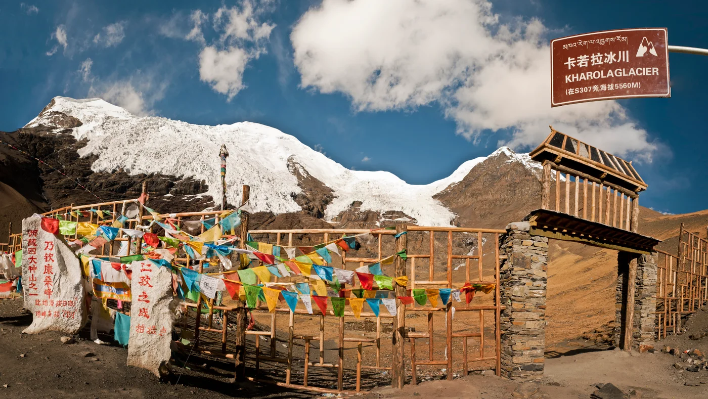

# 去西藏，看雪山与湖泊 · 措勤转线攻略

2026-09-25—2026-10-04 · 10 天 9 晚 · 2026-10-06 更新

2026 年 9 月 25 日至 10 月 4 日，共 10 天 9 晚。实际住宿已核对：9/30 为文布南村琼宗湖景驿站，10/1 班戈华庭，10/2—3 拉萨如家。各日公里数按实际酒店和攻略途经点重新核算，10/4 乘 TV9949 返回杭州。

## 航班

- 9/25：TV9950，原订单10:05杭州萧山T3 → 16:30拉萨贡嘎T3。
- 10/4：TV9949，拉萨 → 杭州，改期后起降时刻与航站楼未提供，以票面为准。

## 全程概览

| 日期 | 主要路线 / 自驾公里数 | 实际住宿 | 穿衣 / 随身重点 |
| --- | --- | --- | --- |
| 2026-09-25 周五 | 杭州萧山 T3 → 拉萨贡嘎 T3 → 拉萨市区 61.5 公里 | 亚朵酒店（拉萨万达广场市政府店） | 长袖打底＋轻外套；外层雨具放在随身包。 随身：身份证、租车资料、常用药、饮水 |
| 2026-09-26 周六 | 亚朵酒店(拉萨万达广场市政府店) → 鲁日拉观景台 → 卡若拉冰川停车场 → 康马维纳斯酒店 390.2 公里 | 康马维纳斯富氧酒店 | 保暖中层＋防风防雨外壳；山口加羽绒、帽子和手套。 随身：边境通行证、路餐、保温水、防晒 |
| 2026-09-27 周日 | 康马维纳斯酒店 → 西林观景台 → 加乌拉山口观景平台 → 定日县珠穆朗玛国际酒店 421.7 公里 | 珠穆朗玛国际酒店 | 抓绒或薄羽绒＋防风外套；观景台戴帽子手套。 随身：证件、保温杯、路餐、充电线 |
| 2026-09-28 周一 | 定日县珠穆朗玛国际酒店 → 珠峰景区环保车换乘中心 → 珠峰古堡停车场 → 佩枯错希峰观景台 → 如家酒店(萨嘎店) 408.9 公里 | 如家酒店（萨嘎店） | 羽绒＋防风壳，保暖裤、帽子、手套；换乘时随身携带。 随身：证件、景区凭证、路餐、热水 |
| 2026-09-29 周二 | 如家酒店(萨嘎店) → 锦江之星酒店(阿里措勤国道216店) 286.6 公里 | 锦江之星酒店（阿里措勤国道216店） | 保暖中层＋防风防水外层；山口与停车时备羽绒、帽子、手套。 随身：身份证、边境通行证、路餐、热水、离线地图、车辆救援联系方式、防滑装备 |
| 2026-09-30 周三 | 锦江之星酒店（阿里措勤国道216店） → 扎日南木措北岸 → 文布南村／当惹雍错 → 琼宗湖景驿站 274.9 公里 | 琼宗湖景驿站 | 羽绒＋防风外套，湖边加帽子手套；雨具放随身包。 随身：路餐、热水、证件、离线地图、充电设备 |
| 2026-10-01 周四 | 琼宗湖景驿站（文布南村） → 尼玛 → 色林措 → 华庭酒店（那曲班戈店） 453.1 公里 | 华庭酒店（那曲班戈店） | 保暖中层＋防风防水外壳，帽子与手套随手可取。 随身：饮水、路餐、防晒、充电宝、离线地图 |
| 2026-10-02 周五 | 班戈县 → 纳木措开放观景区（与圣象天门二选一） → 拉萨市 377.7 公里 | 如家酒店·neo（拉萨布达拉宫广场店） | 湖边继续保暖防风；回拉萨后按体感分层穿脱。 随身：身份证、预约凭证、路餐、保温水、离线地图、酒店联系方式 |
| 2026-10-03 周六 | 拉萨市区 市区用车未计入 | 如家酒店·neo（拉萨布达拉宫广场店） | 长袖＋可脱外套，准备舒适步行鞋。 随身：身份证、水、防晒、充电设备 |
| 2026-10-04 周日 | 如家酒店·neo（拉萨布达拉宫广场店） → 拉萨贡嘎机场 → 杭州萧山机场 57.8 公里 | 返程 | 方便穿脱的长袖与外套，厚衣按需要收纳。 随身：身份证、实际机票、还车资料、充电宝 |

### 每日自驾公里数

高德查询日期：2026-10-06。实际酒店已核对，景点沿用攻略途经点；公里数为2026-10-06高德当前默认驾车规划，不是历史车辆轨迹或里程表；10/2暂沿用纳木措游客集散中心停车场口径；圣象天门路线单列供确认；9月25日及10月4日统一以贡嘎机场T3航站楼为机场端点，实际提还车门店绕行另计；10/3市区驾车路线未提供，未计入汇总；珠峰及纳木措均以换乘停车点计，自驾里程不包括其后的景区接驳车。

| 日期 | 导航路线 | 公里数 | 依据 |
| --- | --- | ---: | --- |
| 2026-09-25 | 拉萨贡嘎国际机场T3航站楼 → 亚朵酒店(拉萨万达广场市政府店) | 61.5 | [高德路线](https://www.amap.com/ssr/dir?from=home&type=0&fname=%E6%8B%89%E8%90%A8%E8%B4%A1%E5%98%8E%E5%9B%BD%E9%99%85%E6%9C%BA%E5%9C%BAT3%E8%88%AA%E7%AB%99%E6%A5%BC&flat=29.289247&flon=90.895441&fid=B0FFLHIUL6&fpoitype=150104&dname=%E4%BA%9A%E6%9C%B5%E9%85%92%E5%BA%97%28%E6%8B%89%E8%90%A8%E4%B8%87%E8%BE%BE%E5%B9%BF%E5%9C%BA%E5%B8%82%E6%94%BF%E5%BA%9C%E5%BA%97%29&dlat=29.658296&dlon=91.156726&did=B0HU15BWOA&dpoitype=100100&policy=1) |
| 2026-09-26 | 亚朵酒店(拉萨万达广场市政府店) → 鲁日拉观景台 → 卡若拉冰川停车场 → 康马维纳斯酒店 | 390.2 | [高德路线](https://www.amap.com/ssr/dir?from=home&type=0&fname=%E4%BA%9A%E6%9C%B5%E9%85%92%E5%BA%97%28%E6%8B%89%E8%90%A8%E4%B8%87%E8%BE%BE%E5%B9%BF%E5%9C%BA%E5%B8%82%E6%94%BF%E5%BA%9C%E5%BA%97%29&flat=29.658296&flon=91.156726&fid=B0HU15BWOA&fpoitype=100100&dname=%E5%BA%B7%E9%A9%AC%E7%BB%B4%E7%BA%B3%E6%96%AF%E9%85%92%E5%BA%97&dlat=28.558874&dlon=89.677379&did=B0L3AUVE6P&dpoitype=100100&policy=1&vname=%E9%B2%81%E6%97%A5%E6%8B%89%E8%A7%82%E6%99%AF%E5%8F%B0%7C%E5%8D%A1%E8%8B%A5%E6%8B%89%E5%86%B0%E5%B7%9D%E5%81%9C%E8%BD%A6%E5%9C%BA&vlat=29.037311%7C28.895750&vlon=90.922754%7C90.165786&vid=B0HANZNTL5%7CB0GUO75N8C) |
| 2026-09-27 | 康马维纳斯酒店 → 西林观景台 → 加乌拉山口观景平台 → 定日县珠穆朗玛国际酒店 | 421.7 | [高德路线](https://www.amap.com/ssr/dir?from=home&type=0&fname=%E5%BA%B7%E9%A9%AC%E7%BB%B4%E7%BA%B3%E6%96%AF%E9%85%92%E5%BA%97&flat=28.558874&flon=89.677379&fid=B0L3AUVE6P&fpoitype=100100&dname=%E5%AE%9A%E6%97%A5%E5%8E%BF%E7%8F%A0%E7%A9%86%E6%9C%97%E7%8E%9B%E5%9B%BD%E9%99%85%E9%85%92%E5%BA%97&dlat=28.629200&dlon=87.177734&did=B0KR6OY1D2&dpoitype=100100&policy=1&vname=%E8%A5%BF%E6%9E%97%E8%A7%82%E6%99%AF%E5%8F%B0%7C%E5%8A%A0%E4%B9%8C%E6%8B%89%E5%B1%B1%E5%8F%A3%E8%A7%82%E6%99%AF%E5%B9%B3%E5%8F%B0&vlat=28.474818%7C28.499393&vlon=87.702591%7C87.070059&vid=B0FFKJWFPH%7CB0L2BLLTOX) |
| 2026-09-28 | 定日县珠穆朗玛国际酒店 → 珠峰景区环保车换乘中心 → 珠峰古堡停车场 → 佩枯错希峰观景台 → 如家酒店(萨嘎店) | 408.9 | [高德路线](https://www.amap.com/ssr/dir?from=home&type=0&fname=%E5%AE%9A%E6%97%A5%E5%8E%BF%E7%8F%A0%E7%A9%86%E6%9C%97%E7%8E%9B%E5%9B%BD%E9%99%85%E9%85%92%E5%BA%97&flat=28.629200&flon=87.177734&fid=B0KR6OY1D2&fpoitype=100100&dname=%E5%A6%82%E5%AE%B6%E9%85%92%E5%BA%97%28%E8%90%A8%E5%98%8E%E5%BA%97%29&dlat=29.331318&dlon=85.234727&did=B0L14O33QN&dpoitype=100000&policy=1&vname=%E7%8F%A0%E5%B3%B0%E6%99%AF%E5%8C%BA%E7%8E%AF%E4%BF%9D%E8%BD%A6%E6%8D%A2%E4%B9%98%E4%B8%AD%E5%BF%83%7C%E7%8F%A0%E5%B3%B0%E5%8F%A4%E5%A0%A1%E5%81%9C%E8%BD%A6%E5%9C%BA%7C%E4%BD%A9%E6%9E%AF%E9%94%99%E5%B8%8C%E5%B3%B0%E8%A7%82%E6%99%AF%E5%8F%B0&vlat=28.423855%7C28.580182%7C28.872316&vlon=87.025200%7C86.516101%7C85.655333&vid=B0JD0HNNV9%7CB0K1KDB778%7CB0HUA590SE) |
| 2026-09-29 | 如家酒店(萨嘎店) → 锦江之星酒店(阿里措勤国道216店) | 286.6 | [高德路线](https://www.amap.com/ssr/dir?from=home&type=0&fname=%E5%A6%82%E5%AE%B6%E9%85%92%E5%BA%97%28%E8%90%A8%E5%98%8E%E5%BA%97%29&flat=29.331318&flon=85.234727&fid=B0L14O33QN&fpoitype=100000&dname=%E9%94%A6%E6%B1%9F%E4%B9%8B%E6%98%9F%E9%85%92%E5%BA%97%28%E9%98%BF%E9%87%8C%E6%8E%AA%E5%8B%A4%E5%9B%BD%E9%81%93216%E5%BA%97%29&dlat=31.019946&dlon=85.151803&did=B0LA31F2O0&dpoitype=100100&policy=1) |
| 2026-09-30 | 锦江之星酒店(阿里措勤国道216店) → 扎日南木措北岸观景台 → 尼玛琼宗湖景驿站 | 274.9 | [高德路线](https://www.amap.com/ssr/dir?from=home&type=0&fname=%E9%94%A6%E6%B1%9F%E4%B9%8B%E6%98%9F%E9%85%92%E5%BA%97(%E9%98%BF%E9%87%8C%E6%8E%AA%E5%8B%A4%E5%9B%BD%E9%81%93216%E5%BA%97)&flat=31.019946&flon=85.151803&fid=B0LA31F2O0&fpoitype=100100&dname=%E5%B0%BC%E7%8E%9B%E7%90%BC%E5%AE%97%E6%B9%96%E6%99%AF%E9%A9%BF%E7%AB%99&dlat=31.340374&dlon=86.757124&did=B0IUTK0X0R&policy=1&vname=%E6%89%8E%E6%97%A5%E5%8D%97%E6%9C%A8%E6%8E%AA%E5%8C%97%E5%B2%B8%E8%A7%82%E6%99%AF%E5%8F%B0&vlat=31.031001&vlon=85.636776&vid=B0GRRSJIJ7) |
| 2026-10-01 | 尼玛琼宗湖景驿站 → 色林错观景台 → 华庭酒店(那曲班戈店) | 453.1 | [高德路线](https://www.amap.com/ssr/dir?from=home&type=0&fname=%E5%B0%BC%E7%8E%9B%E7%90%BC%E5%AE%97%E6%B9%96%E6%99%AF%E9%A9%BF%E7%AB%99&flat=31.340374&flon=86.757124&fid=B0IUTK0X0R&fpoitype=100100&dname=%E5%8D%8E%E5%BA%AD%E9%85%92%E5%BA%97%28%E9%82%A3%E6%9B%B2%E7%8F%AD%E6%88%88%E5%BA%97%29&dlat=31.403426&dlon=90.027663&did=B0LGAZMYB1&dpoitype=100100&policy=1&vname=%E8%89%B2%E6%9E%97%E9%94%99%E8%A7%82%E6%99%AF%E5%8F%B0&vlat=31.694154&vlon=88.750963&vid=B0L1DRV20D) |
| 2026-10-02 | 华庭酒店(那曲班戈店) → 纳木错游客集散中心地上停车场 → 如家酒店·neo(拉萨布达拉宫广场店) | 377.7 | [高德路线](https://www.amap.com/ssr/dir?from=home&type=0&fname=华庭酒店%28那曲班戈店%29&flat=31.403426&flon=90.027663&fid=B0LGAZMYB1&fpoitype=100100&dname=如家酒店·neo%28拉萨布达拉宫广场店%29&dlat=29.651190&dlon=91.122185&did=B0FFJGJRKZ&dpoitype=100105&policy=1&vname=纳木错游客集散中心地上停车场&vlat=30.733875&vlon=91.089075&vid=B0MAD1JUON) |
| 2026-10-03 | 拉萨市区活动，路线未提供 | 未计入 | 不按 0 公里处理 |
| 2026-10-04 | 如家酒店·neo（拉萨布达拉宫广场店） → 拉萨贡嘎国际机场T3航站楼 | 57.8 | [高德路线](https://www.amap.com/ssr/dir?from=home&type=0&fname=如家酒店·neo%28拉萨布达拉宫广场店%29&flat=29.651190&flon=91.122185&fid=B0FFJGJRKZ&fpoitype=100105&dname=拉萨贡嘎国际机场T3航站楼&dlat=29.289247&dlon=90.895441&did=B0FFLHIUL6&dpoitype=150104&policy=1) |
| **合计** | **已列路线** | **2,732.4** | 当前导航规划 |

其中机场往返 119.3 公里，不含机场的环线 2,613.1 公里。

**10/2 若途经圣象天门停车场**：当天 490.2 公里，替换后全程 **2,844.9 公里**。[高德路线](https://www.amap.com/ssr/dir?from=home&type=0&fname=%E5%8D%8E%E5%BA%AD%E9%85%92%E5%BA%97(%E9%82%A3%E6%9B%B2%E7%8F%AD%E6%88%88%E5%BA%97)&flat=31.403426&flon=90.027663&fid=B0LGAZMYB1&fpoitype=100100&dname=%E5%A6%82%E5%AE%B6%E9%85%92%E5%BA%97%C2%B7neo(%E6%8B%89%E8%90%A8%E5%B8%83%E8%BE%BE%E6%8B%89%E5%AE%AB%E5%B9%BF%E5%9C%BA%E5%BA%97)&dlat=29.65119&dlon=91.122185&did=B0FFJGJRKZ&dpoitype=100105&policy=1&vname=%E8%A5%BF%E8%97%8F%E7%BA%B3%E6%9C%A8%E9%94%99%E8%87%AA%E7%84%B6%E4%BF%9D%E6%8A%A4%E5%8C%BA%E5%9C%A3%E8%B1%A1%E5%A4%A9%E9%97%A8%E5%81%9C%E8%BD%A6%E5%9C%BA&vlat=30.820352&vlon=90.510277&vid=B0HGCSJ3NA)。实际到访及停车方式待用户确认，本路线暂不替换上次采用的纳木措游客集散中心口径；不同时叠加两条线路。

- 2026-09-25：按机场T3至酒店计算，实际租车提车点未单独提供。
- 2026-09-26：完整多途经路线，一次规划读取，非分段估算。
- 2026-09-27：完整多途经路线。截图确认第一项蓝框选中421.7公里；第二项442.9公里虽耗时较短，仍采用默认第一推荐方案。
- 2026-09-28：珠峰景区环保车换乘中心为自驾到达点，不含换乘中心至大本营的接驳车里程。
- 2026-09-29：沿G216北上，未额外加入达格架喷泉或草帽山。
- 2026-09-30：默认第一条蓝框选中路线，途经604县道、652乡道、205省道。截图已核验。第二条备选230公里5小时6分未采用。直接以村内酒店作为文布南村到达点，不额外绕行公益电影放映点。
- 2026-10-01：从文布南村实际入住酒店出发，经色林错317国道北侧观景台到班戈；高德当前仅显示一条推荐路线453.1公里。未绕行原拟尼玛县城尚客优。
- 2026-10-02：纳木措采用当雄县206省道与当亚线交叉口北420米的游客集散中心停车场，之后至扎西半岛的景区接驳车不计入自驾。高德默认推荐377.7公里，备选393.7、397.6公里。
- 2026-10-04：机场按T3航站楼规划；尚未指定实际租车还车门店，门店绕行及接驳不在此数内。

## 天气与穿衣

按行程日期和地点匹配旧资料；有数值的是原日期预报快照，不代表实际经历的天气。改期后的措勤、文布南村、班戈和纳木措等地点没有对应数据时留空，旧日期温度不平移。县域参考不等于湖岸、山口和酒店实测；日最低温也不是指定时段的实测最低温。

| 日期 / 地点 | 数据类型 | 天气 | 最高 / 最低 | 风力 | 来源与原核对时间 |
| --- | --- | --- | --- | --- | --- |
| 2026-09-25 拉萨贡嘎机场 | 原日期预报快照 | 阵雨转多云 | 17 / 6℃ | 东北风 3级 | [墨迹](https://tianqi.moji.com/today/china/tibet/gonggar-county)；2026-09-25 06:13:04.593+08:00；贡嘎县预报作为机场区域参考。 |
| 2026-09-25 拉萨市区 / 拉萨住宿 | 原日期预报快照 | 阵雨转多云 | 18 / 7℃ | 西南风 2级 | [墨迹](https://tianqi.moji.com/today/china/tibet/lhasa)；2026-09-25 06:13:02.736+08:00；拉萨市区预报。 |
| 2026-09-26 拉萨市区 | 未取得对应日期数据 | 未取得 | — / — | 未取得 | [墨迹天气查询入口](https://tianqi.moji.com/today/china/tibet/lhasa)；未记录；资料中没有当前行程日期与此地点相匹配的预报记录，数值留空。 |
| 2026-09-26 鲁日拉观景台 | 原日期预报快照 | 多云 | 15 / 2℃ | 东南风 2级 | [墨迹](https://tianqi.moji.com/today/china/tibet/langkazi-county)；2026-09-25 06:13:06.243+08:00；县区级参考，不等同于景点或酒店门口预报；山口、冰川与湖岸体感需现场复核。 |
| 2026-09-26 卡若拉冰川 | 原日期预报快照 | 多云 | 15 / 2℃ | 东南风 2级 | [墨迹](https://tianqi.moji.com/today/china/tibet/langkazi-county)；2026-09-25 06:13:06.243+08:00；县区级参考，不等同于景点或酒店门口预报；山口、冰川与湖岸体感需现场复核。 |
| 2026-09-26 康马住宿 | 原日期预报快照 | 多云 | 14 / 3℃ | 南风 3级 | [墨迹](https://tianqi.moji.com/today/china/tibet/kangmar-county)；2026-09-25 06:13:07.991+08:00；康马县预报，供当晚两家酒店参考。 |
| 2026-09-27 康马出发 | 原日期预报快照 | 多云转晴 | 15 / 2℃ | 西南风 3级 | [墨迹](https://tianqi.moji.com/today/china/tibet/kangmar-county)；2026-09-25 06:13:07.991+08:00；康马县预报。 |
| 2026-09-27 西林观景台 | 原日期预报快照 | 阴转晴 | 15 / 0℃ | 西南风 3级 | [墨迹](https://tianqi.moji.com/today/china/tibet/dingjie-county)；2026-09-25 06:13:28.793+08:00；县区级参考，不等同于景点或酒店门口预报；山口、冰川与湖岸体感需现场复核。 |
| 2026-09-27 加乌拉山口 | 原日期预报快照 | 阴 | 14 / 1℃ | 东南风 2级 | [墨迹](https://tianqi.moji.com/today/china/tibet/tingri-county)；2026-09-25 06:13:30.444+08:00；县区级参考，不等同于景点或酒店门口预报；山口、冰川与湖岸体感需现场复核。 |
| 2026-09-27 定日白坝住宿 | 原日期预报快照 | 阴 | 14 / 1℃ | 东南风 2级 | [墨迹](https://tianqi.moji.com/today/china/tibet/tingri-county)；2026-09-25 06:13:30.444+08:00；定日县级预报供白坝珠穆朗玛国际酒店住宿参考；县级旧快照并非酒店实时天气。 |
| 2026-09-28 定日白坝 | 未取得对应日期数据 | 未取得 | — / — | 未取得 | [墨迹天气查询入口](https://tianqi.moji.com/today/china/tibet/tingri-county)；未记录；资料中没有当前行程日期与此地点相匹配的预报记录，数值留空。 |
| 2026-09-28 珠峰大本营 | 原日期预报快照 | 少云 | 16 / 0℃ | 东南风 3级 | [墨迹](https://tianqi.moji.com/today/china/tibet/qomolangma-national-nature-reserve)；2026-09-25 06:13:32.187+08:00；墨迹珠峰保护区天气点参考，不是 5,200 m 大本营实测，也不是峰顶天气。 |
| 2026-09-28 珠峰古堡遗址 | 原日期预报快照 | 多云 | 15 / 0℃ | 东南风 3级 | [墨迹](https://tianqi.moji.com/today/china/tibet/tingri-county)；2026-09-25 06:13:30.444+08:00；县区级参考，不等同于景点或酒店门口预报；山口、冰川与湖岸体感需现场复核。 |
| 2026-09-28 佩枯措 | 原日期预报快照 | 多云转晴 | 12 / 0℃ | 西南风 1级 | [墨迹](https://tianqi.moji.com/today/china/tibet/gyirong-county)；2026-09-25 06:13:34.338+08:00；县区级参考，不等同于景点或酒店门口预报；山口、冰川与湖岸体感需现场复核。 |
| 2026-09-28 萨嘎住宿 | 原日期预报快照 | 多云转晴 | 12 / -1℃ | 南风 3级 | [墨迹](https://tianqi.moji.com/today/china/tibet/saga-county)；2026-09-25 06:14:26.028+08:00；萨嘎县预报。 |
| 2026-09-29 萨嘎出发 | 原日期预报快照 | 晴 | 14 / -3℃ | 西南风 3级 | [墨迹](https://tianqi.moji.com/today/china/tibet/saga-county)；2026-09-25 06:14:26.028+08:00；萨嘎县预报。 |
| 2026-09-29 措勤县 | 未取得对应日期数据 | 未取得 | — / — | 未取得 | [墨迹天气（待核实）](https://tianqi.moji.com/today/china/tibet/cuoqin-county)；2026-09-29 10:12:43+08:00；未取得新行程日期对应的天气页面数据；此链接仅为查询入口。 |
| 2026-09-30 措勤县 | 未取得对应日期数据 | 未取得 | — / — | 未取得 | [墨迹天气查询入口](https://tianqi.moji.com/today/china/tibet/cuoqin-county)；未记录；资料中没有当前行程日期与此地点相匹配的预报记录，数值留空。 |
| 2026-09-30 扎日南木措北岸 | 未取得对应日期数据 | 未取得 | — / — | 未取得 | [墨迹天气查询入口](https://tianqi.moji.com/today/china/tibet/cuoqin-county)；未记录；资料中没有当前行程日期与此地点相匹配的预报记录，数值留空。 |
| 2026-09-30 文布南村（尼玛县） | 未取得对应日期数据 | 未取得 | — / — | 未取得 | [墨迹天气（待核实）](https://tianqi.moji.com/today/china/tibet/nyinma-county)；2026-09-29 10:12:43+08:00；实际住宿为文布南村琼宗湖景驿站；链接仅为尼玛县天气查询入口，未取得村内当日预报，不以县城天气代替湖岸现场。 |
| 2026-10-01 文布南村／当惹雍措 | 未取得对应日期数据 | 未取得 | — / — | 未取得 | [墨迹天气查询入口](https://tianqi.moji.com/today/china/tibet/nyinma-county)；未记录；资料中没有当前行程日期与此地点相匹配的预报记录，数值留空。 |
| 2026-10-01 尼玛县 | 未取得对应日期数据 | 未取得 | — / — | 未取得 | [墨迹天气查询入口](https://tianqi.moji.com/today/china/tibet/nyinma-county)；未记录；资料中没有当前行程日期与此地点相匹配的预报记录，数值留空。 |
| 2026-10-01 色林措 | 未取得对应日期数据 | 未取得 | — / — | 未取得 | [墨迹天气查询入口](https://tianqi.moji.com/today/china/tibet/baingoin-county)；未记录；资料中没有当前行程日期与此地点相匹配的预报记录，数值留空。 |
| 2026-10-01 班戈县 | 未取得对应日期数据 | 未取得 | — / — | 未取得 | [墨迹天气（待核实）](https://tianqi.moji.com/today/china/tibet/baingoin-county)；2026-09-29 10:12:43+08:00；未取得新行程日期对应的天气页面数据；此链接仅为查询入口。 |
| 2026-10-02 班戈县 | 未取得对应日期数据 | 未取得 | — / — | 未取得 | [墨迹天气查询入口](https://tianqi.moji.com/today/china/tibet/baingoin-county)；未记录；资料中没有当前行程日期与此地点相匹配的预报记录，数值留空。 |
| 2026-10-02 圣象天门（路线备选） | 未取得对应日期数据 | 未取得 | — / — | 未取得 | [墨迹天气查询入口](https://tianqi.moji.com/today/china/tibet/shengxiang-tianmen)；未记录；资料中没有当前行程日期与此地点相匹配的预报记录，数值留空。 |
| 2026-10-02 拉萨市 | 未取得对应日期数据 | 未取得 | — / — | 未取得 | [墨迹天气（待核实）](https://tianqi.moji.com/today/china/tibet/lhasa)；2026-09-29 10:12:43+08:00；未取得新行程日期对应的天气页面数据；此链接仅为查询入口。 |
| 2026-10-02 纳木措国家公园 | 未取得对应日期数据 | 未取得 | — / — | 未取得 | [墨迹天气（待核实）](https://tianqi.moji.com/today/china/tibet/namtso-national-park)；2026-09-29 10:12:43+08:00；未取得新行程日期对应的天气页面数据；景区开放与道路放行须另行确认。 |
| 2026-10-03 拉萨市区 | 未取得对应日期数据 | 未取得 | — / — | 未取得 | [墨迹天气查询入口](https://tianqi.moji.com/today/china/tibet/lhasa)；未记录；资料中没有当前行程日期与此地点相匹配的预报记录，数值留空。 |
| 2026-10-04 拉萨市区 | 未取得对应日期数据 | 未取得 | — / — | 未取得 | [墨迹天气查询入口](https://tianqi.moji.com/today/china/tibet/lhasa)；未记录；资料中没有当前行程日期与此地点相匹配的预报记录，数值留空。 |
| 2026-10-04 拉萨贡嘎机场 | 未取得对应日期数据 | 未取得 | — / — | 未取得 | [墨迹天气查询入口](https://tianqi.moji.com/today/china/tibet/gonggar-county)；未记录；资料中没有当前行程日期与此地点相匹配的预报记录，数值留空。 |

## 每日行程

住宿按实际记录确认；景点玩法和时间窗为路线资料，未逐项确认是否到访。

### D0 · 2026-09-25 周五｜落地拉萨，把节奏放慢

杭州萧山 T3 → 拉萨贡嘎 T3 → 拉萨市区

高德驾车规划 61.5 公里（2026-10-06 查询）。按实际酒店和所列途经点查询当前推荐路线；不代表历史实驶里程。按机场T3至酒店计算，实际租车提车点未单独提供。

穿衣：长袖打底＋轻外套；外层雨具放在随身包。

随身：身份证、租车资料、常用药、饮水

#### 当晚住宿｜亚朵酒店（拉萨万达广场市政府店）

2026-09-25 入住—2026-09-26 退房；已入住（实际住宿记录确认）。

高级双床房 · 1 晚 / 1 间 · 弥散供氧 + 鼻吸；高级大床房 · 1 晚 / 1 间 · 弥散供氧 + 鼻吸

早餐：每间2份，共4份。

**酒店外观**

[图片来源](https://hotels.ctrip.com/hotels/80400198.html) · 酒店 / 携程图片库（远程引用，版权保留）

**高级双床房**

[图片来源](https://hotels.ctrip.com/hotels/80400198.html) · 酒店 / 携程图片库（远程引用，版权保留）

**高级大床房**

[图片来源](https://hotels.ctrip.com/hotels/80400198.html) · 酒店 / 携程图片库（远程引用，版权保留）

| 时间窗 | 安排 | 说明 |
| --- | --- | --- |
| 10:05—16:30 | 原计划：西藏航空 TV9950 | 杭州萧山 T3 出发，拉萨贡嘎 T3 抵达。航班信息沿用订单，临行查航司通知。 |
| 16:30—18:00 | 原计划：取行李、取车 | 拍摄车况，确认油量、轮胎与救援联系方式；到达延误时顺延，不加景点。 |
| 18:00 后 | 原计划：前往亚朵、吃饭与休息 | 提前联系酒店确认入住与供氧使用方式，晚上不安排夜游。 |

**当天取舍：** 用户已确认本晚实际入住亚朵酒店（拉萨万达广场市政府店）；当日景点与游览完成情况尚未逐项确认，保留原计划供回顾。

### D1 · 2026-09-26 周六｜越过山口，走向喜马拉雅

亚朵酒店(拉萨万达广场市政府店) → 鲁日拉观景台 → 卡若拉冰川停车场 → 康马维纳斯酒店

高德驾车规划 390.2 公里（2026-10-06 查询）。按实际酒店和所列途经点查询当前推荐路线；不代表历史实驶里程。完整多途经路线，一次规划读取，非分段估算。

穿衣：保暖中层＋防风防雨外壳；山口加羽绒、帽子和手套。

随身：边境通行证、路餐、保温水、防晒

#### 鲁日拉观景台｜短停 · 20–30 分钟

挑能见度好的方向看羊湖与群山；在开放观景区域短停，不为机位继续向高处攀爬。

[图片来源](https://you.ctrip.com/sight/nagarzecounty2438/133987626.html) · 携程旅行 · 游客实景照片

[小红书搜索入口](https://www.xiaohongshu.com/search_result?keyword=%E9%B2%81%E6%97%A5%E6%8B%89%E8%A7%82%E6%99%AF%E5%8F%B0%20%E6%94%BB%E7%95%A5)

#### 卡若拉冰川｜短停 · 20–30 分钟

在开放平台看冰舌与山体纹理，长焦拍局部即可；不要进入冰川或施工区。

[图片来源](https://www.flickr.com/photos/40977627@N02/6420617305/) · Göran Höglund (Kartläsarn) · CC BY 2.0 · [CC BY 2.0](https://creativecommons.org/licenses/by/2.0/)

照片摄于 2011 年，冰川现状可能不同。

[小红书搜索入口](https://www.xiaohongshu.com/search_result?keyword=%E5%8D%A1%E8%8B%A5%E6%8B%89%E5%86%B0%E5%B7%9D%20%E6%94%BB%E7%95%A5)

#### 当晚住宿｜康马维纳斯富氧酒店

2026-09-26 入住—2026-09-27 退房；已入住（实际住宿记录确认）。

舒适供氧双床房 · 1 晚 / 1 间 · 弥散式供氧；舒适供氧大床房 · 1 晚 / 1 间 · 弥散式供氧

早餐：无。

**酒店外观**

[图片来源](https://hotels.ctrip.com/hotels/25266075.html) · 酒店 / 携程图片库（远程引用，版权保留）

**舒适供氧双床房**

[图片来源](https://hotels.ctrip.com/hotels/25266075.html) · 酒店 / 携程图片库（远程引用，版权保留）

**舒适供氧大床房**

[图片来源](https://hotels.ctrip.com/hotels/25266075.html) · 酒店 / 携程图片库（远程引用，版权保留）

| 时间窗 | 安排 | 说明 |
| --- | --- | --- |
| 08:00 前后 | 原计划：早餐后出发 | 按天气和身体状态安排出发；导航公里数已更新，原时间窗只作游览计划留档。 |
| 上午 | 原计划：鲁日拉短停 20–30 分钟 | 只到正式开放观景区，能见度差就直接继续，不额外爬高找机位。 |
| 中午—下午 | 原计划：午餐、卡若拉短停 | 午餐与休息合计至少留 1 小时；卡若拉控制在 20–30 分钟。 |
| 傍晚 | 原计划：康马酒店入住 | 原参考驾驶时间不含景点、吃饭与检查站；出现延误先删观景停留。 |

**当天取舍：** 用户已确认本晚实际入住康马维纳斯富氧酒店；当日景点与游览完成情况尚未逐项确认，保留原计划供回顾。

### D2 · 2026-09-27 周日｜在加乌拉，看群峰并肩

康马维纳斯酒店 → 西林观景台 → 加乌拉山口观景平台 → 定日县珠穆朗玛国际酒店

高德驾车规划 421.7 公里（2026-10-06 查询）。按实际酒店和所列途经点查询当前推荐路线；不代表历史实驶里程。完整多途经路线。截图确认第一项蓝框选中421.7公里；第二项442.9公里虽耗时较短，仍采用默认第一推荐方案。

穿衣：抓绒或薄羽绒＋防风外套；观景台戴帽子手套。

随身：证件、保温杯、路餐、充电线

#### 西林观景台｜顺路 · 20–30 分钟

远眺喜马拉雅雪山群，云厚时不久等。先确认定结县的正确观景点，别与同名地点混淆。

[图片来源](https://rikaze.xzdw.gov.cn/xwzx_455/tp/202505/t20250506_568134.html) · 文明日喀则 / 中共日喀则市委网站

[小红书搜索入口](https://www.xiaohongshu.com/search_result?keyword=%E8%A5%BF%E6%9E%97%E8%A7%82%E6%99%AF%E5%8F%B0%20%E6%94%BB%E7%95%A5)

#### 加乌拉山口｜重点 · 30–40 分钟

在正规停车区拍雪山群峰与弯道层次；能见度不足就缩短，不在道路中间停车。

[图片来源](https://www.greattibettour.com/tibet-tour/lhasa-gyantse-shigatse-everest-namtso-group-tour-471) · Great Tibet Tour · 原摄影者

[小红书搜索入口](https://www.xiaohongshu.com/search_result?keyword=%E5%8A%A0%E4%B9%8C%E6%8B%89%E5%B1%B1%E5%8F%A3%20%E6%94%BB%E7%95%A5)

#### 当晚住宿｜珠穆朗玛国际酒店

2026-09-27 入住—2026-09-28 退房；已入住（实际住宿记录确认）。

天际富氧双床房 · 1 晚 / 1 间 · 加湿器＋弥散式供氧；天际富氧大床房 · 1 晚 / 1 间 · 加湿器＋弥散式供氧

早餐：2份/间。

地址：定日协格尔镇白坝村白坝大道白坝派出所西南190米

**酒店外观**

图片待核实：尚无可确认对应酒店与房型的实拍资料。

**天际富氧双床房**

图片待核实：尚无可确认对应酒店与房型的实拍资料。

**天际富氧大床房**

图片待核实：尚无可确认对应酒店与房型的实拍资料。

| 时间窗 | 安排 | 说明 |
| --- | --- | --- |
| 08:00 前后 | 原计划：离开康马 | 当晚主住定日协格尔镇白坝村珠穆朗玛国际酒店；巴松村维也纳仅为备选。保留西林、加乌拉计划，出发前按新住宿地复核观景顺序与次日珠峰换乘时间。 |
| 上午—中午 | 原计划：西林观景、午餐 | 西林控制 20–30 分钟；用餐和途中休息留足，不连续久驾。 |
| 下午 | 原计划：加乌拉山口 30–40 分钟 | 晴好时看雪峰群，厚云时不原地久等；只在正规停车区域停靠。 |
| 傍晚 | 原计划：入住珠穆朗玛国际酒店 | 双床、大床各1间，合计¥952.02；准备次日证件和保暖衣，确认从白坝出发到景区的时间。 |

**当天取舍：** 用户已确认本晚实际入住珠穆朗玛国际酒店；当日景点与游览完成情况尚未逐项确认，保留原计划供回顾。

### D3 · 2026-09-28 周一｜看过珠峰，再去湖边

定日县珠穆朗玛国际酒店 → 珠峰景区环保车换乘中心 → 珠峰古堡停车场 → 佩枯错希峰观景台 → 如家酒店(萨嘎店)

高德驾车规划 408.9 公里（2026-10-06 查询）。按实际酒店和所列途经点查询当前推荐路线；不代表历史实驶里程。珠峰景区环保车换乘中心为自驾到达点，不含换乘中心至大本营的接驳车里程。

穿衣：羽绒＋防风壳，保暖裤、帽子、手套；换乘时随身携带。

随身：证件、景区凭证、路餐、热水

#### 珠峰大本营｜重点 · 约 3 小时，含换乘

为景区换乘与排队预留时间，在开放区域看珠峰北壁；不是登山行程，不把日出或金山当作保证。

[图片来源](https://www.tibettour.org/everest-tour/ebc-tours-in-nepal-and-tibet.html) · TibetTour.org · 原摄影者

图为珠峰北坡／绒布寺一带，非营地设施实拍。

[小红书搜索入口](https://www.xiaohongshu.com/search_result?keyword=%E7%8F%A0%E5%B3%B0%E5%A4%A7%E6%9C%AC%E8%90%A5%20%E6%94%BB%E7%95%A5)

#### 珠峰古堡遗址｜可舍弃 · 20–30 分钟

以远景和遗址外观为主。当天珠峰游览延误时直接略过，不额外攀爬遗址。

[图片来源](https://rikaze.xzdw.gov.cn/xwzx_455/qnyw/202412/t20241215_534371.html) · 《守望》参赛作品 / 日喀则新闻中心 / 中共日喀则市委网站

[小红书搜索入口](https://www.xiaohongshu.com/search_result?keyword=%E7%8F%A0%E5%B3%B0%E5%8F%A4%E5%A0%A1%E9%81%97%E5%9D%80%20%E6%94%BB%E7%95%A5)

#### 佩枯措｜短停 · 20–30 分钟

选择一个开放观景点，看湖面与雪山同框；拍够即走，不绕湖寻找重复机位。

[图片来源](https://qa.trip.com/moments/detail/gyirong-120374-137904656?locale=en-QA) · Trip.com · 游客实景照片

[小红书搜索入口](https://www.xiaohongshu.com/search_result?keyword=%E4%BD%A9%E6%9E%AF%E6%8E%AA%20%E6%94%BB%E7%95%A5)

#### 当晚住宿｜如家酒店（萨嘎店）

2026-09-28 入住—2026-09-29 退房；已入住（实际住宿记录确认）。

高级双床房 · 1 晚 / 2 间 · 弥散式供氧

早餐：2份/间，共4份。

**酒店外观**

[图片来源](https://hotels.ctrip.com/hotels/131302999.html) · 酒店 / 携程图片库（远程引用，版权保留）

**高级双床房**

[图片来源](https://hotels.ctrip.com/hotels/131302999.html) · 酒店 / 携程图片库（远程引用，版权保留）

| 时间窗 | 安排 | 说明 |
| --- | --- | --- |
| 景区首班时段 | 原计划：珠峰换乘与观景 | 从定日白坝酒店提前出发，另留到景区的车程；换乘、排队和观景整体预留约 3 小时。 |
| 结束后 | 原计划：午餐并核对剩余车程 | 珠峰结束后再决定古堡和佩枯措能否停靠，不把三个点都作为必达。 |
| 下午 | 原计划：古堡可舍弃，佩枯措短停 | 只在不会压缩行车余量时各停 20–30 分钟；任何延误优先略过古堡。 |
| 入夜前优先 | 原计划：抵达萨嘎、入住如家 | 原参考驾驶时长之外还需游览和休息；若无法安全抵达，立即调整后续而非继续硬赶。 |

**当天取舍：** 用户已确认本晚实际入住如家酒店（萨嘎店）；当日景点与游览完成情况尚未逐项确认，保留原计划供回顾。

### D4 · 2026-09-29 周二｜措勤住宿更新：入住锦江之星

如家酒店(萨嘎店) → 锦江之星酒店(阿里措勤国道216店)

高德驾车规划 286.6 公里（2026-10-06 查询）。按实际酒店和所列途经点查询当前推荐路线；不代表历史实驶里程。沿G216北上，未额外加入达格架喷泉或草帽山。

穿衣：保暖中层＋防风防水外层；山口与停车时备羽绒、帽子、手套。

随身：身份证、边境通行证、路餐、热水、离线地图、车辆救援联系方式、防滑装备

#### 当晚住宿｜锦江之星酒店（阿里措勤国道216店）

2026-09-29 入住—2026-09-30 退房；已入住。

高级大床房 · 1 晚 / 1 间 · 弥散供氧；标准大床房 · 1 晚 / 1 间 · 弥散供氧

早餐：未提供。

**酒店外观**

图片待核实：尚无可确认对应酒店与房型的实拍资料。

**高级大床房**

图片待核实：尚无可确认对应酒店与房型的实拍资料。

**标准大床房**

图片待核实：尚无可确认对应酒店与房型的实拍资料。

| 时间窗 | 安排 | 说明 |
| --- | --- | --- |
| 出发前原计划 | 核实 G216 通行 | 向萨嘎、措勤两端确认小客车通行、山口及放行时段。住宿现已按订单截图更新；入住状态不用于判断全段实时放行。 |
| 天亮后 / 按放行时间 | 萨嘎补给后出发 | 完成加油、饮水与路餐补给，核对车辆及防滑装备；具体出发时间取决于当天路况和剩余日照。 |
| 途中 | 沿确认开放的 G216 转场 | 优先主路，不增加未核实的湖滨支线；在允许停车处休息和用餐。管制或积雪导致延误时，及时重算抵达时间。 |
| 措勤住宿已更新 | 锦江之星：两间房均显示已入住 | 9 月 29 日入住、9 月 30 日退房；高级大床房 ¥536、标准大床房 ¥520，各 1 间，合计 ¥1,056。休息后核对次日文布南村琼宗驿站及湖区道路。 |

**当天取舍：** 9 月 29 日措勤住宿已落实为锦江之星，两笔订单均显示已入住。截图中的行者无疆旅游酒店订单已取消。道路仍按当天交警及检查站指引判断，不由酒店入住状态推定全段放行。

### D5 · 2026-09-30 周三｜住进文布南村，看当惹雍错

锦江之星酒店（阿里措勤国道216店） → 扎日南木措北岸 → 文布南村／当惹雍错 → 琼宗湖景驿站

高德驾车规划 274.9 公里（2026-10-06 查询）。按实际酒店和所列途经点查询当前推荐路线；不代表历史实驶里程。默认第一条蓝框选中路线，途经604县道、652乡道、205省道。截图已核验。第二条备选230公里5小时6分未采用。直接以村内酒店作为文布南村到达点，不额外绕行公益电影放映点。

穿衣：羽绒＋防风外套，湖边加帽子手套；雨具放随身包。

随身：路餐、热水、证件、离线地图、充电设备

#### 扎日南木措｜短停 · 20–30 分钟

按开放入口到北岸观景点，不跟着车辙抄湖滨近路。9 月 30 日当晚住文布南村琼宗湖景驿站，安排好到村时间，再留湖畔慢走与休息的余量。

[图片来源](https://you.ctrip.com/sight/coqen120146/132147.html) · 携程旅行 · 游客实景照片

[小红书搜索入口](https://www.xiaohongshu.com/search_result?keyword=%E6%89%8E%E6%97%A5%E5%8D%97%E6%9C%A8%E6%8E%AA%20%E6%94%BB%E7%95%A5)

#### 文布南村｜重点 · 45–60 分钟

村中慢走，找允许停留的湖景视角，看当惹雍错与村落；拍人和进入院落先征得同意。

[图片来源](https://www.tibet.tw/shenyouali/tibet08.html) · 西藏旅遊網 · 原摄影者

[小红书搜索入口](https://www.xiaohongshu.com/search_result?keyword=%E6%96%87%E5%B8%83%E5%8D%97%E6%9D%91%20%E6%94%BB%E7%95%A5)

#### 当晚住宿｜琼宗湖景驿站

2026-09-30 入住—2026-10-01 退房；已入住（实际住宿记录确认）。

豪华套房 · 1 晚 / 1 间 · 未提供

早餐：未提供。

地址：高德：文部乡文部南村内（安徽人家东南方向100米）

**酒店外观**

图片待核实：尚无可确认对应酒店与房型的实拍资料。

**豪华套房**

图片待核实：尚无可确认对应酒店与房型的实拍资料。

| 时间窗 | 安排 | 说明 |
| --- | --- | --- |
| 早餐后 | 措勤锦江之星出发 | 沿攻略途经扎日南木措北岸，按实际开放道路和天气安排停留。 |
| 途中 | 扎日南木措北岸 | 自驾导航采用北岸观景台；未额外加入美人尖南岸支线。 |
| 下午 | 抵达文布南村／当惹雍错 | 本日终点在文布南村，无需当晚继续赶到尼玛县城。村内观景顺序仍按原路线资料保留。 |
| 实际住宿 | 入住琼宗湖景驿站 | 豪华套房1间、1晚，合计¥952。次日从驿站出发，经尼玛方向向东前往班戈。 |

**当天取舍：** 实际住在文布南村的琼宗湖景驿站，替换原尼玛县城尚客优。扎日南木措北岸与当惹雍错保留为路线资料，景点是否逐点到访未逐项确认。

### D6 · 2026-10-01 周四｜10/1 实际住宿：班戈华庭

琼宗湖景驿站（文布南村） → 尼玛 → 色林措 → 华庭酒店（那曲班戈店）

高德驾车规划 453.1 公里（2026-10-06 查询）。按实际酒店和所列途经点查询当前推荐路线；不代表历史实驶里程。从文布南村实际入住酒店出发，经色林错317国道北侧观景台到班戈；高德当前仅显示一条推荐路线453.1公里。未绕行原拟尼玛县城尚客优。

穿衣：保暖中层＋防风防水外壳，帽子与手套随手可取。

随身：饮水、路餐、防晒、充电宝、离线地图

#### 色林措｜重点 · 30–45 分钟

挑一个开阔的合法观景点看湖色与远山，不沿湖追逐野生动物、不驶入湿地。

[图片来源](https://sg.trip.com/moments/poi-siling-lake-82143/) · Trip.com · 游客实景照片

[小红书搜索入口](https://www.xiaohongshu.com/search_result?keyword=%E8%89%B2%E6%9E%97%E6%8E%AA%20%E6%94%BB%E7%95%A5)

#### 当晚住宿｜华庭酒店（那曲班戈店）

2026-10-01 入住—2026-10-02 退房；已入住；订单已完成。

特惠大床房 · 1 晚 / 1 间 · 供氧（方式未注明）

早餐：无餐食。

**酒店外观**

[图片来源](https://hotels.ctrip.com/hotels/126991866.html) · 酒店 / 携程图片库（远程引用，版权保留）

**特惠大床房**

图片待核实：尚无可确认对应酒店与房型的实拍资料。

| 时间窗 | 安排 | 说明 |
| --- | --- | --- |
| 早餐后 | 从文布南村琼宗湖景驿站出发 | 经尼玛方向向东转场；导航采用色林错317国道北侧观景台，终点为班戈华庭。 |
| 原计划 · 途中 | 原计划：休息、午餐与色林措 | 在一个开放观景点停 30–45 分钟，风雪或转场延误时缩短。 |
| 原计划 · 下午 | 原计划：继续前往班戈 | 不沿湖追机位，不驶入湿地；把检查、休息和抵达余量计入导航之外的总时间。 |
| 订单截图确认 | 华庭 1 间 1 晚，订单已完成 | 10 月 1 日入住、10 月 2 日退房；特惠大床房 1 间，订单 ¥632 扣款成功，无餐食。截图只证实这 1 间，不推定另有第 2 间。 |

**当天取舍：** 实际住宿记录确认华庭 10 月 1 日入住、10 月 2 日退房，特惠大床房 1 间、¥632；原截图另显示订单已完成、扣款成功。色林措等景点是否逐点到访尚未确认；旧订单处理状态另行核实。

### D7 · 2026-10-02 周五｜10/2 实际住宿：拉萨如家两晚

班戈县 → 纳木措开放观景区（与圣象天门二选一） → 拉萨市

高德驾车规划 377.7 公里（2026-10-06 查询）。按实际酒店和所列途经点查询当前推荐路线；不代表历史实驶里程。纳木措采用当雄县206省道与当亚线交叉口北420米的游客集散中心停车场，之后至扎西半岛的景区接驳车不计入自驾。高德默认推荐377.7公里，备选393.7、397.6公里。 若实际走圣象天门停车场，则当日490.2公里、全程合计2844.9公里；实际入口仍待确认，不将两条路线相加。

穿衣：湖边继续保暖防风；回拉萨后按体感分层穿脱。

随身：身份证、预约凭证、路餐、保温水、离线地图、酒店联系方式

#### 纳木措｜重点 · 1–1.5 小时，换乘另计

先决定开放观景区域，再倒推回拉萨的出发时间。扎西岛与圣象天门不要在同一天都深游。

[图片来源](https://www.tibetodysseytours.com/tibet-join-in-group-tours/group09.html) · Tibet Odyssey Tours · 原摄影者

[小红书搜索入口](https://www.xiaohongshu.com/search_result?keyword=%E7%BA%B3%E6%9C%A8%E6%8E%AA%20%E6%94%BB%E7%95%A5)

#### 圣象天门｜条件备选 · 半日量级，含支路往返

9 月 26 日已公告雪后重开，但本次游览日准入仍须确认。东嘎村至三生石原路施工，游客接待中心入口不变，指定绕行单程约 87.5 km、含 35.3 km 一级土路；往返和摆渡需留足时间。

[图片来源](https://wlt.xizang.gov.cn/xccx/lytg/202111/t20211122_270775.html) · 沈虹冰 / 新华社 · 西藏自治区文化和旅游厅

[小红书搜索入口](https://www.xiaohongshu.com/search_result?keyword=%E5%9C%A3%E8%B1%A1%E5%A4%A9%E9%97%A8%20%E6%94%BB%E7%95%A5)

#### 当晚住宿｜如家酒店·neo（拉萨布达拉宫广场店）

2026-10-02 入住—2026-10-04 退房；已入住（实际住宿记录确认）。

高级双床房 · 2 晚 / 2 间 · 弥漫＆鼻吸供氧

早餐：10 月 3 日及 10 月 4 日每间各 2 份早餐；2 间每天合计 4 份。

地址：城关区康昂多南路 8 号

**酒店外观**

图片待核实：尚无可确认对应酒店与房型的实拍资料。

**高级双床房**

图片待核实：尚无可确认对应酒店与房型的实拍资料。

| 时间窗 | 安排 | 说明 |
| --- | --- | --- |
| 原计划 · 早餐后 | 原计划：班戈出发 | 根据前一晚确认的开放入口导航，并倒推离开湖区返回拉萨的时间；不把整片纳木措视为同一停车点。 |
| 原计划 · 上午—中午 | 原计划：选择一次纳木措体验 | 默认开放观景区短游 1–1.5 小时，换乘另计；圣象天门仅在天气、路况、准入和返程余量均确认后替换，按半日量级评估。 |
| 原计划 · 用餐后 / 返城时限前 | 原计划：及时离开湖区 | 若无充分余量，缩短停留或直接走确认开放的道路返城；不叠加扎西岛与圣象天门深游。 |
| 实际住宿记录确认 | 如家 2 间，覆盖 10 月 2—3 日两晚 | 如家酒店·neo（拉萨布达拉宫广场店）10 月 2 日入住、10 月 4 日退房，实际住宿高级双床房 2 间、2 晚合计 ¥1,932。10 月 3 日截图仍为离店待扣款；后续扣款结果未核实。 |

**当天取舍：** 纳木措与圣象天门保留为原条件备选记录，具体游览路线另按实际记录核对。实际住宿已确认拉萨如家 10 月 2—4 日两间两晚；入住事实与付款后续状态分别记录。

### D8 · 2026-10-03 周六｜拉萨休整与返程准备

拉萨市区

市区驾车路线未提供，本日未计入公里数合计

穿衣：长袖＋可脱外套，准备舒适步行鞋。

随身：身份证、水、防晒、充电设备

#### 当晚住宿｜如家酒店·neo（拉萨布达拉宫广场店）

2026-10-02 入住—2026-10-04 退房；已入住（实际住宿记录确认）。

高级双床房 · 2 晚 / 2 间 · 弥漫＆鼻吸供氧

早餐：10 月 3 日及 10 月 4 日每间各 2 份早餐；2 间每天合计 4 份。

地址：城关区康昂多南路 8 号

**酒店外观**

图片待核实：尚无可确认对应酒店与房型的实拍资料。

**高级双床房**

图片待核实：尚无可确认对应酒店与房型的实拍资料。

| 时间窗 | 安排 | 说明 |
| --- | --- | --- |
| 上午 | 休息、早餐与整理 | 如家订单列有 10 月 3 日每间 2 份早餐，两间合计 4 份；实际用餐时段以酒店为准。按体力休息、洗衣和整理行李。 |
| 下午 | 附近活动，核实返程信息 | 如有体力可附近用餐或散步；优先核对 10 月 4 日 TV9949 新票面的起降时间、机场要求、还车地点及交通，不沿用旧时刻。 |
| 晚间 | 完成行李与订单核对 | 按新票面倒推离店、还车和值机时间；核实旧逸扉 10 月 5—6 日订单与原预约的处理情况，不把日程删除视为订单已取消。 |

**当天取舍：** 10 月 4 日返回杭州，今天以休整和返程准备为主。布达拉宫、大昭寺等旧 10 月 6 日城市游不再自动保留或前移；只有实际预约与体力允许才另行安排。

### D9 · 2026-10-04 周日｜TV9949 拉萨返杭州

如家酒店·neo（拉萨布达拉宫广场店） → 拉萨贡嘎机场 → 杭州萧山机场

高德驾车规划 57.8 公里（2026-10-06 查询）。按实际酒店和所列途经点查询当前推荐路线；不代表历史实驶里程。机场按T3航站楼规划；尚未指定实际租车还车门店，门店绕行及接驳不在此数内。

穿衣：方便穿脱的长袖与外套，厚衣按需要收纳。

随身：身份证、实际机票、还车资料、充电宝

| 时间窗 | 安排 | 说明 |
| --- | --- | --- |
| 出发前核实 | 确认 TV9949 新票面 | 用户已确认返程日期为 10 月 4 日、航班号 TV9949；改期后起降时间和航站楼未提供，以实际票面及航司通知为准，不套用旧时间。 |
| 按航班倒推 | 早餐、退房并出发 | 订单列有 10 月 4 日每间 2 份早餐，两间共 4 份；是否赶得上早餐取决于实际航班与酒店供餐时段。如家最晚 14:00 前退房，若航班更早需提前离店。 |
| 按实际交通与航司要求 | 还车、行李和值机 | 提前确认还车点与机场衔接，给验车、航站楼转移、值机及安检留时间；出发时间待新票面确定后计算。 |
| 起降时刻待票面核实 | TV9949 拉萨 → 杭州 | 本日不加景点；到达杭州时间、航站楼及接机安排按 10 月 4 日实际航班信息确认。 |

**当天取舍：** 返程改为 10 月 4 日 TV9949，10 月 5—7 日已从本版日程删除。本攻略记录用户提供的航班日期与号码，不代表替用户完成改签；新航班时刻待票面核实。

## 无人机适飞情况

原资料整理于 2026-09-25；下表随本次路线重排日期，原观察与查询时间保持不变。本次未重新查询 UOM。颜色只对应当时搜索匹配点，实际起飞位置、飞行范围和景区管理仍需复核；蓝区和白区均不单独构成放飞许可。

| 日期 / 地点与定位 | UOM 空域查询 | 景区 / 场地管理 | 当次结论 / 下一步 |
| --- | --- | --- | --- |
| 2026-09-26 · D1 · 鲁日拉观景台 羊湖沿线鲁日拉／鲁日啦观景台 定位精度：UOM 搜索结果已匹配；实际起飞点未确认 UOM 搜索结果为浪卡子县同名观景台；实际停车平台与计划飞行范围仍需确认。 | 原记录 · UOM 蓝区 仅为搜索匹配点的 UOM 页面实见颜色；白区不自动等同法定管制区或可飞区，实际起飞点及飞行范围仍待确认。 原查询时间：2026-09-24 查询词：鲁日拉观景台 匹配结果：鲁日拉观景台 西藏自治区山南市浪卡子县 地图级别：15 原观察 / 尝试时间：2026-09-24 观察说明：搜索标记落在蓝色网格覆盖内，西南侧可见白色未覆盖边界；仅对搜索标记处作颜色记录，不代表整个羊湖沿线。 [UOM 官方空域查询入口（需登录）](https://uom.caac.gov.cn/#/main) | 未核得点名景点的专项准入公告 本次公开检索未找到可据以确定此平台无人机准入的官方专项公告；现场规则仍待询问。  | 原结论：尚不能判定适飞；短停以地面拍摄为主。 确认平台位置后查 UOM，并向现场管理方核实；未确认不飞。 |
| 2026-09-26 · D1 · 卡若拉冰川 卡若拉冰川正式开放观景平台 定位精度：待确认实际起飞点 | 原记录 · UOM 蓝区 仅为搜索匹配点的 UOM 页面实见颜色；白区不自动等同法定管制区或可飞区，实际起飞点及飞行范围仍待确认。 原查询时间：2026-09-24 查询词：卡若拉冰川 匹配结果：卡若拉冰川景区 西藏自治区日喀则市江孜县 地图级别：15 原观察 / 尝试时间：2026-09-24 观察说明：选择景区候选后，G349 道路旁红色标记处与周围显示蓝色空域覆盖。首帧曾为白底，待图层加载后复核为蓝区。 [UOM 官方空域查询入口（需登录）](https://uom.caac.gov.cn/#/main) | 景区航拍要求待确认 未核得此观景平台的现行公开无人机专项准入公告；不能从冰川宣传照片推导许可。  | 原结论：尚不能判定适飞；本次不预留专门航拍时段。 在景区确认可用区域、审批及生态要求；不得进入冰川或封闭区域寻找起飞点。 |
| 2026-09-27 · D2 · 西林观景台 西林观景台（游客别称线索：洛子峰观景台） 定位精度：待确认实际起飞点 青岛日报社记者记为定日、定结、萨迦三县交界处，沿 G219 南行约 20 公里到定结县城；“洛子峰观景台”仅为游客线索，非官方命名，实际平台仍待确认。 | 原记录 · UOM 蓝区 仅为搜索匹配点的 UOM 页面实见颜色；白区不自动等同法定管制区或可飞区，实际起飞点及飞行范围仍待确认。 原查询时间：2026-09-25 查询词：洛子峰观景台 匹配结果：洛子峰观景台 西藏自治区日喀则市定结县 地图级别：15 原观察 / 尝试时间：2026-09-25 观察说明：西林观景台完整名称未匹配，按公开资料的别名线索改查洛子峰观景台。15 级红色标记位于 G219 与 S303 路口附近，陆地及道路上可见连续蓝色空域网格。此为别名候选参考点，不将其自动等同于实际停车平台或起飞机位。 [UOM 官方空域查询入口（需登录）](https://uom.caac.gov.cn/#/main) | 先确认点位及边境管理范围 若实际点位属于边境管理范围，须遵守边境飞行要求；位置报道和游客别称不构成空域或飞行许可依据。 [西藏公安厅：边境活动“十五禁”（2021-04-08 发布）](https://gat.xizang.gov.cn/xwzx_3233/gsgg_205/202104/t20210408_198934.html)；[青岛日报社／观海新闻：西林观景台位置说明（2023-08-25）](https://www.dailyqd.com/guanhai/272473_1.html)；[游客线索：西林又称洛子峰观景台（2025-06-07，非官方命名）](https://www.sina.cn/news/detail/5175025943975368.html) | 原结论：点位未定，不作适飞判断。 先取得正确地图点，再核对 UOM、属地公安及现场要求；未确认不飞。 |
| 2026-09-27 · D2 · 加乌拉山口 加乌拉山口／加吾拉山口的正规观景平台 定位精度：待确认实际起飞点 旅行资料说明两种异写；政府报道使用“加吾拉山山顶珠峰观景台”。仅以定日县珠峰道路沿线为候选，不采用贡嘎或四川同名点；山体 POI 不等于实际起飞平台。 | 原记录 · UOM 蓝区 仅为搜索匹配点的 UOM 页面实见颜色；白区不自动等同法定管制区或可飞区，实际起飞点及飞行范围仍待确认。 原查询时间：2026-09-24 查询词：加吾拉 匹配结果：加吾拉 西藏自治区日喀则市定日县 地图级别：15 原观察 / 尝试时间：2026-09-24 观察说明：加乌拉山口异写候选；UOM 红色标记位于 S515 珠峰路连续盘山弯道，标记处显示蓝色网格覆盖。仅核验此山口搜索点，实际停车平台仍须对应。 [UOM 官方空域查询入口（需登录）](https://uom.caac.gov.cn/#/main) | 有黑飞监管整改报道，现场手续待确认 2026-08-24 官方报道回顾该观景台无人机黑飞问题及公安重装监控的整改；这不是禁飞边界公告，也不能据此认定全域永久禁飞。实际平台仍须核实边境、景区及属地要求。 [西藏公安厅：边境活动“十五禁”（2021-04-08 发布）](https://gat.xizang.gov.cn/xwzx_3233/gsgg_205/202104/t20210408_198934.html)；[西藏政府转载人民日报：加吾拉山顶观景台黑飞监管整改（2026-08-24）](https://www.xizang.gov.cn/xwzx_406/bmkx/202608/t20260824_554823.html)；[旅行资料：加乌拉／加吾拉山口异写说明](https://www.tibet.tw/gonglue/461.html) | 原结论：未确认前不安排起飞。 查明平台与飞行范围；向属地和平台管理方核实，不飞越道路、车辆和观景人群。 |
| 2026-09-28 · D3 · 珠峰大本营 景区正式开放的游客观景区域 定位精度：待确认实际起飞点 游客大本营、登山大本营与保护区核心区不是同一地点。 | 原记录 · UOM 蓝区 仅为搜索匹配点的 UOM 页面实见颜色；白区不自动等同法定管制区或可飞区，实际起飞点及飞行范围仍待确认。 原查询时间：2026-09-24 查询词：珠峰大本营 匹配结果：珠峰大本营 西藏自治区日喀则市定日县 地图级别：15 原观察 / 尝试时间：2026-09-24 观察说明：UOM 同名搜索标记位于蓝色网格内，西侧与西南侧紧邻白色区域；仅记录该 POI，不将其等同于当日开放游客区或允许飞越的范围。 [UOM 官方空域查询入口（需登录）](https://uom.caac.gov.cn/#/main) | 边境、保护区与景区要求并行 游客可进入范围不等于无人机许可范围；尚未取得景区对具体飞行点的确认。 [西藏公安厅：边境活动“十五禁”（2021-04-08 发布）](https://gat.xizang.gov.cn/xwzx_3233/gsgg_205/202104/t20210408_198934.html)；[西藏文旅转载新华社：珠峰核心区保护背景（2023-06-05）](https://wlt.xizang.gov.cn/xwzx_69/xydt/202306/t20230605_359174.html)；[西藏文旅：珠峰景区公告与联系电话（2026-01-29）](https://wlt.xizang.gov.cn/xccx/lytg/202601/t20260129_521748.html) | 原结论：默认地面观景，不把航拍列为本日必做。 先向景区核实航拍管理与办理渠道，再核对属地及 UOM。公告所列 0892-8263013 为紧急联系电话，不能当作已确认的航拍审批热线；不得飞入未获准区域。 |
| 2026-09-28 · D3 · 珠峰古堡遗址 珠峰古堡遗址（名称候选：东巴古堡） 定位精度：待确认实际起飞点 最高检记录使用“珠峰古堡遗址”，明确关联定日县岗嘎镇东巴村；西藏文旅使用“东巴古堡”名称。实际入口、平台及两种名称对应仍待核对，不以附近其他古堡遗址代替。 | 待核验 · 不作适飞判断 已在 UOM 尝试查询，但未确认对应行程点位及颜色；尝试日期不是成功核验日期，不纳入颜色已核验数量。 原查询时间：2026-09-25 查询词：东巴古堡；珠峰古堡；珠峰古堡遗址 匹配结果：未显示匹配候选 地图级别：未记录 原观察 / 尝试时间：2026-09-25 观察说明：09.25 按官方保护报道补查“珠峰古堡遗址”全名，仍无候选，不能读取遗址本身颜色。公开资料指向岗嘎镇东巴村，但未用村庄、宾馆或其他古堡点代替遗址。 [UOM 官方空域查询入口（需登录）](https://uom.caac.gov.cn/#/main) | 遗址身份与管理方待确认 官方文旅及遗址保护报道仅辅助名称和位置核验，不是无人机准入公告；尚不能确定文物保护及边境规则对实际点位的适用范围。 [西藏公安厅：边境活动“十五禁”（2021-04-08 发布）](https://gat.xizang.gov.cn/xwzx_3233/gsgg_205/202104/t20210408_198934.html)；[西藏文旅：定日东巴古堡文旅地标（2025-12-02）](https://wlt.xizang.gov.cn/ztzl_69/wenlv/202512/t20251202_512215.html)；[最高检：定日县岗嘎镇东巴村珠峰古堡遗址保护记录（2024-08-30）](https://www.spp.gov.cn/spp/zdgz/202408/t20240830_664676.shtml) | 原结论：不安排航拍；本点本就可舍弃。 先确认遗址身份与管理方；不得用其他古堡或附近空旷位置的结果代替。 |
| 2026-09-28 · D3 · 佩枯措 佩枯措实际开放观景点 定位精度：待确认实际起飞点 湖岸不同点位须分别核验，不以湖中心代替起飞点。 | 原记录 · UOM 蓝区 仅为搜索匹配点的 UOM 页面实见颜色；白区不自动等同法定管制区或可飞区，实际起飞点及飞行范围仍待确认。 原查询时间：2026-09-24 查询词：佩枯措 匹配结果：佩枯措观景台 西藏自治区日喀则市聂拉木县 地图级别：15 原观察 / 尝试时间：2026-09-24 观察说明：搜索落在湖东岸道路旁观景台，红色标记处陆地区域为蓝色覆盖；与湖面底图蓝色区分读取。不代表整湖或其他岸线。 [UOM 官方空域查询入口（需登录）](https://uom.caac.gov.cn/#/main) | 边境范围与属地要求待确认 未核得本观景点的专项飞行许可说明；需先核实实际湖岸是否涉及边境管理范围。 [西藏公安厅：边境活动“十五禁”（2021-04-08 发布）](https://gat.xizang.gov.cn/xwzx_3233/gsgg_205/202104/t20210408_198934.html) | 原结论：尚不能判定适飞；本日仅预留短停。 先问属地及现场管理方，确认点位、空域及风况；转场延误则放弃航拍。 |
| 2026-09-30 · D5 · 扎日南木措北岸 扎日南木措北岸观景台（另查“扎日南木错北岸观景台”） 定位精度：待确认实际起飞点 高德有独立的北岸观景点条目，携程使用“错”字名称；均仅辅助搜索定位，仍须核对是否为本次实际开放入口与起飞平台，不能用湖心或措勤县城的景区 POI 代替。 | 待核验 · 不作适飞判断 已在 UOM 尝试查询，但未确认对应行程点位及颜色；尝试日期不是成功核验日期，不纳入颜色已核验数量。 原查询时间：2026-09-25 查询词：扎日南木措；扎日南木措观景台；扎日南木措北岸观景台；扎日南木错北岸观景台 匹配结果：原“景区”两候选不能对应北岸；两种北岸观景台完整名称均无匹配 地图级别：未记录 原观察 / 尝试时间：2026-09-25 观察说明：09.24 两个“景区”候选分别落在湖面与措勤县城，均不是已确认的北岸观景点；09.25 按独立地图条目尝试“措／错”两种北岸观景台完整名称，UOM 均未显示候选。不能用湖面或县城代替，颜色保留待核验。 [UOM 官方空域查询入口（需登录）](https://uom.caac.gov.cn/#/main) | 阿里手续与湖区管理待核实 需复核阿里地方流程；尚未取得所选北岸点的景区或保护区准入确认。地图与旅游平台条目不是飞行许可或 UOM 颜色依据。 [阿里行署：低慢小航空器管理通告（2021-05-25）](https://www.al.gov.cn/info/1181/34951.htm)；[高德：扎日南木措北岸观景台（独立观景点，仅定位辅助）](https://www.amap.com/place/B0GRRSJIJ7)；[携程：扎日南木错北岸观景台（“错”字名称线索）](https://gs.ctrip.com/html5/you/sight/coqen120146/152787979.html) | 原结论：尚不能判定适飞；本次按短停安排。 核对正式入口与管理方，不沿车辙进入湿地或用整湖范围代替具体查询。 |
| 2026-09-30 · D5 · 文布南村／当惹雍错 文布南村允许停留的实际湖景位置 定位精度：待确认实际起飞点 文旅部资料使用“文部南村／文部乡南村”，村内文部寺全称“雍忠桑丹林寺”；北村、琼宗遗址与玉本寺另列为不同地点。名称只辅助定位，村落和湖岸应分别核验，不以乡政府、北村或湖心代替机位。 | 待核验 · 不作适飞判断 已在 UOM 尝试查询，但未确认对应行程点位及颜色；尝试日期不是成功核验日期，不纳入颜色已核验数量。 原查询时间：2026-09-25 查询词：文布南村；文部南村；文布；文部；当惹雍错；文布南；文部乡南村；文部寺；雍忠桑丹林寺 匹配结果：未找到明确的南村或寺院候选；“文部”与多个同名湖泊点不能区分南村 地图级别：未记录 原观察 / 尝试时间：2026-09-25 观察说明：09.25 按文旅部资料补查村名和寺院名称，均无匹配；“文部”仍仅返回尼玛县裸名、乡政府等候选，“当惹雍错”此前返回八个无法区分的同名点。未用乡政府或湖中心代替文布南村实际观景位置，颜色待核验。 [UOM 官方空域查询入口（需登录）](https://uom.caac.gov.cn/#/main) | 村落与湖区航拍要求待确认 未核得可确定此点无人机准入的官方专项公告；文旅路线资料只提供名称与位置线索，不是飞行许可或 UOM 颜色依据，仍须询问属地和管理方。 [文化和旅游部：当惹雍措环湖之旅与文部南村名称、位置说明](https://zhuanti.mct.gov.cn/xcszbwg2022/xizang/detail/2012.html) | 原结论：未确认前以村中慢走、地面拍摄为主。 先确认合法起降位置和范围；不低空掠过住宅、礼佛活动或人群，离村时间优先。 |
| 2026-10-01 · D6 · 色林措 色林措选定的合法开放观景点 定位精度：待确认实际起飞点 2022 年游客骑行资料列有“许隆村色林措接待服务中心／色林错游客接待中心”，仅作非官方搜索线索，不确认当前开放状态。服务中心、断崖与湖岸是不同点，不能互相替代，也不能用湖心或保护区管理站代表机位。 | 待核验 · 不作适飞判断 已在 UOM 尝试查询，但未确认对应行程点位及颜色；尝试日期不是成功核验日期，不纳入颜色已核验数量。 原查询时间：2026-09-24 查询词：色林措；色林错；色林错观景台；色林措观景台 匹配结果：只有跨双湖、申扎、班戈的多个同名湖泊点及保护区管理机构，未找到观景台 地图级别：未记录 原观察 / 尝试时间：2026-09-24 观察说明：“色林措”主要返回保护区管理分局；“色林错”返回多个不同县域的同名湖泊点。两种观景台拼写均无匹配。行程未明确岸边机位，不任选湖心或管理机构代替，颜色待核验。 [UOM 官方空域查询入口（需登录）](https://uom.caac.gov.cn/#/main) | 保护区要求需先确认 官方资料确认其保护区野生动物栖息价值，但未提供此观景点的游客航拍许可或空域边界；游客定位线索不构成 UOM 颜色或飞行许可依据。 [国家林草局：色林错保护区野生动物（2026-07-16）](https://www.forestry.gov.cn/lyj/1/zhzs/20260716/680300.html)；[游客骑行资料：许隆村色林错游客接待中心（2022-08-23，非官方定位线索）](https://m.sohu.com/a/578848144_100061833) | 原结论：保护区与空域未核实，不作适飞判断。 先问保护区或观景点管理方；不追拍野生动物，不进入湿地或封闭区域。 |
| 2026-10-02 · D7 · 纳木措开放观景区 最终选择的纳木措入口及观景区域 定位精度：待确认实际起飞点 需先确定是否扎西岛等实际入口，不把整个纳木措视为同一场地。 | 原记录 · UOM 蓝区 仅为搜索匹配点的 UOM 页面实见颜色；白区不自动等同法定管制区或可飞区，实际起飞点及飞行范围仍待确认。 原查询时间：2026-09-24 查询词：扎西岛 匹配结果：扎西岛下拉康 西藏自治区拉萨市当雄县 地图级别：15 原观察 / 尝试时间：2026-09-24 观察说明：纳木措同名候选无法确定入口，故另查明确的扎西岛下拉康地标作为参考。红色标记位于扎西半岛陆地，蓝色空域网格覆盖陆地与周边湖面。该结果仅限此地标，不代表当日开放观景区、其他湖岸或寺院准入，实际机位仍待确认。 [UOM 官方空域查询入口（需登录）](https://uom.caac.gov.cn/#/main) | 实际入口的场地要求待确认 未核得涵盖本次未定观景入口的官方无人机专项准入公告；与圣象天门分开询问。  | 原结论：返拉萨优先，未确认前不安排航拍。 在前一晚确定入口并询问管理方，起飞点及范围单独查 UOM；不延误返城。 |
| 2026-10-02 · D7 · 圣象天门（条件备选） 圣象天门最终获准进入的观景区域 定位精度：待确认实际起飞点 高德独立景点名为“西藏纳木措自然保护区圣象天门”（使用“措”字），地址为那曲市班戈县；仅辅助搜索，仍须确认实际开放入口与平台，不以纳木措南岸其他景区代替。 | 待核验 · 不作适飞判断 已在 UOM 尝试查询，但未确认对应行程点位及颜色；尝试日期不是成功核验日期，不纳入颜色已核验数量。 原查询时间：2026-09-25 查询词：圣象天门；圣象；纳木错圣象天门；西藏纳木措自然保护区圣象天门 匹配结果：完整景点名称无匹配；简称仅返回外省同名商家 地图级别：未记录 原观察 / 尝试时间：2026-09-25 观察说明：09.25 按独立地图条目补查“西藏纳木措自然保护区圣象天门”，仍无候选。没有选中位于班戈县的准确位置，不能沿用纳木措南岸扎西岛结果判断北岸景点。保留待核验。 [UOM 官方空域查询入口（需登录）](https://uom.caac.gov.cn/#/main) | 开放公告不是无人机许可 2026-06-17 公告有生态与区域准入要求，但未明确游客无人机准入；不能据其判定可飞或全面禁飞。高德条目只辅助定位，不是 UOM 颜色依据。 [西藏文旅：圣象天门游览管理公告（2026-06-17）](https://wlt.xizang.gov.cn/xccx/lytg/202606/t20260617_546017.html)；[高德：西藏纳木措自然保护区圣象天门（独立景点，仅定位辅助）](https://www.amap.com/place/B0HGGUVFD3) | 原结论：航拍另行确认；未满足条件仍按原计划舍弃。 可向公告所列景区咨询电话 18011110212／17789060224 询问起降、飞行范围和手续；不惊扰动物、不进入封闭区，并保留返拉萨余量。 |

- 本表是出行前的核验清单，不是放飞许可；颜色已核验的记录仅对应 UOM 搜索匹配点及观察时间，不代表实际起飞点或全程飞行范围已确认，也不代表取得景区或属地的个案批准。已搜索定位不等于已核验颜色，资料整理日期和查询尝试时间不能代替成功核验时间。
- UOM 定位后底图与空域图层可能分先后加载；必须在地图放大至 9 级以上、图层稳定且点位和边界清晰时读取。加载中的白底、模糊截图或仅有地点搜索结果不能记作白区。
- “本次不安排航拍”是行程建议，不等于已确认全域永久禁飞；“未查到专项公告”仅表示本次公开检索未找到，不代表当地没有限制或默认允许。
- 需要同时核对实际起飞点、计划飞行范围、UOM 当前空域、临时管制和场地管理。不得把一个观景点的结果外推到整座湖、整个景区或整段道路。
- 边境依据：西藏公安厅 2021 年公布的“十五禁”限制边境地区私自开展低慢小飞行；本表未完成各起飞点与边境管理范围的边界核验。边境通行证不代替飞行许可。
- 阿里依据：2021-05-25 行署通告提出事前申请和属地报备，并限制城市中心、敏感设施等区域。该旧通告早于国家新条例，公开页未列截止；现行办理流程、机型要求及适用范围须向属地重新确认，不能仅据旧文认定已获准。
- 文物、寺院、村落和保护区的准入需另问管理方；景区恢复开放、宣传航拍、媒体或科研飞行均不是普通游客的飞行许可。保护区说明也不直接等于航空禁飞边界。
- 临时限制只适用于公告中明确的时间和范围；本次日期为 2026-09-25—2026-10-04，起飞前仍需查看当日公告。
- 所有点位均未填写未经核验的坐标。湖区入口、停车区和同名观景台必须先定位；西林、珠峰古堡等定位不清的点位尤其不能仅凭名称确定起飞位置。
- 即使手续、场地与空域均满足，也须按具体机型说明书核对起飞海拔、温度、风速、电池和返航余量；不追逐野生动物，不飞越人群，不为航拍进入封闭区、草场或未知支路。

## 酒店信息

实际住宿列在同日历史备选之前；缺失字段为“未提供”。多间多晚单间价格按对应总额均摊；措勤保留原订单价，并注明记账均摊额。

| 入住日 | 晚数 / 间数 | 地点 | 酒店名 | 单间价格 | 房型 | 可取消时间 | 面积 | 床型 | 供氧方式 | 早餐 |
| --- | --- | --- | --- | --- | --- | --- | --- | --- | --- | --- |
| 09.25 09.26 退房 | 1 晚 / 1 间 | 拉萨市 | 亚朵酒店（拉萨万达广场市政府店） 已入住（实际住宿记录确认） 用户确认的实际住宿记录（2026-10-06 核对） 酒店、房型及金额按实际住宿记录确认；面积、床型、供氧、早餐和取消条款沿用对应原订单资料。 | ¥500.85 / 间 / 晚 1 间 × 1 晚住宿记录总额 ¥500.85 本酒店合计 ¥957.29 | 高级双床房 | 原订单：入住当日 12:00 前 | 27 m² | 2张 1.2 m 单人床 | 弥散供氧 + 鼻吸 | 每间2份，共4份 |
| 09.25 09.26 退房 | 1 晚 / 1 间 | 拉萨市 | 亚朵酒店（拉萨万达广场市政府店） 已入住（实际住宿记录确认） 用户确认的实际住宿记录（2026-10-06 核对） 酒店、房型及金额按实际住宿记录确认；面积、床型、供氧、早餐和取消条款沿用对应原订单资料。 | ¥456.44 / 间 / 晚 1 间 × 1 晚住宿记录总额 ¥456.44 本酒店合计 ¥957.29 | 高级大床房 | 原订单：入住当日 12:00 前 | 27 m² | 1张 2 m 特大床 | 弥散供氧 + 鼻吸 | 每间2份，共4份 |
| 09.25 | 1晚 · 2间 | 拉萨机场（备选） | 维也纳国际酒店（拉萨贡嘎机场店） 历史备选订单，未列入实际住宿 原攻略订单资料 | ¥387 | 豪华景观双床房 | 09.24 12:00 前 | 30 m² | 2张 1.35 m 双人床 | 供氧（方式未注明） | 共4份 |
| 09.26 09.27 退房 | 1 晚 / 1 间 | 康马县 | 康马维纳斯富氧酒店 已入住（实际住宿记录确认） 用户确认的实际住宿记录（2026-10-06 核对） 酒店、房型及金额按实际住宿记录确认；设施与取消条款沿用对应原订单资料。 | ¥428 / 间 / 晚 1 间 × 1 晚住宿记录总额 ¥428 本酒店合计 ¥840 | 舒适供氧双床房 | 原订单：入住当日 18:00 前 | 25 m² | 2张 1.2 m 单人床 | 弥散式供氧 | 无 |
| 09.26 09.27 退房 | 1 晚 / 1 间 | 康马县 | 康马维纳斯富氧酒店 已入住（实际住宿记录确认） 用户确认的实际住宿记录（2026-10-06 核对） 酒店、房型及金额按实际住宿记录确认；设施与取消条款沿用对应原订单资料。 | ¥412 / 间 / 晚 1 间 × 1 晚住宿记录总额 ¥412 本酒店合计 ¥840 | 舒适供氧大床房 | 原订单：入住当日 18:00 前 | 18 m² | 1张 1.8 m 大床 | 弥散式供氧 | 无 |
| 09.26 | 1晚 · 1间 | 康马县（备选） | 尚客优酒店（康马县汽车站店） 历史备选订单，未列入实际住宿 原攻略订单资料 原记录：缺1间 | ¥506 | 智能舒适双床房 | 入住当日 18:00 前 | 25–30 m² | 2张 1.35 m 双人床 | 供氧（方式未注明） | 无，可加购 ¥28/人 |
| 09.26 | 1晚 · 2间 | 江孜县（备选） | 艾扉富氧酒店（江孜宗山古堡店） 历史备选订单，未列入实际住宿 原攻略订单资料 | ¥221 | 艾扉高级双床房 | 入住当日 18:00 前 | 30 m² | 2张 1.3 m 单人床 | 弥漫式供氧 | 无 |
| 09.26 | 1晚 · 2间 | 日喀则市（备选） | 兰欧国际酒店（日喀则汽车总站贡觉林卡店） 历史备选订单，未列入实际住宿 原攻略订单资料 | ¥414 ¥374.22 | 智能豪华双床房 智能豪华大床房 | 入住当日 18:00 前 | 32 m² 30 m² | 2张 1.2 m 单人床 1张 1.8 m 大床 | 鼻吸 + 弥散供氧 | 每间2份，共4份 |
| 09.27 09.28 退房 入住 原订单 08:00 后 退房 原订单 14:00 前 | 1 晚 / 1 间 | 定日协格尔镇白坝村 | 珠穆朗玛国际酒店 已入住（实际住宿记录确认） 用户确认的实际住宿记录（2026-10-06 核对） 定日协格尔镇白坝村白坝大道白坝派出所西南190米 用户已明确更正为大床 ¥460.02、双床 ¥492；不沿用原攻略反向对应。面积、床型和设施沿用对应房型资料。 | ¥492 / 间 / 晚 1 间 × 1 晚住宿记录总额 ¥492 本酒店合计 ¥952.02 | 天际富氧双床房 双床 ¥492，按用户更正后的实际住宿记录；有窗 · 4楼 | 原订单：09.27 18:00 前免费取消 | 30 m² | 2张 1.35 m 双人床 | 加湿器＋弥散式供氧 | 2份/间 |
| 09.27 09.28 退房 入住 原订单 08:00 后 退房 原订单 14:00 前 | 1 晚 / 1 间 | 定日协格尔镇白坝村 | 珠穆朗玛国际酒店 已入住（实际住宿记录确认） 用户确认的实际住宿记录（2026-10-06 核对） 定日协格尔镇白坝村白坝大道白坝派出所西南190米 用户已明确更正为大床 ¥460.02、双床 ¥492；不沿用原攻略反向对应。面积、床型和设施沿用对应房型资料。 | ¥460.02 / 间 / 晚 1 间 × 1 晚住宿记录总额 ¥460.02 本酒店合计 ¥952.02 | 天际富氧大床房 大床 ¥460.02，按用户更正后的实际住宿记录；有窗 · 4楼 | 原订单：09.27 18:00 前免费取消 | 30 m² | 1张 1.8 m 大床 | 加湿器＋弥散式供氧 | 2份/间 |
| 09.27 | 1晚 · 2间 | 巴松村（备选） | 维也纳酒店（珠峰路巴松村店） 历史备选订单，未列入实际住宿 原攻略订单资料 | ¥370.36 | 供氧豪华双床房 | 09.26 12:00 前 | 25–28 m² | 2张 1.2 m 单人床 | 供氧设备（方式未注明） | 1份/间，共2份 |
| 09.27 | 1晚 · 2间 | 拉孜县（备选） | S设计师酒店 历史备选订单，未列入实际住宿 原攻略订单资料 | ¥423 | 高级双床房 | 入住当日 23:59 前 | 35 m² | 2张 1.5 m 双人床 | 弥散式供氧 | 2份/间，共4份 |
| 09.28 09.29 退房 | 1 晚 / 2 间 | 萨嘎县 | 如家酒店（萨嘎店） 已入住（实际住宿记录确认） 用户确认的实际住宿记录（2026-10-06 核对） 实际入住高级双床房 2 间，每间 ¥899.50；设施与取消条款沿用对应原订单资料。 | ¥899.5 / 间 / 晚（均摊） 2 间 × 1 晚住宿记录总额 ¥1,799 | 高级双床房 | 原订单：入住当日 18:00 前 | 25–30 m² | 2张 1.2 m 单人床 | 弥散式供氧 | 2份/间，共4份 |
| 09.28 | 1晚 · 2间 | 萨嘎县（备选） | 星辰富氧酒店（萨嘎店） 历史备选订单，未列入实际住宿 原攻略订单资料 | ¥861 ¥877 | 舒适双床房 豪华大床房 | 入住当日 18:00 前 | 28 m² | 2张 1.51 m 大床 1张 1.8 m 大床 | 弥散 + 鼻吸供氧 | 每间2份，共4份 |
| 09.29 09.30 退房 | 1 晚 / 1 间 | 措勤县 | 锦江之星酒店（阿里措勤国道216店） 已入住 用户确认的实际住宿记录（2026-10-06 核对）；原订单截图 两笔原订单价格分别为高级大床 ¥536、标准大床 ¥520，合计 ¥1,056。实际记账按两间各 ¥528 均摊；¥528 不是两种房型的订单原价。早餐、面积、床宽及退改规则未提供。 | ¥536 / 间 / 晚 1 间 × 1 晚原订单金额 ¥536 本酒店合计 ¥1,056 | 高级大床房 弥散供氧、全屋智控、加湿器 记账分摊金额为 ¥528／间；此处单间价格保留该房型原订单金额。 | 未提供 | 未提供 | 大床（床宽未提供） | 弥散供氧 | 未提供 |
| 09.29 09.30 退房 | 1 晚 / 1 间 | 措勤县 | 锦江之星酒店（阿里措勤国道216店） 已入住 用户确认的实际住宿记录（2026-10-06 核对）；原订单截图 两笔原订单价格分别为高级大床 ¥536、标准大床 ¥520，合计 ¥1,056。实际记账按两间各 ¥528 均摊；¥528 不是两种房型的订单原价。早餐、面积、床宽及退改规则未提供。 | ¥520 / 间 / 晚 1 间 × 1 晚原订单金额 ¥520 本酒店合计 ¥1,056 | 标准大床房 弥散供氧、全屋智控、加湿器 记账分摊金额为 ¥528／间；此处单间价格保留该房型原订单金额。 | 未提供 | 未提供 | 大床（床宽未提供） | 弥散供氧 | 未提供 |
| 09.30 10.01 退房 | 1 晚 / 1 间 | 文布南村（尼玛县） | 琼宗湖景驿站 已入住（实际住宿记录确认） 用户确认的实际住宿记录（2026-10-06 核对） 高德：文部乡文部南村内（安徽人家东南方向100米） 酒店、套房与金额来自用户确认的实际住宿记录；所在村及地址于2026-10-06通过高德核对。其余房间设施未提供。 | ¥952 / 间 / 晚 1 间 × 1 晚住宿记录总额 ¥952 | 豪华套房 | 未提供 | 未提供 | 未提供 | 未提供 | 未提供 |
| 10.01 10.02 退房 入住 14:00 起 退房 12:00 前 | 1 晚 / 1 间 | 班戈县 | 华庭酒店（那曲班戈店） 已入住；订单已完成 用户确认的实际住宿记录（2026-10-06 核对）；2026-10-03 订单截图 实际入住特惠大床房 1 间，住宿记录 ¥632；原截图显示订单已完成、¥632 扣款成功。现有记录仅确认这 1 间，不推定第 2 间。旧订单处理结果未核实。 | ¥632 / 间 / 晚 1 间 × 1 晚订单总额 ¥632 ¥632 扣款成功 | 特惠大床房 供氧、智能马桶、电动窗帘 1 张 1.8 米大床；可住 2 人；25㎡；有窗；1—3 层 | 未提供 | 25㎡ | 1 张 1.8 米大床 | 供氧（方式未注明） | 无餐食 |
| 10.02 10.04 退房 入住 14:00 起 退房 14:00 前 | 2 晚 / 2 间 | 拉萨市 | 如家酒店·neo（拉萨布达拉宫广场店） 已入住（实际住宿记录确认） 用户确认的实际住宿记录（2026-10-06 核对）；2026-10-03 订单截图 城关区康昂多南路 8 号 实际住宿记录确认高级双床房 2 间、10 月 2—3 日两晚，¥1,932 为整笔金额，均摊每间每晚 ¥483。10 月 3 日截图的待扣款仅为当时状态，未取得后续扣款凭证。设施、早餐及取消条款沿用该订单截图。 | ¥483 / 间 / 晚（均摊） 2 间 × 2 晚订单总额 ¥1,932 10/3 截图：离店扣款、待扣款；后续扣款状态未核实 | 高级双床房 弥漫＆鼻吸供氧、加湿器、平台观景 每间 2 张 1.2 米单人床；每间可住 2 人；22㎡；有窗；2—3 层 | 2026-10-02 18:00 后不可取消 | 22㎡ | 2 张 1.2 米单人床 | 弥漫＆鼻吸供氧 | 10 月 3 日及 10 月 4 日每间各 2 份早餐；2 间每天合计 4 份 |

## 海拔曲线

海拔仅复用原攻略近似值，横轴为路线节点顺序，连线用于比较已知点，不代表完整道路剖面。住宿点是所在地区参考，并非酒店实测；9/30 文布南村约 4,650 米不作为琼宗湖景驿站实测海拔。珠峰大本营为游览点，包含景区接驳，不能据此计算自驾里程。

- 2026-09-25 D0：拉萨约 3,650 m（住）
- 2026-09-26 D1：鲁日拉观景台约 5,000 m → 卡若拉冰川约 5,020 m → 康马约 4,300 m（住）
- 2026-09-27 D2：西林观景台约 4,590 m → 加乌拉山口约 5,198 m → 定日白坝（县域海拔参考）约 4,300 m（住）
- 2026-09-28 D3：珠峰大本营约 5,200 m → 珠峰古堡遗址约 4,300 m → 佩枯措约 4,590 m → 萨嘎约 4,500 m（住）
- 2026-09-29 D4：措勤约 4,660 m（住）
- 2026-09-30 D5：扎日南木措约 4,615 m → 文布南村（住宿地区参考）约 4,650 m（住）
- 2026-10-01 D6：尼玛约 4,530 m → 色林措约 4,530 m → 班戈约 4,750 m（住）
- 2026-10-02 D7：纳木措约 4,718 m → 拉萨约 3,650 m（住）
- 2026-10-03 D8：拉萨约 3,650 m（住）

未绘制：圣象天门备选起飞／观景点的独立海拔；10/4 贡嘎机场及当日道路海拔。

## 景点取舍

### 雪山与冰川 · 9/26—28

优先保留：鲁日拉、加乌拉与珠峰的代表性视角。

可以舍弃 / 压缩：卡若拉深入、珠峰古堡久停、云雾中长时间等候。

前段安排以短停为主。珠峰自驾到环保车换乘中心，景区接驳和游览另留时间；9/28 后半程还要衔接萨嘎住宿。

### 萨嘎到措勤 · 9/29

优先保留：G216 主路转场、沿途正规停车点与补给。

可以舍弃 / 压缩：达格架喷泉、草帽山等额外支线。

本版高德路线为萨嘎如家直达措勤锦江之星，286.6 公里。增加景点支线时需要另算导航，不能仍用直达里程。

### 湖景与村落 · 9/30

优先保留：扎日南木措北岸、文布南村与当惹雍错。

可以舍弃 / 压缩：重复湖岸机位、未经核实的湖滨近路。

当晚实际住琼宗湖景驿站。北岸短停后把时间留给到村、湖畔慢走与休息，次日再经尼玛去班戈。

### 羌塘湖群 · 10/1

优先保留：色林措一个正式开放观景点。

可以舍弃 / 压缩：大地之树、恰归错及长距离湖岸支线。

文布南村经尼玛到班戈当天已列路线为 453.1 公里。新增机位不能挤占转场余量；实际住宿以华庭酒店收尾。

### 纳木措体验 · 10/2

优先保留：纳木措开放观景区与圣象天门二选一。

可以舍弃 / 压缩：扎西岛与圣象天门同日深游、北岸新增过夜。

当天回拉萨如家。当前主汇总按纳木措游客集散中心 377.7 公里；圣象天门停车场替代路线为 490.2 公里，选用时同步替换概览中的全程合计。

### 拉萨人文与返程 · 10/3—4

优先保留：有有效预约的市区参观、休息、值机与还车准备。

可以舍弃 / 压缩：雪城附加线路、远郊景点与临时赶场。

10/3 住拉萨如家，10/4 乘 TV9949 返杭州。布达拉宫主体与雪城分开售票；按已取得的预约排参观，再按新票面起飞时刻安排机场交通。

## 购票与预约

沿用老攻略的票务字段，按本版游览日期排列。以下为原资料与历史价格，本次没有重新核实收费、余票或运营；各来源日期保留原值。

### 09.26 · D1｜鲁日拉观景台

提前：出发前向浪卡子文旅或现场确认入口、开放与收费

价格：待核验；不套用羊卓雍错其他观景台票价

渠道：山南文旅景点介绍；现场正规售票点

官方介绍称鲁日啦约4960米，位置在扎玉村西北侧。该文为2021年景点介绍，不能证明2026年当日路况。建议只留20–30分钟，视能见度和身体状态决定。

原资料日期：2021-08-18（景观资料）。[原资料来源](https://lyfzj.shannan.gov.cn/zjsn/jdjs/202108/t20210818_87438.html)

### 09.26 · D1｜卡若拉冰川

提前：出发前复核开放、施工和停车安排

价格：待核验；历史门票50元/人，不作为当前报价

渠道：江孜文旅、景区现场公示

2024年公告曾因暂停经营允许免费进入并禁止进入施工区；此次未查到可据以承诺2026年收费及开放范围的新公告。建议观景平台短停20–30分钟，不进入冰川或施工区域。

原资料日期：2024-09-11（历史公告）。[原资料来源](https://rikaze.xzdw.gov.cn/fbt/gsgg_367/202409/t20240911_506481.html)

### 09.28 · D3｜珠峰景区与观光车

提前：前一天查“珠峰旅游”公告；身份证与边境通行证随身，确认换乘末班车

价格：门票160元＋观光车120元/人（官方历史参考，出发前复核）；其他车辆费用现场核验

渠道：珠峰景区北大门游客服务中心、扎西宗观光车换乘中心；咨询0892-8263013

2026-05-09恢复售票公告表明雪况会影响运营，不代表9月底必然开放。160/120元来自2024年官方公告；不默认适用援藏省市免票。D3需为换乘、排队和观景整体留约3小时，再按进度决定古堡与佩枯措短停。

原资料日期：2026-05-09。[原资料来源](https://wlt.xizang.gov.cn/xccx/lytg/202605/t20260509_539319.html)

### 09.30—10.01 · D5—D6｜扎日南木措、当惹雍错与色林措

提前：逐点确认正规入口和保护区管控

价格：2026年门票、停车与村道服务费以各入口公示为准

渠道：措勤、尼玛、班戈当地文旅或已订酒店核实

旧景区简介不能证明每个湖岸都可自由进入。9/30 安排扎日南木措北岸、文布南村与当惹雍错，10/1 途经色林措；各入口分别确认停车、村道服务费与保护区要求。

原资料日期：2023年（历史参考）。[原资料来源](https://lyfz.al.gov.cn/info/1742/15741.htm)

### 10.02 · D7｜纳木措扎西岛

提前：前一天电话复核票价、班车和天气；当天先确认回拉萨所需时间

价格：门票及观光车总价待官方核验

渠道：“纳木错”官方公众号、景区售票处；0891-6113601

6月官方指南公布旺季去程9:00首班、19:00末班，返程20:00末班，景区禁止过夜；10月班次须再确认。8月底结束的高考免票不适用于本行程。建议与圣象天门二选一，不把晚班车当返拉萨目标。

原资料日期：2026-06-23（学生优惠已于8月31日结束）。[原资料来源](https://wlt.xizang.gov.cn/xccx/lytg/202606/t20260623_546718.html)

### 10.02 · D7｜圣象天门（条件性备选）

提前：提前一天确认路况、时段及车辆准入，再决定是否进入

价格：门票80＋摆渡25＝105元/人；自愿观光车另140元/人

渠道：“游藏游”微信小程序、S206旁游客接待中心；18011110212 / 17789060224

6月公告允许购票核验后自驾；9月26日已公告雪后重开，但不能保证本次游览日开放。8月20日起东嘎村至三生石原54公里路段封闭施工，仍到游客接待中心办理入园，再按指定绕行线行驶；该线路单程约87.5公里，其中35.3公里为一级土路。往返、摆渡和游览分别留时，车辆准入、票价与当日路况再次确认；管制仅针对公告路段。

原资料日期：2026-06-17（6月15日起执行）。[原资料来源](https://wlt.xizang.gov.cn/xccx/lytg/202606/t20260617_546017.html)

### 10.03 · D8（须有有效预约）｜布达拉宫主体参观

提前：按官方小程序的可预约日期和时段安排 10/3 参观，实际预约与余票未在本次更新中核验

价格：旺季一号线200元／二号线100元；优惠资格见官方系统

渠道：“布达拉宫官方票务预订系统”微信小程序、“布达拉宫官方”公众号

原攻略引用 2026 年 7 月预约指引及 9 月恢复周一闭馆公告，法定节假日安排以官方系统为准。资料中的预约提前天数与开馆时间需对应出行日期；10/3 是否参观以有效预约为准。雪城票不包含宫殿主体。

原资料日期：2026-04-24。[原资料来源](https://www.xzxw.com/xw/xzyw/2026-04/24/content_6784912.html)

### 10.03 · D8（须有有效预约）｜大昭寺

提前：按2026年7月官方指引，提前1天实名预约；与布宫时段错开

价格：现价待核验；85元/人仅为2023年官方历史参考

渠道：“大昭寺”微信小程序、“大昭寺公众号”；当天按预约凭证购票

当日凭预约身份证换票入寺；殿内不拍照、不触碰文物。建议1–1.5小时，大昭寺后连接八廓街慢走，不再加排远郊景点。

原资料日期：2026-07-20。[原资料来源](https://wlt.xizang.gov.cn/xccx/lytg/202607/t20260720_550689.html)

## 行前提醒

### 边境通行证：出发前办理并核对覆盖地区

原攻略引用 2026-04-14 电子边境通行证服务指南（4 月 15 日起施行）。按康马、定日珠峰、萨嘎及实际通行县域核对有效期和覆盖范围；办理条件、未成年人材料与通行范围向受理机构或 12367 确认。

[原官方资料](https://s.nia.gov.cn/mps/mbbszy/dzbjtxz/202604/t20260414_1001.html)

### 证件离线备份

电子边境通行证需与有效身份证件一同使用，查验时可出示手机证件或打印件；建议提前下载并备一份打印件。带未满16周岁子女等情形需现场办理，具体材料和通行范围向12367核实。

[原官方资料](https://s.nia.gov.cn/mps/mbbszy/dzbjtxz/202604/t20260414_1001.html)

### 圣象天门9月26日重开，施工绕行与当天放行另查

原 9 月 26 日公告记载景区雪后恢复开园；施工绕行与出园衔接另按对应公告判断。10/2 的纳木措方案选择影响停车点、驾驶距离和返拉时间，概览同时保留主路线与圣象天门替代路线。具体道路资料见本章路况记录。

[原官方资料](https://wlt.xizang.gov.cn/xccx/lytg/202609/t20260928_560871.html)

### 布达拉宫：主体票与雪城票分清

原 2026-09-16 公告区分雪城线路与宫殿主体；雪城另售门票，游览范围不含主体。10/3 若参观主体，核对手中凭证的一号线或二号线、入场时段及证件信息；雪城仅在时间允许时增加。

[原官方资料](https://wlt.xizang.gov.cn/xccx/lytg/202609/t20260916_559291.html)

### 10/3 留给拉萨，10/4 返杭州

10/2—4 实际住宿为拉萨如家酒店·neo（布达拉宫广场店）。10/3 按有效预约安排市区参观，并完成行李、值机、加油与还车准备；10/4 乘 TV9949，按改期后的票面时刻倒推离店，酒店退房权益不作为机场出发时间。

[原官方资料](https://wlt.xizang.gov.cn/xccx/lytg/202609/t20260907_557022.html)

### 旧优惠、旧开放公告不等于本次承诺

卡若拉历史免费公告、纳木措高考季优惠及各类援藏免票有各自适用时段与资格。本版保留原价格来源；结算以实际购买项目和票据为准，旧公告不直接用于扣减本次费用。

[原官方资料](https://www.xizang.gov.cn/zwgk/xxfb/gsgg_428/202605/t20260507_538757.html)

### 保护区内只走明确开放道路

纳木措和圣象天门的未开放湖滨、湿地及野外草场不可因地图上有车辙就驶入。所有湖区按正规入口、停车点和现场管理要求游览，预约或买票不等于允许进入生态管控区。

[原官方资料](https://wlt.xizang.gov.cn/xccx/lytg/202606/t20260617_546017.html)

### 道路资料

- **9/29 萨嘎 → 措勤，G216 北上**：当日全段通行待确认。尚未查到可确认 9/29 小客车从萨嘎至措勤全段通行的公告。9/28 通告提及恢复的 G216 路段为改则至新疆方向，不能据此判断萨嘎至措勤已放行；出发前需确认山口、车型及防滑链要求。 原资料日期：2026-09-29T10:12:43+08:00。[来源](https://cbgc.scol.com.cn/news/8004503)
- **圣象天门：青龙乡东嘎村 → 三生石服务点原54公里道路**：原路段施工封闭，景区按指定线路绕行。施工期为8月20日至12月31日，封闭范围限东嘎村至三生石原道路；不等于全湖封闭。游客接待中心的购票、检票及观光车乘车点不变；指定绕行经东嘎村—S206—加苏村—加岗村—S302与环湖路交叉口—三生石，单程约87.5公里，其中35.3公里一级土路。先确认当日准入和指定线路，再评估往返与返拉用时。 原资料日期：2026-08-20。[来源](https://cbgc.scol.com.cn/news/7880499)
- **圣象天门景区雪后开放与出园衔接道路**：9月26日公告恢复开园，未来游览日及衔接路段待确认。官方公告称景区内积雪基本处理完毕并恢复开园。此公告不保证本次游览日开放，也不证明北南岸环湖、鲁特滩—多加寺—德庆或出园后至当雄全段可通行；应分别确认景区准入和实际返程道路。施工绕行仍按指定路段公告核验。 原资料日期：2026-09-26。[来源](https://wlt.xizang.gov.cn/xccx/lytg/202609/t20260928_560871.html)
- **G216 措勤岔路口—萨嘎雅江大桥施工段（K3270+040—K3326+438）**：白天施工放行窗口，另查雪情。公告施工期为 2026/9/15—2027/1/10，08:00—20:00 开放，20:00—次日 08:00 封闭；施工仍可能间断放行。这只是指定桩号的施工安排，不代表萨嘎至措勤全段已满足雪后通行条件。 原资料日期：2026-09-12。[来源](https://cbgc.scol.com.cn/news/7951524)
- **原西进路线：G219 帕羊 → 马攸桥／塔尔钦**：最近查到 9/28 管制通告，尚未核到此段解除。9/28 公布 G219 帕羊镇 4157KM 至马攸桥 4056KM 因持续降雪实施双向管制；仁多郭瓦拿东拉山、S518 亚热至巴嘎和 X710 亚热至霍尔也有管制。新计划绕开这些西进路段。 原资料日期：2026-09-28。[来源](https://cbgc.scol.com.cn/news/8004503)

### 资料与版本

酒店来源于用户确认的实际住宿记录；高德查询日期为2026-10-06。天气、空域与票务保留原核验日期，未把旧天气平移到新路线。

[老攻略](tibet-guide.html) · [四套候选方案](tibet-return-options.html)
