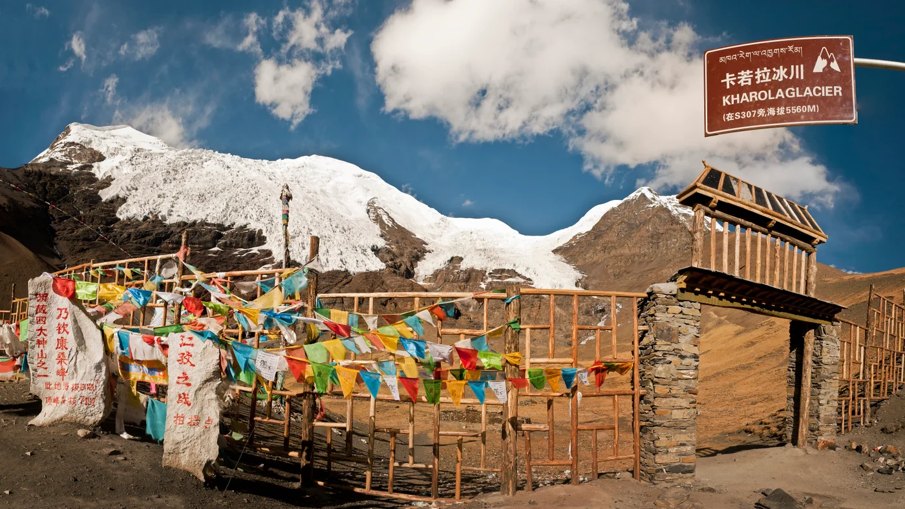
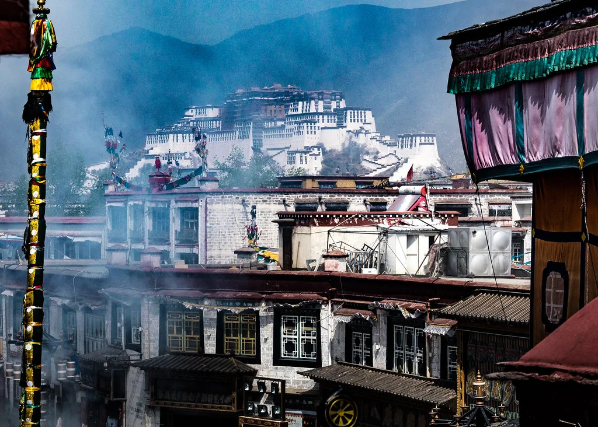

# 去阿里，看山海与旷野

阿里中北线 · 方案 A · 2026.09.25 — 10.07

从珠峰到古格，从圣湖到羌塘。十三天，一条向西再向东的环线。

只含图文攻略；原路线页面保留不变。09.29 住塔尔钦，10.03 住尼玛。

## 航班

- 09.25 西藏航空 TV9950：10:05 杭州萧山 T3 → 16:30 拉萨贡嘎 T3。
- 10.07 西藏航空 TV9949：10:55 拉萨贡嘎 T3 → 16:55 杭州萧山 T3。

## 天气

墨迹核对：2026-09-25T06:20:58.299+08:00，明确日期预报范围为 2026-09-25—2026-10-09。采用 MSN 30 天远期趋势的地点：10-05 圣象天门（条件备选）（本次核对：2026-09-25T06:28:34.909+08:00）。远期趋势不是短期预报或历史平均值。最低温为日最低保守参考，不冒充07:00—24:00小时最低；区县参考不等于景点精确温度。

| 日期 | 地点 | 类型 / 天气 | 最高 / 最低 | 风力 | 来源 | 核对时间 |
| --- | --- | --- | --- | --- | --- | --- |
| 09-25 | 拉萨贡嘎机场 | 阵雨转多云 | 17 / 6℃ | 东北风 3级 | [墨迹 · 贡嘎县](https://tianqi.moji.com/today/china/tibet/gonggar-county) | 2026-09-25T06:13:04.593+08:00 |
| 09-25 | 拉萨市区 / 拉萨住宿 | 阵雨转多云 | 18 / 7℃ | 西南风 2级 | [墨迹 · 拉萨市](https://tianqi.moji.com/today/china/tibet/lhasa) | 2026-09-25T06:13:02.736+08:00 |
| 09-26 | 鲁日拉观景台 | 多云 | 15 / 2℃ | 东南风 2级 | [墨迹 · 浪卡子县](https://tianqi.moji.com/today/china/tibet/langkazi-county) | 2026-09-25T06:13:06.243+08:00 |
| 09-26 | 卡若拉冰川 | 多云 | 15 / 2℃ | 东南风 2级 | [墨迹 · 浪卡子县](https://tianqi.moji.com/today/china/tibet/langkazi-county) | 2026-09-25T06:13:06.243+08:00 |
| 09-26 | 康马住宿 | 多云 | 14 / 3℃ | 南风 3级 | [墨迹 · 康马县](https://tianqi.moji.com/today/china/tibet/kangmar-county) | 2026-09-25T06:13:07.991+08:00 |
| 09-27 | 康马出发 | 多云转晴 | 15 / 2℃ | 西南风 3级 | [墨迹 · 康马县](https://tianqi.moji.com/today/china/tibet/kangmar-county) | 2026-09-25T06:13:07.991+08:00 |
| 09-27 | 西林观景台 | 阴转晴 | 15 / 0℃ | 西南风 3级 | [墨迹 · 定结县](https://tianqi.moji.com/today/china/tibet/dingjie-county) | 2026-09-25T06:13:28.793+08:00 |
| 09-27 | 加乌拉山口 | 阴 | 14 / 1℃ | 东南风 2级 | [墨迹 · 定日县](https://tianqi.moji.com/today/china/tibet/tingri-county) | 2026-09-25T06:13:30.444+08:00 |
| 09-27 | 巴松村住宿 | 阴 | 14 / 1℃ | 东南风 2级 | [墨迹 · 定日县](https://tianqi.moji.com/today/china/tibet/tingri-county) | 2026-09-25T06:13:30.444+08:00 |
| 09-28 | 珠峰大本营 | 少云 | 16 / 0℃ | 东南风 3级 | [墨迹 · 珠穆朗玛峰国家级自然保护区](https://tianqi.moji.com/today/china/tibet/qomolangma-national-nature-reserve) | 2026-09-25T06:13:32.187+08:00 |
| 09-28 | 珠峰古堡遗址 | 多云 | 15 / 0℃ | 东南风 3级 | [墨迹 · 定日县](https://tianqi.moji.com/today/china/tibet/tingri-county) | 2026-09-25T06:13:30.444+08:00 |
| 09-28 | 佩枯措 | 多云转晴 | 12 / 0℃ | 西南风 1级 | [墨迹 · 吉隆县](https://tianqi.moji.com/today/china/tibet/gyirong-county) | 2026-09-25T06:13:34.338+08:00 |
| 09-28 | 萨嘎住宿 | 多云转晴 | 12 / -1℃ | 南风 3级 | [墨迹 · 萨嘎县](https://tianqi.moji.com/today/china/tibet/saga-county) | 2026-09-25T06:14:26.028+08:00 |
| 09-29 | 萨嘎出发 | 晴 | 14 / -3℃ | 西南风 3级 | [墨迹 · 萨嘎县](https://tianqi.moji.com/today/china/tibet/saga-county) | 2026-09-25T06:14:26.028+08:00 |
| 09-29 | 玛旁雍措 / 拉昂措 | 晴转雪 | 11 / -4℃ | 南风 2级 | [墨迹 · 普兰县](https://tianqi.moji.com/today/china/tibet/burang-county) | 2026-09-25T06:13:36.843+08:00 |
| 09-29 | 塔尔钦住宿 | 阵雪转晴 | 0 / -6℃ | 东北风 1级 | [墨迹 · 喜马拉雅·冈仁波齐酒店天气点](https://tianqi.moji.com/today/china/tibet/himalaya-gang-rinpoche) | 2026-09-25T06:14:27.792+08:00 |
| 09-30 | 玛朗峡谷 | 晴 | 4 / -11℃ | 南风 4级 | [墨迹 · 札达县](https://tianqi.moji.com/today/china/tibet/zanda-county) | 2026-09-25T06:14:29.502+08:00 |
| 09-30 | 古格王国遗址 / 札达住宿 | 晴 | 4 / -11℃ | 南风 4级 | [墨迹 · 札达县](https://tianqi.moji.com/today/china/tibet/zanda-county) | 2026-09-25T06:14:29.502+08:00 |
| 10-01 | 霞义沟土林 | 多云转晴 | 10 / 1℃ | 风力待更新 | [墨迹 · 札达县](https://tianqi.moji.com/today/china/tibet/zanda-county) | 2026-09-25T06:14:29.502+08:00 |
| 10-01 | 狮泉河 | 晴 | 10 / -1℃ | 风力待更新 | [墨迹 · 狮泉河镇](https://tianqi.moji.com/today/china/tibet/shiquanhe-town) | 2026-09-25T06:14:31.271+08:00 |
| 10-01 | 革吉住宿 | 多云 | 7 / -5℃ | 风力待更新 | [墨迹 · 革吉县](https://tianqi.moji.com/today/china/tibet/geji-county) | 2026-09-25T06:14:32.956+08:00 |
| 10-02 | 革吉出发 | 多云转晴 | 8 / -5℃ | 风力待更新 | [墨迹 · 革吉县](https://tianqi.moji.com/today/china/tibet/geji-county) | 2026-09-25T06:14:32.956+08:00 |
| 10-02 | 物玛措 / 改则 | 晴 | 10 / -2℃ | 风力待更新 | [墨迹 · 改则县](https://tianqi.moji.com/today/china/tibet/gaize-county) | 2026-09-25T06:14:34.751+08:00 |
| 10-02 | 雀登村（大地之树） / 洞措沿线 | 晴 | 10 / -2℃ | 风力待更新 | [墨迹 · 改则县](https://tianqi.moji.com/today/china/tibet/gaize-county) | 2026-09-25T06:14:34.751+08:00 |
| 10-02 | 措勤住宿 | 晴 | 11 / -1℃ | 风力待更新 | [墨迹 · 措勤县](https://tianqi.moji.com/today/china/tibet/cuoqin-county) | 2026-09-25T06:16:17.304+08:00 |
| 10-03 | 扎日南木措 | 晴转阴 | 10 / -1℃ | 风力待更新 | [墨迹 · 措勤县](https://tianqi.moji.com/today/china/tibet/cuoqin-county) | 2026-09-25T06:16:17.304+08:00 |
| 10-03 | 文布南村 / 当惹雍措 | 晴转多云 | 11 / -2℃ | 风力待更新 | [墨迹 · 尼玛县](https://tianqi.moji.com/today/china/tibet/nyinma-county) | 2026-09-25T06:15:45.269+08:00 |
| 10-03 | 尼玛住宿 | 晴转多云 | 11 / -2℃ | 风力待更新 | [墨迹 · 尼玛县](https://tianqi.moji.com/today/china/tibet/nyinma-county) | 2026-09-25T06:15:45.269+08:00 |
| 10-04 | 尼玛出发 | 阴转晴 | 9 / -1℃ | 风力待更新 | [墨迹 · 尼玛县](https://tianqi.moji.com/today/china/tibet/nyinma-county) | 2026-09-25T06:15:45.269+08:00 |
| 10-04 | 色林措 / 班戈住宿 | 阴 | 8 / -1℃ | 风力待更新 | [墨迹 · 班戈县](https://tianqi.moji.com/today/china/tibet/baingoin-county) | 2026-09-25T06:17:06.962+08:00 |
| 10-05 | 班戈出发 | 晴 | 4 / -1℃ | 风力待更新 | [墨迹 · 班戈县](https://tianqi.moji.com/today/china/tibet/baingoin-county) | 2026-09-25T06:17:06.962+08:00 |
| 10-05 | 纳木措 | 雨 | 9 / 5℃ | 风力待更新 | [墨迹 · 纳木措国家公园](https://tianqi.moji.com/today/china/tibet/namtso-national-park) | 2026-09-25T06:15:52.774+08:00 |
| 10-05 | 圣象天门（条件备选） | MSN 远期趋势（本次已核验）：天气状态待核实 | 10 / 0℃ | 风速待更新 | [MSN · 圣象天门（MSN 景点定位）](https://www.msn.cn/zh-cn/weather/forecast/in-%E8%A5%BF%E8%97%8F%E8%87%AA%E6%B2%BB%E5%8C%BA,%E6%8B%89%E8%90%A8%E5%B8%82) | 2026-09-25T06:28:34.909+08:00 |
| 10-05 | 拉萨住宿 | 阴转多云 | 16 / 6℃ | 风力待更新 | [墨迹 · 拉萨市](https://tianqi.moji.com/today/china/tibet/lhasa) | 2026-09-25T06:13:02.736+08:00 |
| 10-06 | 布达拉宫 / 大昭寺 / 八廓街 / 拉萨住宿 | 多云转晴 | 17 / 5℃ | 风力待更新 | [墨迹 · 拉萨市](https://tianqi.moji.com/today/china/tibet/lhasa) | 2026-09-25T06:13:02.736+08:00 |
| 10-07 | 拉萨市区 | 阴转多云 | 17 / 5℃ | 风力待更新 | [墨迹 · 拉萨市](https://tianqi.moji.com/today/china/tibet/lhasa) | 2026-09-25T06:13:02.736+08:00 |
| 10-07 | 拉萨贡嘎机场 | 多云 | 16 / 6℃ | 风力待更新 | [墨迹 · 贡嘎县](https://tianqi.moji.com/today/china/tibet/gonggar-county) | 2026-09-25T06:13:04.593+08:00 |

### 天气口径与复查

- 2026 年 9 月 25 日 06:13—06:21（北京时间）逐页核对墨迹：19 个有效地点页面均显示明确日期列表，未来预报覆盖 09.25—10.09；31 个唯一地点／日期记录映射全程 36 个墨迹行程节点。
- 10 月 5 日圣象天门（条件备选）的墨迹页面仍为 404；09.25 06:28 已在 MSN 精确选中景点，更新 30 天趋势为最高 10℃、日最低 0℃。天气文字与风速未核实，清空旧值；不以纳木措或拉萨替代。
- 行程日期暂未取得 07:00—24:00 小时预报，所以最低温均为日最低温的保守参考，不冒充白天最低温；临近出发需重新核对小时预报。
- 天气“转”表示白天预报到夜间预报的变化。温度多为县区代理，山口、冰川、湖岸以及保护区内部不能当作同一温度。
- 9 月 25—30 日风力已重新核对墨迹同日天气日历，并匹配同日高低温；10 月 1—7 日墨迹风力未取得，保留“风力待更新”，不沿用旧风力或当前风向。圣象天门本次未取得对应日期风速，标为待更新。
- MSN 景点定位名和日期证据均有留存；本次只更新其趋势温度，不猜测天气图标。MSN 可能把地址改写为市级入口，复查须重新选中对应地点，不能拿默认城市替代。
- 札达 09.30 的 4℃／−11℃已在墨迹预报列表与同日天气日历交叉核对；较前次快照明显降温，按来源记录并提示临近日期复查，不擅自平滑或改回旧值。
- 合并相邻天气点时，最高温取最大值、最低温取最小值，不取平均；存在缺失点时不能宣称已经覆盖整日温度范围。
- 这是带核对时间的静态快照，不是页面自动更新服务。远期预报可能变化，出发前及每日出门前应重新核对墨迹天气和当地气象预警。
- 10-05 圣象天门（条件备选）：景点天气点参考，不是现场实测；路况和准入仍须临行核验。 墨迹页面本次核验返回 404，未取得同日预报；改用 2026-09-25 浏览器核验的 MSN 30 天远期趋势；温度已刷新，天气文字和风速尚未核实，不等同短期预报，非历史平均值。MSN 景点定位，不以供应商行政标签作为独立行政归属证明。 复查：在 MSN 搜索位置输入“圣象天门”，选择“圣象天门, 当雄县, 西藏自治区”，核对地点标题后打开十月日历。10.05 显示 10° / 0°；详情趋势图按日期读“每日最高温／每日最低温”，不要读“历史每日”值。 核对：2026-09-25T06:28:34.909+08:00。

## 无人机适飞情况

核验初稿 · UOM 颜色查询尚未完成。资料整理：2026-09-25；26 条逐日记录中，19 条 UOM 颜色已核验。UOM 颜色与景区、文保和现场管理分开核对；蓝区和白区均不单独构成放飞许可，白区不自动等同法定管制区。

UOM 页面色块已实见：蓝区 / 白区仅描述页面颜色；法律含义未完整核验，不自动推定适飞或法定管制属性。

图例观察：2026-09-24

UOM 页面蓝色色块图例为“适飞空域（地图放大至9级及以上显示）”。本表“白区”仅描述查询标记处未见蓝色空域覆盖，不将河湖底图蓝色当作空域，不根据颜色自行认定飞行许可。

[UOM 空域信息查询页面（已登录实查）](https://uom.caac.gov.cn/#/main)

空域结果只对应记录中的位置与查询时间，不代替出发前和起飞前复查。

| 日期 / 地点与定位 | UOM 空域查询 | 景区 / 场地管理 | 当次结论 / 下一步 |
| --- | --- | --- | --- |
| 2026-09-25 · D0 · 贡嘎机场 → 拉萨市区 贡嘎机场及机场至酒店转场 定位精度：待确认实际起飞点 机场管制范围跨山南、拉萨行政区；不能把整段道路视为一个查询点。 | UOM 白区 仅为搜索匹配点的 UOM 页面实见颜色；白区不自动等同法定管制区或可飞区，实际起飞点及飞行范围仍待确认。 颜色核验：2026-09-25 查询词：拉萨贡嘎国际机场 匹配结果：拉萨贡嘎国际机场 西藏自治区山南市贡嘎县 地图级别：12 观察时间：2026-09-25 观察说明：15 级标记位于机场航站区，缩至 12 级后外围西北、东北及南侧蓝色网格和边界清晰，机场搜索标记处为白色未覆盖区域。仅记录抵达端机场参考点，不代表机场至拉萨整段转场道路，也不以白色取代机场法定管制要求。 [UOM 官方空域查询入口（需登录）](https://uom.caac.gov.cn/#/main) | 机场相关范围有明确管控 两市 2026 年机场公告要求在公布范围内先获批准；机场外市区点位另查，不能沿用机场边界。 [拉萨市：贡嘎机场管制空域通告（2026-04-04）](https://www.lasa.gov.cn/lasa/tggs/202604/9bd6ff1127c246c68b70bfcc9d07ca18.shtml)；[山南市：贡嘎机场风险管控区域（2026-03-30）](https://shannan.gov.cn/xwzx/tggs/202603/t20260330_166357.html) | 本次不安排航拍，以抵达与适应为主。 勿在取车区或转场路边自行起飞；如改变安排，先确定点位并核验全部手续。 |
| 2026-09-26 · D1 · 鲁日拉观景台 羊湖沿线鲁日拉／鲁日啦观景台 定位精度：UOM 搜索结果已匹配；实际起飞点未确认 UOM 搜索结果为浪卡子县同名观景台；实际停车平台与计划飞行范围仍需确认。 | UOM 蓝区 仅为搜索匹配点的 UOM 页面实见颜色；白区不自动等同法定管制区或可飞区，实际起飞点及飞行范围仍待确认。 颜色核验：2026-09-24 查询词：鲁日拉观景台 匹配结果：鲁日拉观景台 西藏自治区山南市浪卡子县 地图级别：15 观察时间：2026-09-24 观察说明：搜索标记落在蓝色网格覆盖内，西南侧可见白色未覆盖边界；仅对搜索标记处作颜色记录，不代表整个羊湖沿线。 [UOM 官方空域查询入口（需登录）](https://uom.caac.gov.cn/#/main) | 未核得点名景点的专项准入公告 本次公开检索未找到可据以确定此平台无人机准入的官方专项公告；现场规则仍待询问。  | 尚不能判定适飞；短停以地面拍摄为主。 确认平台位置后查 UOM，并向现场管理方核实；未确认不飞。 |
| 2026-09-26 · D1 · 卡若拉冰川 卡若拉冰川正式开放观景平台 定位精度：待确认实际起飞点 | UOM 蓝区 仅为搜索匹配点的 UOM 页面实见颜色；白区不自动等同法定管制区或可飞区，实际起飞点及飞行范围仍待确认。 颜色核验：2026-09-24 查询词：卡若拉冰川 匹配结果：卡若拉冰川景区 西藏自治区日喀则市江孜县 地图级别：15 观察时间：2026-09-24 观察说明：选择景区候选后，G349 道路旁红色标记处与周围显示蓝色空域覆盖。首帧曾为白底，待图层加载后复核为蓝区。 [UOM 官方空域查询入口（需登录）](https://uom.caac.gov.cn/#/main) | 景区航拍要求待确认 未核得此观景平台的现行公开无人机专项准入公告；不能从冰川宣传照片推导许可。  | 尚不能判定适飞；本次不预留专门航拍时段。 在景区确认可用区域、审批及生态要求；不得进入冰川或封闭区域寻找起飞点。 |
| 2026-09-27 · D2 · 西林观景台 西林观景台（游客别称线索：洛子峰观景台） 定位精度：待确认实际起飞点 青岛日报社记者记为定日、定结、萨迦三县交界处，沿 G219 南行约 20 公里到定结县城；“洛子峰观景台”仅为游客线索，非官方命名，实际平台仍待确认。 | UOM 蓝区 仅为搜索匹配点的 UOM 页面实见颜色；白区不自动等同法定管制区或可飞区，实际起飞点及飞行范围仍待确认。 颜色核验：2026-09-25 查询词：洛子峰观景台 匹配结果：洛子峰观景台 西藏自治区日喀则市定结县 地图级别：15 观察时间：2026-09-25 观察说明：西林观景台完整名称未匹配，按公开资料的别名线索改查洛子峰观景台。15 级红色标记位于 G219 与 S303 路口附近，陆地及道路上可见连续蓝色空域网格。此为别名候选参考点，不将其自动等同于实际停车平台或起飞机位。 [UOM 官方空域查询入口（需登录）](https://uom.caac.gov.cn/#/main) | 先确认点位及边境管理范围 若实际点位属于边境管理范围，须遵守边境飞行要求；位置报道和游客别称不构成空域或飞行许可依据。 [西藏公安厅：边境活动“十五禁”（2021-04-08 发布）](https://gat.xizang.gov.cn/xwzx_3233/gsgg_205/202104/t20210408_198934.html)；[青岛日报社／观海新闻：西林观景台位置说明（2023-08-25）](https://www.dailyqd.com/guanhai/272473_1.html)；[游客线索：西林又称洛子峰观景台（2025-06-07，非官方命名）](https://www.sina.cn/news/detail/5175025943975368.html) | 点位未定，不作适飞判断。 先取得正确地图点，再核对 UOM、属地公安及现场要求；未确认不飞。 |
| 2026-09-27 · D2 · 加乌拉山口 加乌拉山口／加吾拉山口的正规观景平台 定位精度：待确认实际起飞点 旅行资料说明两种异写；政府报道使用“加吾拉山山顶珠峰观景台”。仅以定日县珠峰道路沿线为候选，不采用贡嘎或四川同名点；山体 POI 不等于实际起飞平台。 | UOM 蓝区 仅为搜索匹配点的 UOM 页面实见颜色；白区不自动等同法定管制区或可飞区，实际起飞点及飞行范围仍待确认。 颜色核验：2026-09-24 查询词：加吾拉 匹配结果：加吾拉 西藏自治区日喀则市定日县 地图级别：15 观察时间：2026-09-24 观察说明：加乌拉山口异写候选；UOM 红色标记位于 S515 珠峰路连续盘山弯道，标记处显示蓝色网格覆盖。仅核验此山口搜索点，实际停车平台仍须对应。 [UOM 官方空域查询入口（需登录）](https://uom.caac.gov.cn/#/main) | 有黑飞监管整改报道，现场手续待确认 2026-08-24 官方报道回顾该观景台无人机黑飞问题及公安重装监控的整改；这不是禁飞边界公告，也不能据此认定全域永久禁飞。实际平台仍须核实边境、景区及属地要求。 [西藏公安厅：边境活动“十五禁”（2021-04-08 发布）](https://gat.xizang.gov.cn/xwzx_3233/gsgg_205/202104/t20210408_198934.html)；[西藏政府转载人民日报：加吾拉山顶观景台黑飞监管整改（2026-08-24）](https://www.xizang.gov.cn/xwzx_406/bmkx/202608/t20260824_554823.html)；[旅行资料：加乌拉／加吾拉山口异写说明](https://www.tibet.tw/gonglue/461.html) | 未确认前不安排起飞。 查明平台与飞行范围；向属地和平台管理方核实，不飞越道路、车辆和观景人群。 |
| 2026-09-28 · D3 · 珠峰大本营 景区正式开放的游客观景区域 定位精度：待确认实际起飞点 游客大本营、登山大本营与保护区核心区不是同一地点。 | UOM 蓝区 仅为搜索匹配点的 UOM 页面实见颜色；白区不自动等同法定管制区或可飞区，实际起飞点及飞行范围仍待确认。 颜色核验：2026-09-24 查询词：珠峰大本营 匹配结果：珠峰大本营 西藏自治区日喀则市定日县 地图级别：15 观察时间：2026-09-24 观察说明：UOM 同名搜索标记位于蓝色网格内，西侧与西南侧紧邻白色区域；仅记录该 POI，不将其等同于当日开放游客区或允许飞越的范围。 [UOM 官方空域查询入口（需登录）](https://uom.caac.gov.cn/#/main) | 边境、保护区与景区要求并行 游客可进入范围不等于无人机许可范围；尚未取得景区对具体飞行点的确认。 [西藏公安厅：边境活动“十五禁”（2021-04-08 发布）](https://gat.xizang.gov.cn/xwzx_3233/gsgg_205/202104/t20210408_198934.html)；[西藏文旅转载新华社：珠峰核心区保护背景（2023-06-05）](https://wlt.xizang.gov.cn/xwzx_69/xydt/202306/t20230605_359174.html)；[西藏文旅：珠峰景区公告与联系电话（2026-01-29）](https://wlt.xizang.gov.cn/xccx/lytg/202601/t20260129_521748.html) | 默认地面观景，不把航拍列为本日必做。 先向景区核实航拍管理与办理渠道，再核对属地及 UOM。公告所列 0892-8263013 为紧急联系电话，不能当作已确认的航拍审批热线；不得飞入未获准区域。 |
| 2026-09-28 · D3 · 珠峰古堡遗址 珠峰古堡遗址（名称候选：东巴古堡） 定位精度：待确认实际起飞点 最高检记录使用“珠峰古堡遗址”，明确关联定日县岗嘎镇东巴村；西藏文旅使用“东巴古堡”名称。实际入口、平台及两种名称对应仍待核对，不以附近其他古堡遗址代替。 | 已尝试查询 · 点位待确认 已在 UOM 尝试查询，但未确认对应行程点位及颜色；尝试日期不是成功核验日期，不纳入颜色已核验数量。 尝试日期：2026-09-25 查询词：东巴古堡；珠峰古堡；珠峰古堡遗址 匹配结果：未显示匹配候选 地图级别：未记录 尝试说明：09.25 按官方保护报道补查“珠峰古堡遗址”全名，仍无候选，不能读取遗址本身颜色。公开资料指向岗嘎镇东巴村，但未用村庄、宾馆或其他古堡点代替遗址。 [UOM 官方空域查询入口（需登录）](https://uom.caac.gov.cn/#/main) | 遗址身份与管理方待确认 官方文旅及遗址保护报道仅辅助名称和位置核验，不是无人机准入公告；尚不能确定文物保护及边境规则对实际点位的适用范围。 [西藏公安厅：边境活动“十五禁”（2021-04-08 发布）](https://gat.xizang.gov.cn/xwzx_3233/gsgg_205/202104/t20210408_198934.html)；[西藏文旅：定日东巴古堡文旅地标（2025-12-02）](https://wlt.xizang.gov.cn/ztzl_69/wenlv/202512/t20251202_512215.html)；[最高检：定日县岗嘎镇东巴村珠峰古堡遗址保护记录（2024-08-30）](https://www.spp.gov.cn/spp/zdgz/202408/t20240830_664676.shtml) | 不安排航拍；本点本就可舍弃。 先确认遗址身份与管理方；不得用其他古堡或附近空旷位置的结果代替。 |
| 2026-09-28 · D3 · 佩枯措 佩枯措实际开放观景点 定位精度：待确认实际起飞点 湖岸不同点位须分别核验，不以湖中心代替起飞点。 | UOM 蓝区 仅为搜索匹配点的 UOM 页面实见颜色；白区不自动等同法定管制区或可飞区，实际起飞点及飞行范围仍待确认。 颜色核验：2026-09-24 查询词：佩枯措 匹配结果：佩枯措观景台 西藏自治区日喀则市聂拉木县 地图级别：15 观察时间：2026-09-24 观察说明：搜索落在湖东岸道路旁观景台，红色标记处陆地区域为蓝色覆盖；与湖面底图蓝色区分读取。不代表整湖或其他岸线。 [UOM 官方空域查询入口（需登录）](https://uom.caac.gov.cn/#/main) | 边境范围与属地要求待确认 未核得本观景点的专项飞行许可说明；需先核实实际湖岸是否涉及边境管理范围。 [西藏公安厅：边境活动“十五禁”（2021-04-08 发布）](https://gat.xizang.gov.cn/xwzx_3233/gsgg_205/202104/t20210408_198934.html) | 尚不能判定适飞；本日仅预留短停。 先问属地及现场管理方，确认点位、空域及风况；转场延误则放弃航拍。 |
| 2026-09-29 · D4 · 玛旁雍措 玛旁雍措本次选择的正式开放湖景点 定位精度：待确认实际起飞点 | UOM 蓝区 仅为搜索匹配点的 UOM 页面实见颜色；白区不自动等同法定管制区或可飞区，实际起飞点及飞行范围仍待确认。 颜色核验：2026-09-24 查询词：玛旁雍错 匹配结果：玛旁雍错游客中心 西藏自治区阿里地区普兰县 地图级别：15 观察时间：2026-09-24 观察说明：采用已收录的游客中心作为明确参考点：G219 旁红色标记处显示蓝色网格覆盖。不是整湖结论，不能代替本次实际湖岸起飞点。 [UOM 官方空域查询入口（需登录）](https://uom.caac.gov.cn/#/main) | 阿里地方手续及边境要求待复核 适用阿里地方管理核验清单；还须确认该湖岸点的边境、保护区与景区要求。 [阿里行署：低慢小航空器管理通告（2021-05-25）](https://www.al.gov.cn/info/1181/34951.htm)；[西藏公安厅：边境活动“十五禁”（2021-04-08 发布）](https://gat.xizang.gov.cn/xwzx_3233/gsgg_205/202104/t20210408_198934.html) | 先核准实际点位，不默认随到随飞。 向普兰属地及景区核实现行手续；以批准范围和当前 UOM 为准，不扩大到整湖。 |
| 2026-09-29 · D4 · 拉昂措 拉昂措合法开放的实际观景点 定位精度：待确认实际起飞点 | UOM 蓝区 仅为搜索匹配点的 UOM 页面实见颜色；白区不自动等同法定管制区或可飞区，实际起飞点及飞行范围仍待确认。 颜色核验：2026-09-24 查询词：拉昂错 匹配结果：拉昂错 西藏自治区阿里地区普兰县（首个同名结果） 地图级别：15 观察时间：2026-09-24 观察说明：搜索点位于湖北部水面，蓝色网格连续覆盖湖面与周围陆地。此为湖泊 POI 参考点，不能代替尚未确定的岸边起飞点，也不代表全湖范围。 [UOM 官方空域查询入口（需登录）](https://uom.caac.gov.cn/#/main) | 地方手续与具体湖岸准入待核实 需复核阿里旧通告的现行流程及边境适用范围；未取得此点的场地飞行确认。 [阿里行署：低慢小航空器管理通告（2021-05-25）](https://www.al.gov.cn/info/1181/34951.htm)；[西藏公安厅：边境活动“十五禁”（2021-04-08 发布）](https://gat.xizang.gov.cn/xwzx_3233/gsgg_205/202104/t20210408_198934.html) | 未获确认前只作地面短停。 独立核对此湖岸点，不沿用玛旁雍措结果；大风或行程延误直接取消航拍。 |
| 2026-09-30 · D5 · 玛朗峡谷 玛朗峡谷观景台（另查：玛朗观景台） 定位精度：待确认实际起飞点 县政府使用“玛朗观景台”；Trip.com 将“玛朗峡谷观景台”列在札达县土林玛朗景区。同县另有托林镇玛朗组居民点，“玛朗”裸名不足以确认峡谷平台；Trip.com 另列“玛琅观景台”，不能擅作同点别名。 | 已尝试查询 · 点位待确认 已在 UOM 尝试查询，但未确认对应行程点位及颜色；尝试日期不是成功核验日期，不纳入颜色已核验数量。 尝试日期：2026-09-25 查询词：玛朗峡谷；玛朗观景台；玛朗峡谷观景台 匹配结果：玛朗观景台无匹配；峡谷观景台全名查询尚未完成复核 地图级别：未记录 尝试说明：“玛朗观景台”未显示候选；补查“玛朗峡谷观景台”后系统报告 Mac 锁定，无法完成结果复核。没有选中准确观景平台，不能读取颜色，也不采用札达或改则的“玛朗”裸名居民点代替。 [UOM 官方空域查询入口（需登录）](https://uom.caac.gov.cn/#/main) | 先复核阿里地方申请流程 阿里公开地方通告见共用说明；本次未核得观景台专项准入公告。名称及居民点资料只辅助定位，不是飞行许可或 UOM 颜色依据。 [阿里行署：低慢小航空器管理通告（2021-05-25）](https://www.al.gov.cn/info/1181/34951.htm)；[札达县政府：旅发委工作总结中的“玛朗观景台”（2019-01-18）](https://www.zhada.gov.cn/info/1951/90701.htm?urltype=tree.TreeTempUrl&wbtreeid=1063)；[札达县政府：托林镇玛朗组居民点（2023-05-31）](https://zhada.gov.cn/info/1020/56011.htm)；[Trip.com：玛朗峡谷观景台景点条目（非官方定位资料）](https://hk.trip.com/travel-guide/attraction/zanda/city-145330563/)；[Trip.com：另列的“玛琅观景台”（不能直接当作同点别名）](https://hk.trip.com/travel-guide/attraction/zanda/malang-observation-deck-143752288?poiType=3&scene=DISTRICT) | 尚不能判定适飞；不为航拍压缩古格游览。 核准观景台及峡谷内计划飞行范围，询问属地和管理方；不下未知沟谷寻找起飞点。 |
| 2026-09-30 · D5 · 古格王国遗址 古格遗址开放区域及管理方指定位置 定位精度：待确认实际起飞点 | UOM 蓝区 仅为搜索匹配点的 UOM 页面实见颜色；白区不自动等同法定管制区或可飞区，实际起飞点及飞行范围仍待确认。 颜色核验：2026-09-24 查询词：古格王国遗址 匹配结果：古格王国遗址 西藏自治区阿里地区札达县 地图级别：15 观察时间：2026-09-24 观察说明：遗址搜索标记处显示蓝色网格覆盖，北侧波林村与河谷附近可见白色区域边界；不外推至全部文物范围或景区出入口。 [UOM 官方空域查询入口（需登录）](https://uom.caac.gov.cn/#/main) | 文物管理与地方手续需另行确认 未核得足以确认现行航拍范围的官方景区专项公告；历史游记中的禁飞告示不作为本次已核实规则。 [阿里行署：低慢小航空器管理通告（2021-05-25）](https://www.al.gov.cn/info/1181/34951.htm) | 本次默认地面拍摄，不安排自行起飞。 向遗址管理处及属地询问书面要求；有许可也需另查实际点位 UOM，不飞越未获准文物区域。 |
| 2026-10-01 · D6 · 霞义沟土林 霞义沟土林正式开放观景区域 定位精度：待确认实际起飞点 | UOM 蓝区 仅为搜索匹配点的 UOM 页面实见颜色；白区不自动等同法定管制区或可飞区，实际起飞点及飞行范围仍待确认。 颜色核验：2026-09-24 查询词：霞义沟 匹配结果：霞义沟景区游客服务中心 西藏自治区阿里地区札达县 地图级别：15 观察时间：2026-09-24 观察说明：S302 旁游客服务中心红色标记位于蓝色覆盖内；东侧可见白色边界。此为景区入口参考点，沟内其他观景台及飞行范围需另核。 [UOM 官方空域查询入口（需登录）](https://uom.caac.gov.cn/#/main) | 地方手续与景区许可待核实 需复核阿里地方流程，并独立取得景区对起飞位置和范围的确认。 [阿里行署：低慢小航空器管理通告（2021-05-25）](https://www.al.gov.cn/info/1181/34951.htm) | 手续和场地未确认前，不作适飞判断。 先问景区及属地；不得为机位攀爬土柱或进入封闭沟谷。 |
| 2026-10-01 · D6 · 狮泉河 狮泉河镇午餐、加油与补给区域 定位精度：待确认实际起飞点 | UOM 白区 仅为搜索匹配点的 UOM 页面实见颜色；白区不自动等同法定管制区或可飞区，实际起飞点及飞行范围仍待确认。 颜色核验：2026-09-24 查询词：狮泉河镇 匹配结果：狮泉河镇 西藏自治区阿里地区噶尔县 地图级别：11 观察时间：2026-09-24 观察说明：镇区红色搜索标记处未见蓝色空域覆盖；连续核对 15、13、12、11 级地图均为白底，11 级西南侧可见蓝色网格边界，确认图层有加载。仅代表镇区参考点，不外推至整个噶尔县。 [UOM 官方空域查询入口（需登录）](https://uom.caac.gov.cn/#/main) | 城镇及敏感设施限制需核对 阿里地方通告涉及城市中心和敏感设施；不将旧旅游节临时管制作为本次依据。 [阿里行署：低慢小航空器管理通告（2021-05-25）](https://www.al.gov.cn/info/1181/34951.htm) | 本次不安排航拍，仅作补给。 避免在加油站、聚居和敏感设施附近自行放飞；不要因补给停车临时增加航拍。 |
| 2026-10-02 · D7 · 物玛措 物玛措沿途合法停靠观景点 定位精度：待确认实际起飞点 | UOM 蓝区 仅为搜索匹配点的 UOM 页面实见颜色；白区不自动等同法定管制区或可飞区，实际起飞点及飞行范围仍待确认。 颜色核验：2026-09-24 查询词：物玛错 匹配结果：物玛错 西藏自治区阿里地区改则县 地图级别：15 观察时间：2026-09-24 观察说明：“物玛措”无匹配后改搜“物玛错”；红色标记位于 G317 南侧湖面，蓝色空域覆盖连续延伸到周边陆地。仅为湖泊 POI 参考点，不代表尚未选定的岸边起飞点或整个湖区。 [UOM 官方空域查询入口（需登录）](https://uom.caac.gov.cn/#/main) | 地方手续及湖岸管理待确认 阿里地方流程须复核；尚未核实所选湖岸点的独立管理要求。 [阿里行署：低慢小航空器管理通告（2021-05-25）](https://www.al.gov.cn/info/1181/34951.htm) | 尚不能判定适飞；只按短停安排。 定位允许停靠处并问属地；不驶离道路进入草场或湖岸寻找航拍位置。 |
| 2026-10-02 · D7 · 改则 改则县城午餐与加油补给区域 定位精度：待确认实际起飞点 | UOM 白区 仅为搜索匹配点的 UOM 页面实见颜色；白区不自动等同法定管制区或可飞区，实际起飞点及飞行范围仍待确认。 颜色核验：2026-09-24 查询词：改则县 匹配结果：改则县 西藏自治区阿里地区改则县 地图级别：15 观察时间：2026-09-24 观察说明：红色搜索标记位于县城北部白色矩形区域，四周蓝色空域网格及边界清晰可见。仅记录县城 POI，不能概括整个县城或改则县行政范围。 [UOM 官方空域查询入口（需登录）](https://uom.caac.gov.cn/#/main) | 县城相关场景有公开限制 改则通告列有聚居、人员密集及交通运行等场景限制；实际范围仍按现场与主管部门确认。 [改则公安：无人机安全管理通告（2025-05-20 发布）](https://gaizexian.gov.cn/info/2251/306001.htm) | 本次不安排航拍，保留补给与休息。 勿在道路、加油站或县城人群上空自行放飞；有其他需求先询问治安大队。 |
| 2026-10-02 · D7 · 洞措大地之树／确登村 洞措乡确登村洞错湖南岸、G216 2860 里程碑附近的“大地之树” 定位精度：待确认实际起飞点 西藏文旅 2025-07-15 明确里程碑位置，政府名单使用“确登村”（原行程写“雀登村”）；此为定位线索，仍须确认合法停靠与实际机位，不能用村中心、那曲 G317 沿线大地之树或尼玛达则错天空之树代替。 | 已尝试查询 · 点位待确认 已在 UOM 尝试查询，但未确认对应行程点位及颜色；尝试日期不是成功核验日期，不纳入颜色已核验数量。 尝试日期：2026-09-24 查询词：确登村；大地之树 匹配结果：确登村 西藏自治区阿里地区改则县；大地之树无匹配 地图级别：未记录 尝试说明：确登村候选的 G216 旁红色标记在 15 级地图显示蓝色覆盖，但村庄 POI 不是已确认的“大地之树”拍摄机位。“大地之树”未显示匹配，故此景点颜色仍待核验，不用村庄蓝区代替。 [UOM 官方空域查询入口（需登录）](https://uom.caac.gov.cn/#/main) | 先确认改则手续与飞行范围 官方景观报道、里程碑及村名资料只用于定位，不是游客飞行许可或 UOM 颜色依据；须核实改则申请及道路、聚居等范围限制。 [改则公安：无人机安全管理通告（2025-05-20 发布）](https://gaizexian.gov.cn/info/2251/306001.htm)；[阿里行署：低慢小航空器管理通告（2021-05-25）](https://www.al.gov.cn/info/1181/34951.htm)；[西藏文旅转载新华网：洞措乡确登村“大地之树”位置（2023-04-11）](https://wlt.xizang.gov.cn/xwzx_69/xydt/202304/t20230411_350322.html)；[西藏政府：生态文明示范区名单中的洞措乡确登村（2023-07-04）](https://www.xizang.gov.cn/zwgk/xxfb/zfwj/202307/t20230704_364127.html)；[西藏文旅：G216 2860 里程碑附近的大地之树（2025-07-15，仅定位辅助）](https://wlt.xizang.gov.cn/xccx/lytg/202507/t20250715_489418.html) | 航拍是条件选项，未核准则跳过。 携实际点位和机型向 0897-2653110 核实；明确起降与全程范围后再查 UOM，不为拍摄压缩长途余量。 |
| 2026-10-03 · D8 · 扎日南木措北岸 扎日南木措北岸观景台（另查“扎日南木错北岸观景台”） 定位精度：待确认实际起飞点 高德有独立的北岸观景点条目，携程使用“错”字名称；均仅辅助搜索定位，仍须核对是否为本次实际开放入口与起飞平台，不能用湖心或措勤县城的景区 POI 代替。 | 已尝试查询 · 点位待确认 已在 UOM 尝试查询，但未确认对应行程点位及颜色；尝试日期不是成功核验日期，不纳入颜色已核验数量。 尝试日期：2026-09-25 查询词：扎日南木措；扎日南木措观景台；扎日南木措北岸观景台；扎日南木错北岸观景台 匹配结果：原“景区”两候选不能对应北岸；两种北岸观景台完整名称均无匹配 地图级别：未记录 尝试说明：09.24 两个“景区”候选分别落在湖面与措勤县城，均不是已确认的北岸观景点；09.25 按独立地图条目尝试“措／错”两种北岸观景台完整名称，UOM 均未显示候选。不能用湖面或县城代替，颜色保留待核验。 [UOM 官方空域查询入口（需登录）](https://uom.caac.gov.cn/#/main) | 阿里手续与湖区管理待核实 需复核阿里地方流程；尚未取得所选北岸点的景区或保护区准入确认。地图与旅游平台条目不是飞行许可或 UOM 颜色依据。 [阿里行署：低慢小航空器管理通告（2021-05-25）](https://www.al.gov.cn/info/1181/34951.htm)；[高德：扎日南木措北岸观景台（独立观景点，仅定位辅助）](https://www.amap.com/place/B0GRRSJIJ7)；[携程：扎日南木错北岸观景台（“错”字名称线索）](https://gs.ctrip.com/html5/you/sight/coqen120146/152787979.html) | 尚不能判定适飞；本次按短停安排。 核对正式入口与管理方，不沿车辙进入湿地或用整湖范围代替具体查询。 |
| 2026-10-03 · D8 · 文布南村／当惹雍错 文布南村允许停留的实际湖景位置 定位精度：待确认实际起飞点 文旅部资料使用“文部南村／文部乡南村”，村内文部寺全称“雍忠桑丹林寺”；北村、琼宗遗址与玉本寺另列为不同地点。名称只辅助定位，村落和湖岸应分别核验，不以乡政府、北村或湖心代替机位。 | 已尝试查询 · 点位待确认 已在 UOM 尝试查询，但未确认对应行程点位及颜色；尝试日期不是成功核验日期，不纳入颜色已核验数量。 尝试日期：2026-09-25 查询词：文布南村；文部南村；文布；文部；当惹雍错；文布南；文部乡南村；文部寺；雍忠桑丹林寺 匹配结果：未找到明确的南村或寺院候选；“文部”与多个同名湖泊点不能区分南村 地图级别：未记录 尝试说明：09.25 按文旅部资料补查村名和寺院名称，均无匹配；“文部”仍仅返回尼玛县裸名、乡政府等候选，“当惹雍错”此前返回八个无法区分的同名点。未用乡政府或湖中心代替文布南村实际观景位置，颜色待核验。 [UOM 官方空域查询入口（需登录）](https://uom.caac.gov.cn/#/main) | 村落与湖区航拍要求待确认 未核得可确定此点无人机准入的官方专项公告；文旅路线资料只提供名称与位置线索，不是飞行许可或 UOM 颜色依据，仍须询问属地和管理方。 [文化和旅游部：当惹雍措环湖之旅与文部南村名称、位置说明](https://zhuanti.mct.gov.cn/xcszbwg2022/xizang/detail/2012.html) | 未确认前以村中慢走、地面拍摄为主。 先确认合法起降位置和范围；不低空掠过住宅、礼佛活动或人群，离村时间优先。 |
| 2026-10-04 · D9 · 色林措 色林措选定的合法开放观景点 定位精度：待确认实际起飞点 2022 年游客骑行资料列有“许隆村色林措接待服务中心／色林错游客接待中心”，仅作非官方搜索线索，不确认当前开放状态。服务中心、断崖与湖岸是不同点，不能互相替代，也不能用湖心或保护区管理站代表机位。 | 已尝试查询 · 点位待确认 已在 UOM 尝试查询，但未确认对应行程点位及颜色；尝试日期不是成功核验日期，不纳入颜色已核验数量。 尝试日期：2026-09-24 查询词：色林措；色林错；色林错观景台；色林措观景台 匹配结果：只有跨双湖、申扎、班戈的多个同名湖泊点及保护区管理机构，未找到观景台 地图级别：未记录 尝试说明：“色林措”主要返回保护区管理分局；“色林错”返回多个不同县域的同名湖泊点。两种观景台拼写均无匹配。行程未明确岸边机位，不任选湖心或管理机构代替，颜色待核验。 [UOM 官方空域查询入口（需登录）](https://uom.caac.gov.cn/#/main) | 保护区要求需先确认 官方资料确认其保护区野生动物栖息价值，但未提供此观景点的游客航拍许可或空域边界；游客定位线索不构成 UOM 颜色或飞行许可依据。 [国家林草局：色林错保护区野生动物（2026-07-16）](https://www.forestry.gov.cn/lyj/1/zhzs/20260716/680300.html)；[游客骑行资料：许隆村色林错游客接待中心（2022-08-23，非官方定位线索）](https://m.sohu.com/a/578848144_100061833) | 保护区与空域未核实，不作适飞判断。 先问保护区或观景点管理方；不追拍野生动物，不进入湿地或封闭区域。 |
| 2026-10-05 · D10 · 纳木措开放观景区 最终选择的纳木措入口及观景区域 定位精度：待确认实际起飞点 需先确定是否扎西岛等实际入口，不把整个纳木措视为同一场地。 | UOM 蓝区 仅为搜索匹配点的 UOM 页面实见颜色；白区不自动等同法定管制区或可飞区，实际起飞点及飞行范围仍待确认。 颜色核验：2026-09-24 查询词：扎西岛 匹配结果：扎西岛下拉康 西藏自治区拉萨市当雄县 地图级别：15 观察时间：2026-09-24 观察说明：纳木措同名候选无法确定入口，故另查明确的扎西岛下拉康地标作为参考。红色标记位于扎西半岛陆地，蓝色空域网格覆盖陆地与周边湖面。该结果仅限此地标，不代表当日开放观景区、其他湖岸或寺院准入，实际机位仍待确认。 [UOM 官方空域查询入口（需登录）](https://uom.caac.gov.cn/#/main) | 实际入口的场地要求待确认 未核得涵盖本次未定观景入口的官方无人机专项准入公告；与圣象天门分开询问。  | 返拉萨优先，未确认前不安排航拍。 在前一晚确定入口并询问管理方，起飞点及范围单独查 UOM；不延误返城。 |
| 2026-10-05 · D10 · 圣象天门（条件备选） 圣象天门最终获准进入的观景区域 定位精度：待确认实际起飞点 高德独立景点名为“西藏纳木措自然保护区圣象天门”（使用“措”字），地址为那曲市班戈县；仅辅助搜索，仍须确认实际开放入口与平台，不以纳木措南岸其他景区代替。 | 已尝试查询 · 点位待确认 已在 UOM 尝试查询，但未确认对应行程点位及颜色；尝试日期不是成功核验日期，不纳入颜色已核验数量。 尝试日期：2026-09-25 查询词：圣象天门；圣象；纳木错圣象天门；西藏纳木措自然保护区圣象天门 匹配结果：完整景点名称无匹配；简称仅返回外省同名商家 地图级别：未记录 尝试说明：09.25 按独立地图条目补查“西藏纳木措自然保护区圣象天门”，仍无候选。没有选中位于班戈县的准确位置，不能沿用纳木措南岸扎西岛结果判断北岸景点。保留待核验。 [UOM 官方空域查询入口（需登录）](https://uom.caac.gov.cn/#/main) | 开放公告不是无人机许可 2026-06-17 公告有生态与区域准入要求，但未明确游客无人机准入；不能据其判定可飞或全面禁飞。高德条目只辅助定位，不是 UOM 颜色依据。 [西藏文旅：圣象天门游览管理公告（2026-06-17）](https://wlt.xizang.gov.cn/xccx/lytg/202606/t20260617_546017.html)；[高德：西藏纳木措自然保护区圣象天门（独立景点，仅定位辅助）](https://www.amap.com/place/B0HGGUVFD3) | 航拍另行确认；未满足条件仍按原计划舍弃。 可向公告所列景区咨询电话 18011110212／17789060224 询问起降、飞行范围和手续；不惊扰动物、不进入封闭区，并保留返拉萨余量。 |
| 2026-10-06 · D11 · 布达拉宫 布达拉宫主体、广场及实际外部拍摄点 定位精度：待确认实际起飞点 不同位置分别核验，不把远处拍摄布宫的机位等同宫殿或广场。 | UOM 白区 仅为搜索匹配点的 UOM 页面实见颜色；白区不自动等同法定管制区或可飞区，实际起飞点及飞行范围仍待确认。 颜色核验：2026-09-24 查询词：布达拉宫 匹配结果：布达拉宫 西藏自治区拉萨市城关区 地图级别：12 观察时间：2026-09-24 观察说明：先在 15 级核对红色标记位于布达拉宫，再缩至 12 级复核；标记处未见蓝色覆盖，城区外围北侧与南侧蓝色网格及边界清晰，图层已加载。仅为该 POI 颜色，不代表文物区准入或飞行许可。 [UOM 官方空域查询入口（需登录）](https://uom.caac.gov.cn/#/main) | 文物、安保与人群要求需核对 拉萨公安说明重要文物及周边等管制类别；该说明不是布宫逐点永久边界公告。 [拉萨公安：黑飞案例与管制空域说明（2026-03-06）](https://www.lasa.gov.cn/lasa/zfdt/202603/ef71afb7529e4aeca766abfe8d549f16.shtml) | 本次不安排航拍，使用地面机位。 按参观预约和现场管理拍摄；如另有专业飞行需求，先取得对应许可并核对实际空域。 |
| 2026-10-06 · D11 · 大昭寺 大昭寺参观区域及寺前广场 定位精度：待确认实际起飞点 | UOM 白区 仅为搜索匹配点的 UOM 页面实见颜色；白区不自动等同法定管制区或可飞区，实际起飞点及飞行范围仍待确认。 颜色核验：2026-09-24 查询词：大昭寺 匹配结果：大昭寺 西藏自治区拉萨市城关区 地图级别：15 观察时间：2026-09-24 观察说明：15 级地图红色标记位于大昭寺，未见蓝色空域覆盖；同轮已在拉萨 12 级地图核对城区外围蓝色边界。仅为该寺院 POI 的页面颜色，不能视为文物区或宗教场所的飞行许可。 [UOM 官方空域查询入口（需登录）](https://uom.caac.gov.cn/#/main) | 文物、宗教场地和安保须确认 尚未核得对本点生效的专项飞行边界及许可；不能从官媒航拍反推游客可飞。 [拉萨公安：黑飞案例与管制空域说明（2026-03-06）](https://www.lasa.gov.cn/lasa/zfdt/202603/ef71afb7529e4aeca766abfe8d549f16.shtml) | 本次不安排航拍，服从参观及拍摄规则。 不在寺院、广场或礼佛人群上空自行放飞；场地管理与 UOM 需分别满足。 |
| 2026-10-06 · D11 · 八廓街 八廓街实际街巷与拟拍摄位置 定位精度：待确认实际起飞点 | UOM 白区 仅为搜索匹配点的 UOM 页面实见颜色；白区不自动等同法定管制区或可飞区，实际起飞点及飞行范围仍待确认。 颜色核验：2026-09-24 查询词：八廓街 匹配结果：八廓街 西藏自治区拉萨市城关区（首个同名候选） 地图级别：12 观察时间：2026-09-24 观察说明：15 级地图定位于大昭寺西北侧街区，再缩至 12 级核对；旧会话色块未加载，刷新并重新进入空域查询后，北侧及南侧蓝色网格恢复，街区红色标记位于白色区域。仅代表街区 POI，不概括所有街巷或准入许可。 [UOM 官方空域查询入口（需登录）](https://uom.caac.gov.cn/#/main) | 老城人群与周边文物场地待核实 未取得街巷实际点位的空域或管理许可；拉萨公安材料不能代替此处逐点确认。 [拉萨公安：黑飞案例与管制空域说明（2026-03-06）](https://www.lasa.gov.cn/lasa/zfdt/202603/ef71afb7529e4aeca766abfe8d549f16.shtml) | 本次不安排航拍，慢走与地面拍摄。 不飞越街巷人群，不打扰转经和居民生活；拍摄人物先征得同意。 |
| 2026-10-07 · D12 · 拉萨市区 → 贡嘎机场 酒店至还车点、贡嘎机场返程路线 定位精度：待确认实际起飞点 | UOM 白区 仅为搜索匹配点的 UOM 页面实见颜色；白区不自动等同法定管制区或可飞区，实际起飞点及飞行范围仍待确认。 颜色核验：2026-09-25 查询词：拉萨贡嘎国际机场 匹配结果：拉萨贡嘎国际机场 西藏自治区山南市贡嘎县 地图级别：12 观察时间：2026-09-25 观察说明：返程复用同次机场 POI 观察：15 级定位航站区，12 级外围蓝色网格加载完整，机场标记处无蓝色覆盖。此为 09.25 的出行前快照，不是 10.07 当天已核验；不概括还车、加油及市区至机场全部路线。 [UOM 官方空域查询入口（需登录）](https://uom.caac.gov.cn/#/main) | 机场公布范围未经许可不得飞 返程涉及机场相关管控区域；市区及途中其他位置须另查，不代表整条路线统一禁飞。 [拉萨市：贡嘎机场管制空域通告（2026-04-04）](https://www.lasa.gov.cn/lasa/tggs/202604/9bd6ff1127c246c68b70bfcc9d07ca18.shtml)；[山南市：贡嘎机场风险管控区域（2026-03-30）](https://shannan.gov.cn/xwzx/tggs/202603/t20260330_166357.html) | 不安排航拍，只作返程。 不在还车、加油或候机期间临时起飞，按还车和航班时间前往机场。 |

- 本表是出行前的核验清单，不是放飞许可；颜色已核验的记录仅对应 UOM 搜索匹配点及观察时间，不代表实际起飞点或全程飞行范围已确认，也不代表取得景区或属地的个案批准。已搜索定位不等于已核验颜色，资料整理日期和查询尝试时间不能代替成功核验时间。
- UOM 定位后底图与空域图层可能分先后加载；必须在地图放大至 9 级以上、图层稳定且点位和边界清晰时读取。加载中的白底、模糊截图或仅有地点搜索结果不能记作白区。
- “本次不安排航拍”是行程建议，不等于已确认全域永久禁飞；“未查到专项公告”仅表示本次公开检索未找到，不代表当地没有限制或默认允许。
- 需要同时核对实际起飞点、计划飞行范围、UOM 当前空域、临时管制和场地管理。不得把一个观景点的结果外推到整座湖、整个景区或整段道路。
- 边境依据：西藏公安厅 2021 年公布的“十五禁”限制边境地区私自开展低慢小飞行；本表未完成各起飞点与边境管理范围的边界核验。边境通行证不代替飞行许可。
- 阿里依据：2021-05-25 行署通告提出事前申请和属地报备，并限制城市中心、敏感设施等区域。该旧通告早于国家新条例，公开页未列截止；现行办理流程、机型要求及适用范围须向属地重新确认，不能仅据旧文认定已获准。
- 改则依据：通告落款 2025-02-19、网页发布 2025-05-20，列有交通运行沿线、敏感设施和人员密集场景限制及个人申请材料；可向改则公安治安管理大队 0897-2653110 核实。不将其解释为全县永久禁飞。
- 文物、寺院、村落和保护区的准入需另问管理方；景区恢复开放、宣传航拍、媒体或科研飞行均不是普通游客的飞行许可。保护区说明也不直接等于航空禁飞边界。
- 未把拉萨 2025 年 8 月庆典、2026 年 6 月高考、日喀则 2026 年 6 月展佛及狮泉河 2023 年象雄节的临时限制外推到本次 2026-09-25 至 10-07 行程；临行和起飞前仍需查看新公告。
- 所有点位均未填写未经核验的坐标。湖区入口、停车区和同名观景台必须先定位；西林、珠峰古堡及洞措大地之树尤其不能仅凭名称确定起飞位置。
- 即使手续、场地与空域均满足，也须按具体机型说明书核对起飞海拔、温度、风速、电池和返航余量；不追逐野生动物，不飞越人群，不为航拍进入封闭区、草场或未知支路。

## 酒店信息表

| 入住日 | 晚数 / 间数 | 地点 | 酒店名 | 单间价格 | 房型 | 可取消时间 | 面积 | 床型 | 供氧方式 | 早餐 |
| --- | --- | --- | --- | --- | --- | --- | --- | --- | --- | --- |
| 09.25 | 1晚 · 2间 | 拉萨市 | [亚朵酒店（拉萨万达广场市政府店）](https://hotels.ctrip.com/hotels/80400198.html) | ¥500.85 ¥456.44 | 高级双床房 高级大床房 | 入住当日 12:00 前 | 27 m² | 2张 1.2 m 单人床 1张 2 m 特大床 | 弥散供氧 + 鼻吸 | 每间2份，共4份 |
| 09.25 | 1晚 · 2间 | 拉萨机场（备选） | [维也纳国际酒店（拉萨贡嘎机场店）](https://hotels.ctrip.com/hotels/95302521.html) | ¥387 | 豪华景观双床房 | 09.24 12:00 前 | 30 m² | 2张 1.35 m 双人床 | 供氧（方式未注明） | 共4份 |
| 09.26 | 1晚 · 2间 | 康马县 | [康马维纳斯富氧酒店](https://hotels.ctrip.com/hotels/25266075.html) | ¥428 ¥412 | 舒适供氧双床房 舒适供氧大床房 | 入住当日 18:00 前 | 25 m² 18 m² | 2张 1.2 m 单人床 1张 1.8 m 大床 | 弥散式供氧 | 无 |
| 09.26 | 1晚 · 1间 | 康马县（缺1间） | [尚客优酒店（康马县汽车站店）](https://hotels.ctrip.com/hotels/134438339.html) | ¥506 | 智能舒适双床房 | 入住当日 18:00 前 | 25–30 m² | 2张 1.35 m 双人床 | 供氧（方式未注明） | 无，可加购 ¥28/人 |
| 09.26 | 1晚 · 2间 | 江孜县（备选） | [艾扉富氧酒店（江孜宗山古堡店）](https://hotels.ctrip.com/hotels/123015297.html) | ¥221 | 艾扉高级双床房 | 入住当日 18:00 前 | 30 m² | 2张 1.3 m 单人床 | 弥漫式供氧 | 无 |
| 09.26 | 1晚 · 2间 | 日喀则市（备选） | [兰欧国际酒店（日喀则汽车总站贡觉林卡店）](https://hotels.ctrip.com/hotels/134503508.html) | ¥414 ¥374.22 | 智能豪华双床房 智能豪华大床房 | 入住当日 18:00 前 | 32 m² 30 m² | 2张 1.2 m 单人床 1张 1.8 m 大床 | 鼻吸 + 弥散供氧 | 每间2份，共4份 |
| 09.27 | 1晚 · 2间 | 巴松村 | [维也纳酒店（珠峰路巴松村店）](https://hotels.ctrip.com/hotels/131959061.html) | ¥370.36 | 供氧豪华双床房 | 09.26 12:00 前 | 25–28 m² | 2张 1.2 m 单人床 | 供氧设备（方式未注明） | 1份/间，共2份 |
| 09.27 | 1晚 · 2间 | 拉孜县（备选） | [S设计师酒店](https://hotels.ctrip.com/hotels/135169738.html) | ¥423 | 高级双床房 | 入住当日 23:59 前 | 35 m² | 2张 1.5 m 双人床 | 弥散式供氧 | 2份/间，共4份 |
| 09.28 | 1晚 · 2间 | 萨嘎县 | [如家酒店（萨嘎店）](https://hotels.ctrip.com/hotels/131302999.html) | ¥899.50 | 高级双床房 | 入住当日 18:00 前 | 25–30 m² | 2张 1.2 m 单人床 | 弥散式供氧 | 2份/间，共4份 |
| 09.28 | 1晚 · 2间 | 萨嘎县（备选） | [星辰富氧酒店（萨嘎店）](https://hotels.ctrip.com/hotels/134687158.html) | ¥861 ¥877 | 舒适双床房 豪华大床房 | 入住当日 18:00 前 | 28 m² | 2张 1.51 m 大床 1张 1.8 m 大床 | 弥散 + 鼻吸供氧 | 每间2份，共4份 |
| 09.29 | 1晚 · 2间 | 塔尔钦 | [西遇秘境国际大酒店](https://hotels.ctrip.com/hotels/134645724.html) | ¥1,226.50 | 纳木那尼投影标间 | 09.29 20:00 前 | 26–28 m² | 2张 1.35 m 双人床 | 全天供氧 | 2份/间，共4份 |
| 09.29 | 1晚 · 2间 | 普兰县（备选） | [普兰迪欧富氧酒店](https://hotels.ctrip.com/hotels/134867194.html) | ¥613 ¥516 | 尊享双床房 优享大床房（内窗） | 入住当日 18:00 前 | 28 m² 22 m² | 2张 1.35 m 双人床 1张 1.8 m 大床 | 弥散式供氧 | 无 |
| 09.30 | 1晚 · 2间 | 札达县 | [环藏酒店](https://hotels.ctrip.com/hotels/123247806.html) | ¥636 | 双床房 | 入住当日 20:00 前 | 25 m² | 2张 1.1 m 单人床 | 弥散式供氧 | 无 |
| 10.01 | 1晚 · 2间 | 革吉县 | [维也纳酒店（阿里革吉店）](https://hotels.ctrip.com/hotels/134008587.html) | ¥513 | 高级双床房 | 09.30 12:00 前 | 32–38 m² | 2张 1.35 m 双人床 | 弥散式供氧 | 2份/间，共4份 |
| 10.02 | 1晚 · 2间 | 措勤县 | [汉庭酒店（阿里措勤店）](https://hotels.ctrip.com/hotels/83111556.html) | ¥935.28 | 供氧双床房 | 入住当日 18:00 前 | 30–35 m² | 2张 1.35 m 双人床 | 弥散式供氧 | 无 |
| 10.03 | 1晚 · 2间 | 尼玛县 | [尚客优酒店（那曲尼玛县政府客运站店）](https://hotels.ctrip.com/hotels/80819778.html) | ¥454 | 尊享休闲家庭房 | 入住当日 18:00 前 | 45 m² | 1张 1.2 m 单人床 1张 1.8 m 大床 | 弥散式供氧 | 无 |
| 10.03 | 1晚 · 2间 | 文布南村（备选） | 尼玛五龙宾馆 | ¥500 | 供氧舒适标准间 | 10.01 23:59 前 | 18 m² | 2张 1.35 m 双人床 | 供氧（方式未注明） | 无 |
| 10.04 | 1晚 · 2间 | 班戈县 | [华庭酒店（那曲班戈店）](https://hotels.ctrip.com/hotels/126991866.html) | ¥770 | 特惠双床房 | 入住当日 18:00 前 | 25 m² | 2张 1.35 m 双人床 | 供氧（方式未注明） | 无 |
| 10.05 10.06 | 2晚 · 2间 | 拉萨市 | [拉萨布达拉宫逸扉酒店](https://hotels.ctrip.com/hotels/116695820.html) | ¥685.97 | 豪华双床房 | 入住当日 18:00 前 | 35–40 m² | 2张 1.35 m 双人床 | 弥散式供氧 | 未含，可前台加购 |

## 海拔曲线

完整按日期曲线见配套 HTML；海拔沿用原攻略近似值，横轴是节点顺序而非等距离。

- 09.25 D0：拉萨约3650m（住）
- 09.26 D1：鲁日拉观景台约5000m → 卡若拉冰川约5020m → 康马约4300m（住）
- 09.27 D2：西林观景台约4590m → 加乌拉山口约5198m → 巴松村约4200m（住）
- 09.28 D3：珠峰大本营约5200m → 珠峰古堡遗址约4300m → 佩枯措约4590m → 萨嘎约4500m（住）
- 09.29 D4：玛旁雍措约4590m → 拉昂措约4570m → 塔尔钦约4675m（住）
- 09.30 D5：玛朗峡谷约4900m → 古格遗址约3700m → 札达约3750m（住）
- 10.01 D6：霞义沟约4400m → 狮泉河约4250m → 革吉约4500m（住）
- 10.02 D7：物玛措约4600m → 改则约4420m → 雀登村约4600m → 措勤约4660m（住）
- 10.03 D8：扎日南木措约4615m → 文布南村约4650m → 尼玛约4530m（住）
- 10.04 D9：尼玛约4530m → 色林措约4530m → 班戈约4750m（住）
- 10.05 D10：纳木措约4718m → 拉萨约3650m（住）
- 10.06 D11：拉萨市区约3650m（住）

## 每日行程

时间窗为建议，车程不含游览、吃饭、检查站和休息；调整住宿后的里程不套用旧值。

### D0 · 09.25 周五｜落地拉萨，把节奏放慢

杭州萧山 T3 → 拉萨贡嘎 T3 → 拉萨市区

机场 → 酒店，车程以当天导航为准

住宿：[亚朵酒店（拉萨万达广场市政府店）](https://hotels.ctrip.com/hotels/80400198.html)

穿衣：长袖打底＋轻外套；外层雨具放在随身包。

随身：身份证、租车资料、常用药、饮水

#### 亚朵酒店（拉萨万达广场市政府店）｜外观与房型

**酒店外观**

[图片来源](https://hotels.ctrip.com/hotels/80400198.html) · 酒店 / 携程图片库（远程引用，版权保留）

**高级双床房**

[图片来源](https://hotels.ctrip.com/hotels/80400198.html) · 酒店 / 携程图片库（远程引用，版权保留） · 来源房型：高级双床房（弥散&鼻吸+独立空调+加湿器+电视投屏）

**高级大床房**

[图片来源](https://hotels.ctrip.com/hotels/80400198.html) · 酒店 / 携程图片库（远程引用，版权保留） · 来源房型：高级大床房（弥散&鼻吸+独立空调+加湿器+电视投屏）

图片只展示对应房型，具体楼层、朝向、布置和入住时现状以酒店安排为准。

#### 维也纳国际酒店（拉萨贡嘎机场店）（备选）｜外观与房型

**酒店外观**

[图片来源](https://hotels.ctrip.com/hotels/95302521.html) · 酒店 / 携程图片库（远程引用，版权保留）

**豪华景观双床房**

[图片来源](https://hotels.ctrip.com/hotels/95302521.html) · 酒店 / 携程图片库（远程引用，版权保留） · 来源房型：豪华景观双床房（供氧）

图片只展示对应房型，具体楼层、朝向、布置和入住时现状以酒店安排为准。

| 时间窗 | 安排 | 说明 |
| --- | --- | --- |
| 10:05—16:30 | 西藏航空 TV9950 | 杭州萧山 T3 出发，拉萨贡嘎 T3 抵达。航班信息沿用订单，临行查航司通知。 |
| 16:30—18:00 | 取行李、取车 | 拍摄车况，确认油量、轮胎与救援联系方式；到达延误时顺延，不加景点。 |
| 18:00 后 | 前往亚朵、吃饭与休息 | 提前联系酒店确认入住与供氧使用方式，晚上不安排夜游。 |

**当日取舍：** 第一晚只做抵达与休息。若身体不适，优先就医和调整次日行程，不为既定安排硬赶。

### D1 · 09.26 周六｜越过山口，走向喜马拉雅

拉萨市 → 鲁日拉观景台 → 卡若拉冰川 → 康马县

原方案参考 442.1 km · 8 小时 43 分纯驾驶

住宿：[康马维纳斯富氧酒店](https://hotels.ctrip.com/hotels/25266075.html) / [尚客优酒店（康马县汽车站店）](https://hotels.ctrip.com/hotels/134438339.html)

穿衣：保暖中层＋防风防雨外壳；山口加羽绒、帽子和手套。

随身：边境通行证、路餐、保温水、防晒

#### 鲁日拉观景台｜20–30 分钟

挑能见度好的方向看羊湖与群山；在开放观景区域短停，不为机位继续向高处攀爬。

[图片来源](https://you.ctrip.com/sight/nagarzecounty2438/133987626.html) · 携程旅行 · 游客实景照片

[小红书搜索攻略](https://www.xiaohongshu.com/search_result?keyword=%E9%B2%81%E6%97%A5%E6%8B%89%E8%A7%82%E6%99%AF%E5%8F%B0%20%E6%94%BB%E7%95%A5)

#### 卡若拉冰川｜20–30 分钟

在开放平台看冰舌与山体纹理，长焦拍局部即可；不要进入冰川或施工区。

[图片来源](https://www.flickr.com/photos/40977627@N02/6420617305/) · Göran Höglund (Kartläsarn) · CC BY 2.0 · [CC BY 2.0](https://creativecommons.org/licenses/by/2.0/) · 图片经缩放与格式转换

[小红书搜索攻略](https://www.xiaohongshu.com/search_result?keyword=%E5%8D%A1%E8%8B%A5%E6%8B%89%E5%86%B0%E5%B7%9D%20%E6%94%BB%E7%95%A5)

#### 康马维纳斯富氧酒店｜外观与房型

**酒店外观**

[图片来源](https://hotels.ctrip.com/hotels/25266075.html) · 酒店 / 携程图片库（远程引用，版权保留）

**舒适供氧双床房**

[图片来源](https://hotels.ctrip.com/hotels/25266075.html) · 酒店 / 携程图片库（远程引用，版权保留） · 来源房型：舒适供氧双床房（弥散式供氧+加湿器+全屋取暖）

**舒适供氧大床房**

[图片来源](https://hotels.ctrip.com/hotels/25266075.html) · 酒店 / 携程图片库（远程引用，版权保留） · 来源房型：舒适供氧大床房（弥散式供氧+加湿器+全屋取暖）

图片只展示对应房型，具体楼层、朝向、布置和入住时现状以酒店安排为准。

#### 尚客优酒店（康马县汽车站店）｜外观与房型

**酒店外观**

[图片来源](https://hotels.ctrip.com/hotels/134438339.html) · 酒店 / 携程图片库（远程引用，版权保留）

**智能舒适双床房**

[图片来源](https://hotels.ctrip.com/hotels/134438339.html) · 酒店 / 携程图片库（远程引用，版权保留） · 来源房型：智能舒适双床房||全屋智能+供氧+加湿器+干湿分离+地暖

图片只展示对应房型，具体楼层、朝向、布置和入住时现状以酒店安排为准。

#### 艾扉富氧酒店（江孜宗山古堡店）（备选）｜外观与房型

**酒店外观**

[图片来源](https://hotels.ctrip.com/hotels/123015297.html) · 酒店 / 携程图片库（远程引用，版权保留）

**艾扉高级双床房**

[图片来源](https://hotels.ctrip.com/hotels/123015297.html) · 酒店 / 携程图片库（远程引用，版权保留） · 来源房型：艾扉高级双床房（弥漫式氧气+智能客控+加湿器）

图片只展示对应房型，具体楼层、朝向、布置和入住时现状以酒店安排为准。

#### 兰欧国际酒店（日喀则汽车总站贡觉林卡店）（备选）｜外观与房型

**酒店外观**

[图片来源](https://hotels.ctrip.com/hotels/134503508.html) · 酒店 / 携程图片库（远程引用，版权保留）

**智能豪华双床房**

[图片来源](https://hotels.ctrip.com/hotels/134503508.html) · 酒店 / 携程图片库（远程引用，版权保留） · 来源房型：智能豪华双床房|鼻吸弥散供氧+中央加湿+智能客控

**智能豪华大床房**

[图片来源](https://hotels.ctrip.com/hotels/134503508.html) · 酒店 / 携程图片库（远程引用，版权保留） · 来源房型：智能豪华大床房|鼻吸弥散供氧+中央加湿+智能客控

图片只展示对应房型，具体楼层、朝向、布置和入住时现状以酒店安排为准。

| 时间窗 | 安排 | 说明 |
| --- | --- | --- |
| 08:00 前后 | 早餐后出发 | 以天亮和身体状态为前提；今天原路线纯驾驶已接近 9 小时。 |
| 上午 | 鲁日拉短停 20–30 分钟 | 只到正式开放观景区，能见度差就直接继续，不额外爬高找机位。 |
| 中午—下午 | 午餐、卡若拉短停 | 午餐与休息合计至少留 1 小时；卡若拉控制在 20–30 分钟。 |
| 傍晚 | 康马酒店入住 | 原参考驾驶时间不含景点、吃饭与检查站；出现延误先删观景停留。 |

**当日取舍：** 康马维纳斯已有双床＋大床共 2 间；尚客优仍按原表保留 1 间、备注“缺1间”，不擅自合并成同一笔订单。

### D2 · 09.27 周日｜在加乌拉，看群峰并肩

康马县 → 西林观景台 → 加乌拉山口 → 巴松村

原方案参考 476.6 km · 8 小时 17 分纯驾驶

住宿：[维也纳酒店（珠峰路巴松村店）](https://hotels.ctrip.com/hotels/131959061.html)

穿衣：抓绒或薄羽绒＋防风外套；观景台戴帽子手套。

随身：证件、保温杯、路餐、充电线

#### 西林观景台｜20–30 分钟

远眺喜马拉雅雪山群，云厚时不久等。先确认定结县的正确观景点，别与同名地点混淆。

[图片来源](https://rikaze.xzdw.gov.cn/xwzx_455/tp/202505/t20250506_568134.html) · 文明日喀则 / 中共日喀则市委网站

[小红书搜索攻略](https://www.xiaohongshu.com/search_result?keyword=%E8%A5%BF%E6%9E%97%E8%A7%82%E6%99%AF%E5%8F%B0%20%E6%94%BB%E7%95%A5)

#### 加乌拉山口｜30–40 分钟

在正规停车区拍雪山群峰与弯道层次；能见度不足就缩短，不在道路中间停车。

[图片来源](https://www.greattibettour.com/tibet-tour/lhasa-gyantse-shigatse-everest-namtso-group-tour-471) · Great Tibet Tour · 原摄影者

[小红书搜索攻略](https://www.xiaohongshu.com/search_result?keyword=%E5%8A%A0%E4%B9%8C%E6%8B%89%E5%B1%B1%E5%8F%A3%20%E6%94%BB%E7%95%A5)

#### 维也纳酒店（珠峰路巴松村店）｜外观与房型

**酒店外观**

[图片来源](https://hotels.ctrip.com/hotels/131959061.html) · 酒店 / 携程图片库（远程引用，版权保留）

**供氧豪华双床房**

[图片来源](https://hotels.ctrip.com/hotels/131959061.html) · 酒店 / 携程图片库（远程引用，版权保留） · 来源房型：供氧豪华双床房（配备加湿器+全屋地暖+供氧设备）

图片只展示对应房型，具体楼层、朝向、布置和入住时现状以酒店安排为准。

#### S设计师酒店（备选）｜外观与房型

**酒店外观**

[图片来源](https://hotels.ctrip.com/hotels/135169738.html) · 酒店 / 携程图片库（远程引用，版权保留）

**高级双床房**

[图片来源](https://hotels.ctrip.com/hotels/135169738.html) · 酒店 / 携程图片库（远程引用，版权保留） · 来源房型：高级双床房（弥散式供氧+智能+24小时热水+地暖）

图片只展示对应房型，具体楼层、朝向、布置和入住时现状以酒店安排为准。

| 时间窗 | 安排 | 说明 |
| --- | --- | --- |
| 08:00 前后 | 离开康马 | 当晚入住珠峰路巴松村，不是林芝巴松措。提前核实珠峰景区换乘安排。 |
| 上午—中午 | 西林观景、午餐 | 西林控制 20–30 分钟；用餐和途中休息留足，不连续久驾。 |
| 下午 | 加乌拉山口 30–40 分钟 | 晴好时看雪峰群，厚云时不原地久等；只在正规停车区域停靠。 |
| 傍晚 | 入住巴松村维也纳 | 准备次日证件、保暖衣与换乘物品，确认最早运营时间。 |

**当日取舍：** 保留加乌拉的完整观景时间，西林作为顺路短停。到得晚就直接入住，不再追加绒布寺或大本营夜游。

### D3 · 09.28 周一｜看过珠峰，再去湖边

巴松村 → 珠峰大本营 → 珠峰古堡遗址 → 佩枯措 → 萨嘎县

原方案参考 421.7 km · 8 小时 19 分纯驾驶

住宿：[如家酒店（萨嘎店）](https://hotels.ctrip.com/hotels/131302999.html)

穿衣：羽绒＋防风壳，保暖裤、帽子、手套；换乘时随身携带。

随身：证件、景区凭证、路餐、热水

#### 珠峰大本营｜约 3 小时，含换乘

为景区换乘与排队预留时间，在开放区域看珠峰北壁；不是登山行程，不把日出或金山当作保证。

[图片来源](https://www.tibettour.org/everest-tour/ebc-tours-in-nepal-and-tibet.html) · TibetTour.org · 原摄影者

[小红书搜索攻略](https://www.xiaohongshu.com/search_result?keyword=%E7%8F%A0%E5%B3%B0%E5%A4%A7%E6%9C%AC%E8%90%A5%20%E6%94%BB%E7%95%A5)

#### 珠峰古堡遗址｜20–30 分钟

以远景和遗址外观为主。当天珠峰游览延误时直接略过，不额外攀爬遗址。

[图片来源](https://rikaze.xzdw.gov.cn/xwzx_455/qnyw/202412/t20241215_534371.html) · 《守望》参赛作品 / 日喀则新闻中心 / 中共日喀则市委网站

[小红书搜索攻略](https://www.xiaohongshu.com/search_result?keyword=%E7%8F%A0%E5%B3%B0%E5%8F%A4%E5%A0%A1%E9%81%97%E5%9D%80%20%E6%94%BB%E7%95%A5)

#### 佩枯措｜20–30 分钟

选择一个开放观景点，看湖面与雪山同框；拍够即走，不绕湖寻找重复机位。

[图片来源](https://qa.trip.com/moments/detail/gyirong-120374-137904656?locale=en-QA) · Trip.com · 游客实景照片

[小红书搜索攻略](https://www.xiaohongshu.com/search_result?keyword=%E4%BD%A9%E6%9E%AF%E6%8E%AA%20%E6%94%BB%E7%95%A5)

#### 如家酒店（萨嘎店）｜外观与房型

**酒店外观**

[图片来源](https://hotels.ctrip.com/hotels/131302999.html) · 酒店 / 携程图片库（远程引用，版权保留）

**高级双床房**

[图片来源](https://hotels.ctrip.com/hotels/131302999.html) · 酒店 / 携程图片库（远程引用，版权保留） · 来源房型：高级双床房（加湿器+弥散供氧）

图片只展示对应房型，具体楼层、朝向、布置和入住时现状以酒店安排为准。

#### 星辰富氧酒店（萨嘎店）（备选）｜外观与房型

**酒店外观**

[图片来源](https://hotels.ctrip.com/hotels/134687158.html) · 酒店 / 携程图片库（远程引用，版权保留）

**舒适双床房**

[图片来源](https://hotels.ctrip.com/hotels/134687158.html) · 酒店 / 携程图片库（远程引用，版权保留） · 来源房型：舒适双床房（弥散鼻吸供氧+地暖+加湿器）

**豪华大床房**

[图片来源](https://hotels.ctrip.com/hotels/134687158.html) · 酒店 / 携程图片库（远程引用，版权保留） · 来源房型：豪华大床房（弥散鼻吸供氧+地暖+加湿器）

图片只展示对应房型，具体楼层、朝向、布置和入住时现状以酒店安排为准。

| 时间窗 | 安排 | 说明 |
| --- | --- | --- |
| 景区首班时段 | 珠峰换乘与观景 | 按确认后的运营时间出发；换乘、排队和观景整体预留约 3 小时。 |
| 结束后 | 午餐并核对剩余车程 | 珠峰结束后再决定古堡和佩枯措能否停靠，不把三个点都作为必达。 |
| 下午 | 古堡可舍弃，佩枯措短停 | 只在不会压缩行车余量时各停 20–30 分钟；任何延误优先略过古堡。 |
| 入夜前优先 | 抵达萨嘎、入住如家 | 原参考驾驶时长之外还需游览和休息；若无法安全抵达，立即调整后续而非继续硬赶。 |

**当日取舍：** 这是明显超满的一天。珠峰是主体验，古堡可直接放弃，佩枯措只做短停；不要把日出、等云散与长距离转场同时排成必选。

### D4 · 09.29 周二｜一蓝一深，双湖之间

萨嘎县 → 玛旁雍措 → 拉昂措 → 塔尔钦

旧方案参考 559.5 km · 8 小时 22 分纯驾驶。旧路线：萨嘎县 → 普兰县；现住塔尔钦，新里程与车程待导航复核。

住宿：[西遇秘境国际大酒店](https://hotels.ctrip.com/hotels/134645724.html)

穿衣：羽绒＋防风防雨外壳；塔尔钦晚间按低温准备。

随身：路餐、热水、保暖手套、证件

#### 玛旁雍措｜30–45 分钟

只选一个正式开放的湖景点，看湖色与远山；这一天不安排转湖，也不临时追加转山。

[图片来源](https://tibettour.jp/tibet/Manasarovar-Lake.html) · 西藏甲羌百马国际旅行社 · 原摄影者

[小红书搜索攻略](https://www.xiaohongshu.com/search_result?keyword=%E7%8E%9B%E6%97%81%E9%9B%8D%E6%8E%AA%20%E6%94%BB%E7%95%A5)

#### 拉昂措｜20–30 分钟

与玛旁雍措比较湖岸线和山水层次。风大或转场延误就缩短停留，住宿仍回塔尔钦。

[图片来源](https://www.qnly.com/sight/ali/16511.html) · 西藏青年国际旅行社 · 原摄影者

[小红书搜索攻略](https://www.xiaohongshu.com/search_result?keyword=%E6%8B%89%E6%98%82%E6%8E%AA%20%E6%94%BB%E7%95%A5)

#### 西遇秘境国际大酒店｜外观与房型

**酒店外观**

[图片来源](https://hotels.ctrip.com/hotels/134645724.html) · 酒店 / 携程图片库（远程引用，版权保留）

**纳木那尼投影标间**

[图片来源](https://hotels.ctrip.com/hotels/134645724.html) · 酒店 / 携程图片库（远程引用，版权保留） · 来源房型：纳木那尼投影标间·全天供氧气

图片只展示对应房型，具体楼层、朝向、布置和入住时现状以酒店安排为准。

#### 普兰迪欧富氧酒店（备选）｜外观与房型

**酒店外观**

[图片来源](https://hotels.ctrip.com/hotels/134867194.html) · 酒店 / 携程图片库（远程引用，版权保留）

**尊享双床房**

[图片来源](https://hotels.ctrip.com/hotels/134867194.html) · 酒店 / 携程图片库（远程引用，版权保留） · 来源房型：尊享双床房（弥散供氧+投影影院+全屋智能+地暖）

**优享大床房（内窗）**

[图片来源](https://hotels.ctrip.com/hotels/134867194.html) · 酒店 / 携程图片库（远程引用，版权保留） · 来源房型：优享大床房（弥散供氧+投影影院+智能+地暖）（内窗）

图片只展示对应房型，具体楼层、朝向、布置和入住时现状以酒店安排为准。

| 时间窗 | 安排 | 说明 |
| --- | --- | --- |
| 早餐后 | 从萨嘎出发 | 出发前用塔尔钦酒店作最终终点，核对两湖观景入口，途中安排用餐与休息。 |
| 下午 | 玛旁雍措 30–45 分钟 | 只选一个正式开放观景点，不做整圈转湖。 |
| 随后 | 拉昂措 20–30 分钟 | 两湖看不同视角即可；前段延误时缩短此处。 |
| 傍晚 | 塔尔钦西遇秘境入住 | 住宿按最新订单；普兰仍在酒店表中作为备选，不默认往返普兰县城。 |

**当日取舍：** 今天不加冈仁波齐转山。湖景结束后优先入住塔尔钦，明天从塔尔钦出发。

### D5 · 09.30 周三｜走进古格，走进时间

塔尔钦 → 玛朗峡谷 → 古格王国遗址 → 札达县

旧方案参考 398.3 km · 7 小时 05 分纯驾驶。旧路线：普兰县 → 札达县；现从塔尔钦出发，新里程与车程待导航复核。

住宿：[环藏酒店](https://hotels.ctrip.com/hotels/123247806.html)

穿衣：长袖＋保暖中层与防风外套；土林日晒强，带遮阳帽。

随身：防晒、饮水、防尘用品、景区凭证

#### 玛朗峡谷｜20–30 分钟

在观景台看峡谷切面与地层，不下到未经确认的沟谷；把更多游览时间留给古格。

[图片来源](https://www.xzxw.com/tpsp/2023-08/10/content_921699.html) · 张洁 / 追梦古格摄影俱乐部 / 中国西藏新闻网

[小红书搜索攻略](https://www.xiaohongshu.com/search_result?keyword=%E7%8E%9B%E6%9C%97%E5%B3%A1%E8%B0%B7%20%E6%94%BB%E7%95%A5)

#### 古格王国遗址｜1.5–2 小时

优先了解遗址历史与空间层次，有正式讲解时再决定是否参加；开放殿堂与末次入场以当天为准。

[图片来源](https://www.greattibettour.com/tips/things-to-know-before-traveling-to-ngari.html) · Great Tibet Tour · 原摄影者

[小红书搜索攻略](https://www.xiaohongshu.com/search_result?keyword=%E5%8F%A4%E6%A0%BC%E7%8E%8B%E5%9B%BD%E9%81%97%E5%9D%80%20%E6%94%BB%E7%95%A5)

#### 环藏酒店｜外观与房型

**酒店外观**

[图片来源](https://hotels.ctrip.com/hotels/123247806.html) · 酒店 / 携程图片库（远程引用，版权保留）

**双床房**

[图片来源](https://hotels.ctrip.com/hotels/123247806.html) · 酒店 / 携程图片库（远程引用，版权保留） · 来源房型：双床房（弥散供氧）

图片只展示对应房型，具体楼层、朝向、布置和入住时现状以酒店安排为准。

| 时间窗 | 安排 | 说明 |
| --- | --- | --- |
| 早餐后 | 离开塔尔钦 | 先核对古格末次入场；不为前一天备选酒店绕去普兰。 |
| 途中 | 玛朗峡谷短停、午餐 | 观景 20–30 分钟；午餐和休息后继续，保留古格至少 1.5 小时。 |
| 下午 | 古格遗址 1.5–2 小时 | 按开放范围参观，讲解、山坡与外部景观取舍以到达时间为准。 |
| 傍晚 | 札达环藏酒店入住 | 如果抵达遗址已晚，不强行等日落；返县城吃饭休息。 |

**当日取舍：** 古格优先于玛朗久停。不要用没有核验的关门时间安排“最后一小时冲进去”。

### D6 · 10.01 周四｜把彩色土林留在眼里

札达县 → 霞义沟土林 → 狮泉河 → 革吉县

原方案参考 357.4 km · 6 小时纯驾驶

住宿：[维也纳酒店（阿里革吉店）](https://hotels.ctrip.com/hotels/134008587.html)

穿衣：早晚羽绒，白天分层穿脱；防风外壳和太阳镜随手可取。

随身：燃油、饮水、保暖衣、相机备用电池

#### 霞义沟土林｜1–1.5 小时

看彩色土林和沟谷线条，优先正规观景区域；不攀爬松散土柱，不雨后深入沟底。

[图片来源](https://www.al.gov.cn/info/1178/129377.htm) · 陈明 · 天上阿里 / 阿里地区行政公署

[小红书搜索攻略](https://www.xiaohongshu.com/search_result?keyword=%E9%9C%9E%E4%B9%89%E6%B2%9F%E5%9C%9F%E6%9E%97%20%E6%94%BB%E7%95%A5)

#### 狮泉河｜午餐 / 补给 45–60 分钟

以吃饭、加油、补水为主，不额外增加夜间观星或市区打卡，之后继续前往革吉。

[图片来源](https://www.xzdw.gov.cn/xzds/dsj/202110/t20211004_196588.html) · 西藏自治区党委网站 · 原摄影者

[小红书搜索攻略](https://www.xiaohongshu.com/search_result?keyword=%E7%8B%AE%E6%B3%89%E6%B2%B3%20%E6%94%BB%E7%95%A5)

#### 维也纳酒店（阿里革吉店）｜外观与房型

**酒店外观**

[图片来源](https://hotels.ctrip.com/hotels/134008587.html) · 酒店 / 携程图片库（远程引用，版权保留）

**高级双床房**

[图片来源](https://hotels.ctrip.com/hotels/134008587.html) · 酒店 / 携程图片库（远程引用，版权保留） · 来源房型：高级双床房（弥散供氧+加湿器）

图片只展示对应房型，具体楼层、朝向、布置和入住时现状以酒店安排为准。

| 时间窗 | 安排 | 说明 |
| --- | --- | --- |
| 早餐后 | 霞义沟 1–1.5 小时 | 确认开放与观光车后进入，不攀爬土柱；雨后不深入沟底。 |
| 中午—下午 | 转场、用餐、抵达狮泉河 | 狮泉河以补给为主，给车和人都留休息时间。 |
| 补给后 | 继续前往革吉 | 原参考车程之外另留景区、加油、吃饭时间，不追加夜间观星。 |
| 傍晚 | 革吉维也纳入住 | 提前确认当天供氧和早餐；为次日长距离转场早休息。 |

**当日取舍：** 古格看人文，霞义沟看色彩，值得分别保留；狮泉河不再叠加城市打卡。

### D7 · 10.02 周五｜羌塘很大，停留要克制

革吉县 → 物玛措 → 改则 → 雀登村／洞措 → 措勤县

原方案参考 621.3 km · 8 小时 18 分纯驾驶

住宿：[汉庭酒店（阿里措勤店）](https://hotels.ctrip.com/hotels/83111556.html)

穿衣：防风保暖外套；遇雨雪用防水外层，备干燥袜子。

随身：路餐、足量饮水、离线信息、车辆补给

#### 物玛措｜15–20 分钟

沿允许停靠处看高原湖景即可；长途日不下湖岸、不增加越野支线。

[图片来源](https://www.al.gov.cn/info/1178/129617.htm) · 阿里旅游 / 阿里地区行政公署网站

[小红书搜索攻略](https://www.xiaohongshu.com/search_result?keyword=%E7%89%A9%E7%8E%9B%E6%8E%AA%20%E6%94%BB%E7%95%A5)

#### 改则｜午餐 / 补给 45–60 分钟

提前检查燃油与饮水；当天驾驶距离长，在县城完成补给再继续。

[小红书搜索攻略](https://www.xiaohongshu.com/search_result?keyword=%E6%94%B9%E5%88%99%20%E6%94%BB%E7%95%A5)

#### 洞措大地之树｜20–30 分钟

雀登村一带的河流纹理以航拍视角更明显，地面不保证看到完整“树形”；航拍须服从当地管理。

[图片来源](https://news.haiwainet.cn/n/2023/1108/c3541092-32685172.html) · 边巴多吉 / 人民网 / 海外网

图源需转载授权，本稿仅提供原文看图入口。

[小红书搜索攻略](https://www.xiaohongshu.com/search_result?keyword=%E6%B4%9E%E6%8E%AA%E5%A4%A7%E5%9C%B0%E4%B9%8B%E6%A0%91%20%E6%94%BB%E7%95%A5)

#### 汉庭酒店（阿里措勤店）｜外观与房型

**酒店外观**

[图片来源](https://hotels.ctrip.com/hotels/83111556.html) · 酒店 / 携程图片库（远程引用，版权保留）

**供氧双床房**

[图片来源](https://hotels.ctrip.com/hotels/83111556.html) · 酒店 / 携程图片库（远程引用，版权保留） · 来源房型：供氧双床房（加湿器+弥散式供氧）

图片只展示对应房型，具体楼层、朝向、布置和入住时现状以酒店安排为准。

| 时间窗 | 安排 | 说明 |
| --- | --- | --- |
| 天亮后尽早 | 革吉出发 | 今天以转场为主，物玛和洞措只留短停，不临时增加湖边支路。 |
| 上午 | 物玛措 15–20 分钟 | 在允许停靠处拍湖景，随后继续前进。 |
| 中午 | 改则午餐与补给 | 吃饭、加油和休息合计留 45–60 分钟。 |
| 下午 | 雀登村／洞措视进度短停 | “大地之树”不保证地面可见完整树形；若转场延误，直接去措勤。 |
| 傍晚 | 措勤汉庭入住 | 到店后准备次日路餐与水；不再外出追日落。 |

**当日取舍：** 621 公里的长途日不要做成景点收集日。优先完成改则补给和措勤住宿，重复湖景可以跳过。

### D8 · 10.03 周六｜经过文布，把夜晚留给尼玛

措勤县 → 扎日南木措北岸 → 文布南村／当惹雍错 → 尼玛县

旧方案参考 265.6 km · 6 小时 30 分纯驾驶。旧路线：措勤县 → 文布南村；不含文布南村 → 尼玛追加段，全日里程与车程待复核。

住宿：[尚客优酒店（那曲尼玛县政府客运站店）](https://hotels.ctrip.com/hotels/80819778.html)

穿衣：羽绒＋防风外套，湖边加帽子手套；雨具备在随身包。

随身：路餐、热水、证件、离线地图

#### 扎日南木措｜20–30 分钟

按开放入口到北岸观景点，不跟着车辙抄湖滨近路；当天还要经文布南村到尼玛，时间留给转场。

[图片来源](https://you.ctrip.com/sight/coqen120146/132147.html) · 携程旅行 · 游客实景照片

[小红书搜索攻略](https://www.xiaohongshu.com/search_result?keyword=%E6%89%8E%E6%97%A5%E5%8D%97%E6%9C%A8%E6%8E%AA%20%E6%94%BB%E7%95%A5)

#### 文布南村｜45–60 分钟

村中慢走，找允许停留的湖景视角，看当惹雍错与村落；拍人和进入院落先征得同意。

[图片来源](https://www.tibet.tw/shenyouali/tibet08.html) · 西藏旅遊網 · 原摄影者

[小红书搜索攻略](https://www.xiaohongshu.com/search_result?keyword=%E6%96%87%E5%B8%83%E5%8D%97%E6%9D%91%20%E6%94%BB%E7%95%A5)

#### 尚客优酒店（那曲尼玛县政府客运站店）｜外观与房型

**酒店外观**

[图片来源](https://hotels.ctrip.com/hotels/80819778.html) · 酒店 / 携程图片库（远程引用，版权保留）

**尊享休闲家庭房**

[图片来源](https://hotels.ctrip.com/hotels/80819778.html) · 酒店 / 携程图片库（远程引用，版权保留） · 来源房型：尊享休闲家庭房【弥散式供氧+中央空调】

图片只展示对应房型，具体楼层、朝向、布置和入住时现状以酒店安排为准。

#### 尼玛五龙宾馆（备选）｜外观与房型

**酒店外观**

图片待核实：未找到可确认对应关系的实拍图，不以其他酒店或房型替代。

**供氧舒适标准间**

图片待核实：未找到可确认对应关系的实拍图，不以其他酒店或房型替代。

图片只展示对应房型，具体楼层、朝向、布置和入住时现状以酒店安排为准。

| 时间窗 | 安排 | 说明 |
| --- | --- | --- |
| 早餐后尽早 | 措勤出发 | 先向两端酒店核对可通行道路，导航终点设尼玛尚客优；不用未知湖滨小路抄近道。 |
| 上午 | 扎日南木措短停 | 观景控制 20–30 分钟，不做额外绕湖。 |
| 中午—下午 | 文布南村与当惹雍错 | 路餐后留 45–60 分钟慢走观景；是否停足取决于尼玛剩余路程。 |
| 离村前 | 核对到尼玛的预计抵达时间 | 留出吃饭、检查和道路不确定性余量；若会赶夜路，缩短游览并及时调整。 |
| 傍晚目标 | 尼玛尚客优入住 | 文布南村五龙宾馆仍保留在订单表作为备选，不自动改变预订。 |

**当日取舍：** 文布南村是途经游览点，尼玛才是本晚主住宿。原来的 6小时30分不能当作全天车程，出发前必须补齐末段核验。

### D9 · 10.04 周日｜色林措之后，继续向东

尼玛县 → 色林措 → 班戈县

旧方案参考 491.3 km · 7 小时 08 分纯驾驶。旧路线：文布南村 → 班戈县；现从尼玛出发，不再重复前段，新里程与车程待导航复核。

住宿：[华庭酒店（那曲班戈店）](https://hotels.ctrip.com/hotels/126991866.html)

穿衣：按高原秋季准备保暖层＋防风外壳；具体增减待临近日预报。

随身：饮水、路餐、防晒、充电宝

#### 色林措｜30–45 分钟

挑一个开阔的合法观景点看湖色与远山，不沿湖追逐野生动物、不驶入湿地。

[图片来源](https://sg.trip.com/moments/poi-siling-lake-82143/) · Trip.com · 游客实景照片

[小红书搜索攻略](https://www.xiaohongshu.com/search_result?keyword=%E8%89%B2%E6%9E%97%E6%8E%AA%20%E6%94%BB%E7%95%A5)

#### 华庭酒店（那曲班戈店）｜外观与房型

**酒店外观**

[图片来源](https://hotels.ctrip.com/hotels/126991866.html) · 酒店 / 携程图片库（远程引用，版权保留）

**特惠双床房**

[图片来源](https://hotels.ctrip.com/hotels/126991866.html) · 携程住客实拍（点评标注特惠双床房，版权归上传者） · 来源房型：特惠双床房(供氧+智能马桶+电动窗帘) · 住客实拍；点评标注为特惠双床房。

图片只展示对应房型，具体楼层、朝向、布置和入住时现状以酒店安排为准。

| 时间窗 | 安排 | 说明 |
| --- | --- | --- |
| 早餐后 | 尼玛出发 | 确认当日天气、道路与班戈酒店；不回文布南村重复折返。 |
| 途中 | 休息、午餐与色林措 | 选一个开放观景点停 30–45 分钟，风大时缩短。 |
| 下午 | 继续前往班戈 | 不沿湖追机位，不驶入湿地，保持按时入住的余量。 |
| 傍晚 | 华庭酒店入住 | 向纳木措及圣象天门官方渠道核验次日路况、预约与准入，确定二选一。 |

**当日取舍：** 今天把节奏放平。10.04 的准确天气尚未进入当前预报范围，不能用前一天温度替代。

### D10 · 10.05 周一｜最后一片湖，然后回拉萨

班戈县 → 纳木措开放观景区 → 拉萨市

旧方案参考 445.6 km · 8 小时 30 分；按实际观景入口复核

住宿：[拉萨布达拉宫逸扉酒店](https://hotels.ctrip.com/hotels/116695820.html)

穿衣：湖边保暖防风；回拉萨后按体感减少中层。

随身：预约凭证、路餐、保温水、航班资料

#### 纳木措｜1–1.5 小时，换乘另计

先决定开放观景区域，再倒推回拉萨的出发时间。扎西岛与圣象天门不要在同一天都深游。

[图片来源](https://www.tibetodysseytours.com/tibet-join-in-group-tours/group09.html) · Tibet Odyssey Tours · 原摄影者

[小红书搜索攻略](https://www.xiaohongshu.com/search_result?keyword=%E7%BA%B3%E6%9C%A8%E6%8E%AA%20%E6%94%BB%E7%95%A5)

#### 圣象天门｜半日量级，含支路往返

已有 2026 年官方自驾入园规则；支路和景区内移动耗时，只有路况、天气、准入与返拉萨余量都确认后才选择。

[图片来源](https://wlt.xizang.gov.cn/xccx/lytg/202111/t20211122_270775.html) · 沈虹冰 / 新华社 · 西藏自治区文化和旅游厅

[小红书搜索攻略](https://www.xiaohongshu.com/search_result?keyword=%E5%9C%A3%E8%B1%A1%E5%A4%A9%E9%97%A8%20%E6%94%BB%E7%95%A5)

#### 拉萨布达拉宫逸扉酒店｜外观与房型

**酒店外观**

[图片来源](https://hotels.ctrip.com/hotels/116695820.html) · 酒店 / 携程图片库（远程引用，版权保留）

**豪华双床房**

[图片来源](https://hotels.ctrip.com/hotels/116695820.html) · 酒店 / 携程图片库（远程引用，版权保留） · 来源房型：豪华双床房（弥散供氧+智能客控+加湿器)

图片只展示对应房型，具体楼层、朝向、布置和入住时现状以酒店安排为准。

| 时间窗 | 安排 | 说明 |
| --- | --- | --- |
| 早餐后 | 班戈出发 | 以回到拉萨为硬目标，按实际景区入口重查导航，不将整个湖区视为同一停车点。 |
| 上午—中午 | 纳木措二选一 | 默认一次开放湖区体验；圣象天门仅在前一晚确认条件全部满足后替换，不额外叠加。 |
| 用餐后 | 及时离开湖区返拉萨 | 支路、摆渡和休息都要算入总用时；没有充分余量就只短停或直接回城。 |
| 晚间 | 逸扉酒店入住 | 连住两晚，确认翌日布宫与大昭寺预约。 |

**当日取舍：** 圣象天门已有开放公告，但接待中心到三生石往返 110 km，不能当作随手停一下的路边点。不要同时深游扎西岛与圣象天门。

### D11 · 10.06 周二｜用一天，慢慢读拉萨

逸扉酒店 → 布达拉宫 → 大昭寺 → 八廓街 → 逸扉酒店

市区游览，不计入环线公路里程

住宿：[拉萨布达拉宫逸扉酒店](https://hotels.ctrip.com/hotels/116695820.html)

穿衣：长袖＋可脱外套，舒适步行鞋；寺院内着装得体。

随身：身份证、预约凭证、水、防晒

#### 布达拉宫｜2–3 小时，服从预约时段

预订宫殿主体的一号线或二号线；雪城独立票不含主体。放慢步伐，参观后再安排城市漫步。

[图片来源](https://www.flickr.com/photos/mondo79/50844372796/) · Mondo79 · CC BY 2.0 · [CC BY 2.0](https://creativecommons.org/licenses/by/2.0/) · 图片经缩放与格式转换

[小红书搜索攻略](https://www.xiaohongshu.com/search_result?keyword=%E5%B8%83%E8%BE%BE%E6%8B%89%E5%AE%AB%20%E6%94%BB%E7%95%A5)

#### 大昭寺｜1–1.5 小时

与布达拉宫预约错开。遵守参观动线，殿内不拍照，不触碰文物或打扰礼佛者。

[图片来源](https://www.tibettour.jp/tibet/Jokhang-Temple.html) · 西藏甲羌百马国际旅行社 · 原摄影者

[小红书搜索攻略](https://www.xiaohongshu.com/search_result?keyword=%E5%A4%A7%E6%98%AD%E5%AF%BA%20%E6%94%BB%E7%95%A5)

#### 八廓街｜1–1.5 小时

顺着街巷慢走，喝茶、吃饭、看城市日常；拍人物先询问，不把购物安排塞进两处预约之间。

[图片来源](https://gs.ctrip.com/html5/you/sight/lhasa36/3124.html) · 携程旅行 · 游客实景照片

[小红书搜索攻略](https://www.xiaohongshu.com/search_result?keyword=%E5%85%AB%E5%BB%93%E8%A1%97%20%E6%94%BB%E7%95%A5)

#### 拉萨布达拉宫逸扉酒店｜外观与房型

**酒店外观**

[图片来源](https://hotels.ctrip.com/hotels/116695820.html) · 酒店 / 携程图片库（远程引用，版权保留）

**豪华双床房**

[图片来源](https://hotels.ctrip.com/hotels/116695820.html) · 酒店 / 携程图片库（远程引用，版权保留） · 来源房型：豪华双床房（弥散供氧+智能客控+加湿器)

图片只展示对应房型，具体楼层、朝向、布置和入住时现状以酒店安排为准。

| 时间窗 | 安排 | 说明 |
| --- | --- | --- |
| 上午 / 预约时段 | 布达拉宫主体 2–3 小时 | 实际时段以预约为准；若订到下午，与大昭寺顺序对调。 |
| 中午 | 午餐与休息 | 两处参观之间留出步行、用餐及排队时间。 |
| 下午 / 预约时段 | 大昭寺 1–1.5 小时 | 按实名预约参观，随后衔接八廓街。 |
| 下午—傍晚 | 八廓街慢走、吃晚饭 | 不再加远郊景点，晚上整理行李并核对还车地点。 |

**当日取舍：** 以两个预约时段排顺序。布宫主体票与雪城独立票分开，别买错；当天是周二，仍以实际开放与预约为准。

### D12 · 10.07 周三｜把阿里留在身后

拉萨逸扉酒店 → 拉萨贡嘎 T3 → 杭州萧山 T3

市区 → 机场，预留还车与值机时间

住宿：无

穿衣：方便穿脱的长袖与外套，厚衣可收进托运行李。

随身：身份证、机票、还车资料、充电宝

| 时间窗 | 安排 | 说明 |
| --- | --- | --- |
| 前一晚确认 | 核对航班与还车点 | 确认加油要求、营业时间及去机场交通，不等早晨临时联系。 |
| 约 06:30 | 离开酒店 | 按实际车程倒推，目标约 08:00 到机场区域；如租车公司要求更早就提前。 |
| 约 08:00—08:30 | 还车、行李与值机 | 留出验车、航站楼转移与排队时间，截止时间以航司规定为准。 |
| 10:55—16:55 | 西藏航空 TV9949 | 拉萨贡嘎 T3 出发，杭州萧山 T3 抵达。 |

**当日取舍：** 返程日不加景点。所有时间为计划窗口，航班与值机要求以航司临行通知为准。

## 景点取舍

- **雪山与冰川**：优先珠峰观景、加乌拉山口；可舍弃鲁日拉久停、卡若拉深入、珠峰古堡绕行。行程取舍建议：初到高原两天以短停为主；珠峰给排队换乘留足时间，云雾遮峰或身体不适即缩短，不以等金山拖长后续驾驶。
- **神山与圣湖**：优先玛旁雍措一个正式观景点、拉昂措短停；可舍弃全程转湖、临时转山、普兰县城往返。行程取舍建议：09.29主酒店在塔尔钦，完成湖景后回酒店；次日从实际住宿地出发。原路线中普兰仅作备选住宿，不默认额外往返。
- **阿里人文与土林**：优先古格遗址、霞义沟；可舍弃玛朗峡谷长停、狮泉河额外市区游。行程取舍建议：古格重在遗址与讲解，霞义沟重在土林色彩，体验互补；把赶路日的附加停留压缩，保证札达与革吉按时入住。
- **羌塘湖群**：优先当惹雍错、色林措代表性观景点；可舍弃重复湖岸机位、未经确认的支线与长距离湖滨绕行。行程取舍建议：连续多日湖景不必逐个深玩；大风、雨雪或驾驶延误时，优先保住宿和主路通行。
- **10.05返拉萨**：优先开放观景点中选择一次纳木措体验；可舍弃圣象天门、扎西岛两处同时深游。行程取舍建议：圣象天门虽有2026年开放规则，支路仍耗时。二选一后倒推回拉萨；条件不满足时只做合法沿线短停。
- **拉萨人文**：优先预约成功的布达拉宫主体、大昭寺与八廓街；可舍弃布宫雪城附加线路、其他寺院。行程取舍建议：10.06按两处预约时段排顺序；雪城单独门票不含宫殿主体，不能误订为布宫主体票。

## 购票与预约

### 鲁日拉观景台 · 09.26 · D1

出发前向浪卡子文旅或现场确认入口、开放与收费。待核验；不套用羊卓雍错其他观景台票价。

渠道：山南文旅景点介绍；现场正规售票点。官方介绍称鲁日啦约4960米，位置在扎玉村西北侧。该文为2021年景点介绍，不能证明2026年当日路况。建议只留20–30分钟，视能见度和身体状态决定。

[核验来源](https://lyfzj.shannan.gov.cn/zjsn/jdjs/202108/t20210818_87438.html)

### 卡若拉冰川 · 09.26 · D1

出发前复核开放、施工和停车安排。待核验；历史门票50元/人，不作为当前报价。

渠道：江孜文旅、景区现场公示。2024年公告曾因暂停经营允许免费进入并禁止进入施工区；此次未查到可据以承诺2026年收费及开放范围的新公告。建议观景平台短停20–30分钟，不进入冰川或施工区域。

[核验来源](https://rikaze.xzdw.gov.cn/fbt/gsgg_367/202409/t20240911_506481.html)

### 珠峰景区与观光车 · 09.27–09.28 · D2–D3

前一天查“珠峰旅游”公告；身份证与边境通行证随身，确认换乘末班车。门票160元＋观光车120元/人（官方历史参考，出发前复核）；其他车辆费用现场核验。

渠道：珠峰景区北大门游客服务中心、扎西宗观光车换乘中心；咨询0892-8263013。2026-05-09恢复售票公告表明雪况会影响运营，不代表9月底必然开放。160/120元来自2024年官方公告；不默认适用援藏省市免票。D3需为换乘、排队和观景整体留约3小时，再按进度决定古堡与佩枯措短停。

[核验来源](https://wlt.xizang.gov.cn/xccx/lytg/202605/t20260509_539319.html)

### 玛旁雍措 · 09.29 · D4

当日按实际观景入口购票；不安排转湖全程。转湖票历史参考150元/人；本行程观景点收费待核验。

渠道：冈仁波齐玛旁雍错景区官方渠道及正规售票处。阿里官方旧攻略区分转湖体验与公路观景。当天是长距离转场，选一个正式开放的湖景点停留30–45分钟；不要将转山、转湖或观光车项目自动计入。

[核验来源](https://www.al.gov.cn/info/1178/129237.htm)

### 拉昂措观景台 · 09.29 · D4

现场确认可通行观景点，不走封闭湖岸与草场。未查到2026年统一收费公告；停车或服务费现场核验。

渠道：普兰文旅、景区正规入口和现场公示。与玛旁雍措选不同视角即可，建议20–30分钟。若前段延误，缩短此处停留，优先按已订酒店返回塔尔钦。

[核验来源](https://www.al.gov.cn/info/1178/129237.htm)

### 古格王国遗址 · 09.30 · D5

提前一天向札达酒店或景区核实末次入场、殿堂开放及讲解。2026年门票、区间车及讲解费用待核验。

渠道：古格遗址正规售票处；阿里文旅官方信息。保留为札达人文重点，建议约1.5–2小时。链接为2020年历史开放公告，不作为当前开放或免票凭据；不承诺所有殿堂、山顶都可进入。到达太晚时以外部景观为主，不为等日落耽误入住。

[核验来源](https://www.al.gov.cn/info/1610/54786.htm)

### 霞义沟土林 · 10.01 · D6

前一日确认景区、观光车与道路是否运行。2026年票价待核验；不沿用2024年阶段性免费结论。

渠道：霞义沟游客中心、札达文旅；阿里地区12345可转接咨询。2024年官方报道曾称门票和观光车免费，但没有本次出行日的新定价依据。建议1–1.5小时看彩色土林，雨后沟谷与陡坡不深入，之后保留前往革吉的时间。

[核验来源](https://www.xizang.gov.cn/xwzx_406/ztzl_416/cxzt/yzgz/202406/t20240602_419436.html)

### 扎日南木措、当惹雍错与色林措 · 10.03–10.04 · D8–D9

逐点确认正规入口和保护区管控。2026年门票、停车与村道服务费以各入口公示为准。

渠道：措勤、尼玛、班戈当地文旅或已订酒店核实。旧景区简介不能证明每个湖岸都可自由进入。选开放观景点，主路以外的湖滨湿地、草场与未开放区域不驶入；当天把当惹雍错留作主停、其他湖按时间短停。

[核验来源](https://lyfz.al.gov.cn/info/1742/15741.htm)

### 纳木措扎西岛 · 10.05 · D10

前一天电话复核票价、班车和天气；当天先确认回拉萨所需时间。门票及观光车总价待官方核验。

渠道：“纳木错”官方公众号、景区售票处；0891-6113601。6月官方指南公布旺季去程9:00首班、19:00末班，返程20:00末班，景区禁止过夜；10月班次须再确认。8月底结束的高考免票不适用于本行程。建议与圣象天门二选一，不把晚班车当返拉萨目标。

[核验来源](https://wlt.xizang.gov.cn/xccx/lytg/202606/t20260623_546718.html)

### 圣象天门（条件性备选） · 10.05 · D10

提前一天确认路况、时段及车辆准入，再决定是否进入。门票80＋摆渡25＝105元/人；自愿观光车另140元/人。

渠道：“游藏游”微信小程序、S206旁游客接待中心；18011110212 / 17789060224。2026-06-15生效公告允许购票核验后自驾入园，不能再写成长期关闭。接入道路为一级土路，接待中心至三生石往返110公里；仅在天气、道路、体力和返程时间均允许时进入，未开放保护区域不可进入。

[核验来源](https://wlt.xizang.gov.cn/xccx/lytg/202606/t20260617_546017.html)

### 布达拉宫主体参观 · 10.06 · D11

现在完成实名信息；按官方小程序可预约日历尽早锁定10.06。旺季一号线200元／二号线100元；优惠资格见官方系统。

渠道：“布达拉宫官方票务预订系统”微信小程序、“布达拉宫官方”公众号。7月官方指引曾给出最早提前15天（4月为10天），以当前预约日历为准；9月21日起恢复周一闭馆，法定节假日除外。10月6日为周二，旺季9:00开馆、15:40停止入馆，仍须以预约时段为准。

[核验来源](https://www.xzxw.com/xw/xzyw/2026-04/24/content_6784912.html)

### 大昭寺 · 10.06 · D11

按2026年7月官方指引，提前1天实名预约；与布宫时段错开。现价待核验；85元/人仅为2023年官方历史参考。

渠道：“大昭寺”微信小程序、“大昭寺公众号”；当天按预约凭证购票。当日凭预约身份证换票入寺；殿内不拍照、不触碰文物。建议1–1.5小时，大昭寺后连接八廓街慢走，不再加排远郊景点。

[核验来源](https://wlt.xizang.gov.cn/xccx/lytg/202607/t20260720_550689.html)

## 全程注意事项

- **边境通行证：出发前办理并核对覆盖地区**：2026-04-15起启用电子边境通行证。年满16周岁的中国内地居民可通过“移民局12367”APP或微信/支付宝小程序免费申请，网上审核一般3个工作日。把康马、定日珠峰、普兰、札达等实际行程告知受理机构，核对通行范围与有效期；不要等到09.26周六出发才补办。 [来源](https://s.nia.gov.cn/mps/mbbszy/dzbjtxz/202604/t20260414_1001.html)
- **证件离线备份**：电子边境通行证需与有效身份证件一同使用，查验时可出示手机证件或打印件；建议提前下载并备一份打印件。带未满16周岁子女等情形需现场办理，具体材料和通行范围向12367核实。 [来源](https://s.nia.gov.cn/mps/mbbszy/dzbjtxz/202604/t20260414_1001.html)
- **圣象天门是条件性备选，已有2026年官方开放规则**：6月公告允许实名购票后经人车核验自驾进入。10.04再向景区确认土路、车辆准入和天气，10.05只有在能按时返拉萨的前提下安排；不能用未经证实的“封闭”或“全天随到随进”代替当日核验。 [来源](https://wlt.xizang.gov.cn/xccx/lytg/202606/t20260617_546017.html)
- **布达拉宫：主体票与雪城票分清**：2026-09-20起雪城另售旺季25元门票，游览范围不含宫殿主体。10.06想进入布宫主体，应在官方系统选择一号线或二号线；雪城仅作有余力时的补充。 [来源](https://wlt.xizang.gov.cn/xccx/lytg/202609/t20260916_559291.html)
- **10.06保留拉萨预约日**：布达拉宫自2026-09-21起周一闭馆（国家法定节假日除外）；10.06为周二。按官网预约时段安排参观，把10.05用于返拉萨，10.07用于还车和机场手续。 [来源](https://wlt.xizang.gov.cn/xccx/lytg/202609/t20260907_557022.html)
- **旧优惠、旧开放公告不等于本次承诺**：卡若拉2024年免费、霞义沟2024年阶段性免费、纳木措高考季优惠及各省市援藏免票均有各自背景与期限。本攻略不自动扣减这类费用；出发前携证向正规窗口确认，费用以实际所选产品为准。 [来源](https://www.xizang.gov.cn/zwgk/xxfb/gsgg_428/202605/t20260507_538757.html)
- **保护区内只走明确开放道路**：纳木措和圣象天门的未开放湖滨、湿地及野外草场不可因地图上有车辙就驶入。所有湖区按正规入口、停车点和现场管理要求游览，预约或买票不等于允许进入生态管控区。 [来源](https://wlt.xizang.gov.cn/xccx/lytg/202606/t20260617_546017.html)

## 图片与资料

酒店信息来自用户原攻略与订单；公开图片仅作旅行参考，版权归原作者。远程图需要联网。未获取小红书笔记原文，链接为搜索入口而非已引用笔记。
